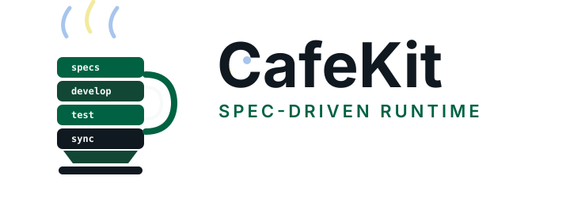

<!-- _class: lead -->



# CafeKit 101

Quy trình AI coding theo spec cho Claude Code

---

## Mục Lục

| Phần | Nội dung |
|---|---|
| 1 | Vì sao cần CafeKit |
| 2 | Nền tảng Claude Code: `CLAUDE.md`, Skills, Agents, Hooks |
| 3 | CafeKit runtime: install, version tracking, workflow |
| 4 | Spec artifacts: requirements, research, design, tasks |
| 5 | Validation, readiness và runtime reachability |
| 6 | Demo flow: specs → develop → test → review → git |
| 7 | Khi nào dùng, lab thực hành, adoption path |
| 8 | Phụ lục tham chiếu |

---

## Vì Sao Có Buổi Này

- AI coding rất nhanh, nhưng dễ lệch scope
- Spec thường được viết ra rồi bị bỏ qua
- Code có thể build được nhưng chưa chắc chạy tới được
- Test và review thường đến quá muộn

**CafeKit thêm kỷ luật kỹ thuật cho Claude Code**

---

## Vấn Đề Cốt Lõi

```text
User prompt
  -> AI viết code ngay
  -> giả định bị ẩn
  -> thiếu test
  -> lệch scope
  -> review phát hiện quá muộn
```

Ta cần một workflow tạo **sự thật chung trước khi viết code**.

---

## Câu Trả Lời Của CafeKit

```text
Ý tưởng
  -> Spec
  -> Bằng chứng task
  -> Validation
  -> Development
  -> Test
  -> Review
  -> Git
```

CafeKit biến việc prompt lặp lại thành **workflow dự án**.

---

## Nội Dung Sẽ Xây

Customer support triage dashboard:

- Danh sách ticket
- Badge priority/status
- Bộ lọc
- Màn hình chi tiết ticket
- Luồng cập nhật trạng thái
- Responsive layout

---

## Prompt Demo Feature

```text
Build a customer support triage dashboard that helps support agents
prioritize tickets, filter work, inspect ticket details, and update
ticket status
```

Prompt này đủ để demo spec, validation, UI work, testing và review.

---

## Nền Tảng Claude Code

CafeKit dựa trên các primitive của Claude Code:

- `CLAUDE.md`
- Skills
- Agents / subagents
- Hooks
- Settings
- Scripts

CafeKit không thay thế Claude Code. Nó cấu hình và mở rộng Claude Code.

---

## Mental Model Của Claude Code

```text
User request
  -> project memory
  -> selected instructions / skills
  -> tool calls
  -> file edits / terminal commands
  -> result
```

CafeKit thêm workflow rules, specialist agents, runtime guardrails và deterministic checks.

---

## `CLAUDE.md`

Bộ nhớ cấp project:

- Quy tắc của team
- Coding standards
- Kỳ vọng workflow
- Context quan trọng của project
- Commands và conventions

CafeKit dùng file này để giữ hành vi nhất quán giữa các session.

---

## Skills

Skills là các workflow tái sử dụng, lưu ở:

```text
.claude/skills/<skill-name>/SKILL.md
```

Một skill có thể chứa:

- Instructions
- References
- Templates
- Scripts
- Quy tắc dùng tool

---

## CafeKit Skills

| Skill | Mục đích |
|---|---|
| `hapo:specs` | Requirements, design, task files |
| `hapo:develop` | Implement spec đã approve |
| `hapo:test` | Verify theo task evidence |
| `hapo:code-review` | Review compliance và quality |
| `hapo:debug` | Chẩn đoán dựa trên evidence |
| `hapo:git` | Commit/push workflow |

---

## Agents / Subagents

Agents là các trợ lý chuyên môn với instruction và context riêng.

CafeKit dùng agents cho:

- Tạo spec
- Development
- Testing
- Code audit
- Debugging
- Git operations

**Mục tiêu: mỗi specialist chỉ giữ một vai trò rõ ràng.**

---

## CafeKit Agents

```text
.claude/agents/
├── spec-maker.md
├── god-developer.md
├── test-runner.md
├── code-auditor.md
├── debugger.md
├── git-ops.md
└── ...
```

Specialists giúp workflow dễ kiểm soát hơn.

---

## Hooks

Hooks chạy quanh lifecycle events của Claude Code:

- `SessionStart`
- `UserPromptSubmit`
- `PreToolUse`
- `PostToolUse`
- `Stop`
- `SubagentStart`
- `SubagentStop`

CafeKit dùng hooks để đặt runtime guardrails và sync context.

---

## Hooks Trong CafeKit

Ví dụ:

- Inject rules và project context
- Theo dõi spec state
- Theo dõi lifecycle của subagent
- Chặn truy cập file nhạy cảm/rủi ro
- Sync docs/status
- Cung cấp statusline context

**Prompt định hướng hành vi. Hook giữ biên workflow.**

---

## Settings

Hành vi cấp project của Claude nằm trong:

```text
.claude/settings.json
```

CafeKit dùng settings để nối:

- Hooks
- Statusline
- Runtime behavior
- Project-level automation

---

## CafeKit Cài Những Gì

```text
.claude/
├── .gitignore
├── agents/
├── hooks/
├── references/
├── rules/
├── scripts/
├── skills/
├── cafekit.json
├── runtime.json
├── settings.json
└── status.cjs
```

---

## Theo Dõi Version

CafeKit ghi lại metadata lúc install:

```json
{
  "packageName": "@haposoft/cafekit",
  "version": "0.8.11",
  "platform": "claude",
  "installCommand": "npx @haposoft/cafekit@0.8.11"
}
```

Hữu ích cho demo có thể tái lập và debugging.

---

## Workflow Chính Của CafeKit

```text
Ý tưởng
  -> /hapo:brainstorm
  -> /hapo:specs
  -> /hapo:specs <feature> --validate
  -> /hapo:develop
  -> /hapo:test
  -> /hapo:code-review
  -> /hapo:git
```

Mỗi bước có một nhiệm vụ riêng.

---

## Output Của Spec Folder

```text
specs/<feature>/
├── spec.json
├── requirements.md
├── research.md
├── design.md
└── tasks/
    ├── task-R1-01-project-setup.md
    ├── task-R1-02-types-constants.md
    └── ...
```

Các file này trở thành source of truth.

---

## `spec.json`

Workflow state dạng machine-readable:

- `scope_lock`
- approvals
- progress
- `task_files`
- `task_registry`
- validation status
- `ready_for_implementation`

**Quan trọng:** validator PASS chưa chắc đã sẵn sàng develop.

---

## `requirements.md`

Requirement tốt cần:

- Đơn nghĩa
- Không mơ hồ
- Test được
- Trace được tới task

Ví dụ:

```text
R2: Ticket Filtering
The system shall filter tickets by status, priority, and category.
```

---

## `research.md`

Research giải thích vì sao quyết định được chọn:

- Kết quả scout codebase
- External research hoặc lý do skip
- Quyết định được chọn
- Phương án bị loại
- Ảnh hưởng xuống task/test

**Research tránh thiết kế theo trí nhớ.**

---

## `design.md`

Design ghi lại quyết định implementation:

- Architecture
- Data model
- State model
- Component hierarchy
- Runtime entrypoints
- UI/responsive behavior

Design tốt giúp tránh mỗi người hiểu một kiểu.

---

## Cấu Trúc Một Task

Mỗi task CafeKit nên có:

- `Context`
- `Constraints`
- `Steps`
- `Related Files`
- `Completion Criteria`
- `Evidence`
- `Risk Assessment`

Đây là cấu trúc chính được enforce từ v0.8.11.

---

## Evidence

Evidence trả lời câu hỏi:

> Làm sao biết task này thật sự xong?

Ví dụ:

- Build/typecheck command
- Unit hoặc component test
- UI flow verification
- Runtime reachability proof
- Negative-path proof

---

## Runtime Reachability

Lỗi AI thường gặp:

> File đã được tạo, nhưng không được import hoặc mount ở đâu.

CafeKit yêu cầu mỗi task trả lời:

- Entrypoint là gì?
- Nó được import ở đâu?
- Nó được mount/register/invoke như thế nào?
- Bằng chứng nào chứng minh runtime path chạy được?

---

## Deterministic Validator

Command:

```bash
node .claude/scripts/validate-spec-output.cjs specs/<feature>
```

Kiểm tra:

- Artifact shape
- Quy ước tên file task
- Tính nhất quán của task registry
- Các section bắt buộc trong task
- Runtime reachability evidence

---

## Validate vs Ready

Với spec phức tạp:

```text
validator PASS
  -> Red Team
  -> Validate
  -> accepted fixes applied
  -> validator PASS again
  -> validation.status = completed
  -> ready_for_implementation = true
```

**Validator kiểm shape. Red Team kiểm judgment.**

---

## Demo 1: Install

```bash
mkdir triage-dashboard
cd triage-dashboard
npx @haposoft/cafekit@0.8.11
claude
```

Kiểm tra:

```bash
cat .claude/cafekit.json
find .claude -maxdepth 2 -type f | sort
```

---

## Demo 2: Tạo Specs

```text
/hapo:specs Build a customer support triage dashboard that helps support agents prioritize tickets, filter work, inspect ticket details, and update ticket status
```

Trình bày:

- scope decisions
- generated files
- task anatomy

---

## Demo 3: Validate Specs

```text
/hapo:specs customer-support-triage-dashboard --validate
```

Trình bày:

- kết quả deterministic validator
- Red Team findings
- task updates
- trạng thái readiness cuối trong `spec.json`

---

## Demo 4: Develop

```text
/hapo:develop customer-support-triage-dashboard
```

CafeKit develop nên:

- Đọc spec/task files đã approve
- Scout current source theo từng task
- Tôn trọng `scope_lock`
- Chứng minh runtime reachability
- Tránh feature ngoài scope

---

## Demo 5: Test

```text
/hapo:test customer-support-triage-dashboard
```

Test có thể gồm:

- Unit tests
- Component/integration tests
- E2E/UI flow checks
- Responsive verification
- Accessibility checks
- Build/typecheck

---

## Demo 6: Code Review

```text
/hapo:code-review --pending
```

Các lớp review:

1. Spec compliance
2. Runtime reachability
3. Missing tests
4. Code quality
5. Security/performance risks

---

## Demo 7: Git

```text
/hapo:git
```

Hoặc:

```bash
git status
git add ...
git commit -m "feat: implement triage dashboard"
git push
```

Giữ commit tập trung, tránh session/cache noise.

---

## Lỗi Thường Gặp

| Lỗi | Guardrail |
|---|---|
| Task template bị rút gọn | Validator fail |
| Lệch scope | `scope_lock` + review |
| Component mồ côi | Runtime reachability proof |
| Trạng thái ready giả | Validation gate |
| Session noise trong Git | `.claude/.gitignore` |

---

## Khi Nào Nên Dùng CafeKit

Phù hợp với:

- Feature mới gồm nhiều task
- UI workflow có state/routes
- Backend/API change
- Refactor có blast radius
- Debugging chưa rõ root cause
- Release/publish workflow

---

## Khi Nào Không Nên Dùng

Tránh dùng cho:

- Sửa typo nhỏ
- Đổi copy một dòng
- Emergency manual patch
- Việc mà full spec tốn công hơn thay đổi thực tế

Dùng judgment. CafeKit là workflow, không phải nghi thức cho mọi việc.

---

## Hands-on Lab

Tự tạo một mini spec:

```text
/hapo:specs Build a simple expense tracker that lets users add expenses, categorize them, filter by category, and see monthly totals
```

Sau đó validate:

```text
/hapo:specs expense-tracker --validate
```

---

## Lộ Trình Áp Dụng

1. Bắt đầu với `/hapo:specs`
2. Thêm `/hapo:specs --validate`
3. Yêu cầu task evidence cho việc phức tạp
4. Thêm `/hapo:test` trước PR
5. Thêm `/hapo:code-review`
6. Chỉ customize hooks/agents sau khi hiểu defaults

---

## Kết Luận

CafeKit là Claude Code có thêm kỷ luật kỹ thuật:

- Scope
- Specs
- Task evidence
- Validation
- Development
- Test
- Review
- Git

**Từ prompt-to-code sang spec-driven delivery.**

---

<!-- _class: appendix -->

# Phụ Lục

Tài liệu tham chiếu nhanh cho workshop CafeKit 101

---

<!-- _class: appendix -->

## Phụ Lục A: Claude Code Primitives

| Thành phần | Vai trò trong CafeKit |
|---|---|
| `CLAUDE.md` | Memory và quy tắc cấp project |
| Skills | Workflow tái sử dụng |
| Agents | Specialist context theo vai trò |
| Hooks | Guardrails quanh lifecycle/tool calls |
| Settings | Nối hooks, statusline, automation |
| Scripts | Kiểm tra deterministic và runtime support |

---

<!-- _class: appendix -->

## Phụ Lục B: CafeKit Command Cheat Sheet

```text
/hapo:brainstorm <idea>
/hapo:specs <feature description>
/hapo:specs <feature-name> --validate
/hapo:develop <feature-name>
/hapo:test <feature-name>
/hapo:code-review --pending
/hapo:git
```

Dùng theo thứ tự từ spec tới evidence, rồi mới commit/push.

---

<!-- _class: appendix -->

## Phụ Lục C: Spec Readiness Checklist

- `spec.json` có `scope_lock`, `task_files`, `task_registry`
- `requirements.md` testable và trace được
- `research.md` ghi rõ quyết định và tradeoff
- `design.md` đủ để implement không đoán mò
- Mỗi task có `Context`, `Constraints`, `Steps`, `Evidence`
- Validation completed
- `ready_for_implementation = true`

---

<!-- _class: appendix -->

## Phụ Lục D: Task Evidence Checklist

Mỗi task nên trả lời được:

- Command nào chứng minh build/typecheck?
- Test nào chứng minh logic?
- UI flow nào chứng minh người dùng dùng được?
- Entrypoint runtime ở đâu?
- File đã được import/mount/invoke ở đâu?
- Negative path nào đã kiểm?
- Bằng chứng nào đủ để reviewer tin?

---

<!-- _class: appendix -->

## Phụ Lục E: Demo Backup Commands

```bash
cat .claude/cafekit.json
find .claude -maxdepth 2 -type f | sort
node .claude/scripts/validate-spec-output.cjs specs/<feature>
git status --short
```

Khi demo live bị chậm, dùng các command này để chuyển sang review artifact.

---

<!-- _class: appendix -->

## Phụ Lục F: Cách Đọc Kết Quả Validate

| Tín hiệu | Ý nghĩa |
|---|---|
| `PASS` từ validator | Artifact đúng shape |
| Red Team findings | Rủi ro về judgment/scope |
| `validation.status=completed` | Validate workflow đã kết thúc |
| `ready_for_implementation=true` | Có thể bắt đầu `/hapo:develop` |

Không bắt đầu develop chỉ vì file đã được tạo.
