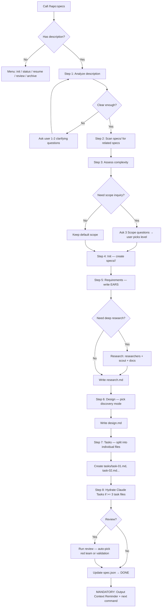

# Specs (SDD — Specification-Driven Development)

> A structured specification system that turns vague ideas into actionable, implementable task lists.

## Overview

This skill provides a 7-phase workflow to transform ideas into specs and real implementations:

```
Init → Requirements → Design → Tasks → Code → Test → Review
```

**CRITICAL:** Before starting, the system MUST:
1. Scan `specs/` directory for incomplete specs
2. If any spec is `in-progress` → ask user whether to continue or create new
3. Detect cross-spec dependencies (see `references/cross-spec-dependency.md`)

## Core Responsibilities & Rules

### Development Principles
- **YAGNI** — Don't add functionality until it's actually needed
- **KISS** — Prefer simple solutions over complex ones
- **DRY** — Don't repeat existing code/logic
- **Be honest, direct, to the point, concise.**

### Phase Separation Rules
- Each phase (Init → Requirements → Design → Tasks) must complete before the next begins
- No skipping — don't write design without requirements
- Exception: simple tasks may merge requirements + design into one step

### Scope Rules
- Respect `scope_lock` absolutely once user has confirmed
- Never silently expand or shrink scope
- If scope change needed → ask user, record reason in `spec.json`

### Output Criteria
- Never implement code — only create spec documents
- Return file paths and a brief summary
- Spec files must be self-contained (full context)
- Insert code samples/pseudocode when needed to clarify flow
- Comply with `./docs/development-rules.md` if it exists

### Writing Style
- Concise, prefer bullet lists
- Get straight to the point, no fluff
- Unresolved questions → list at the end of each document

## Default Behavior

### When called WITHOUT arguments

Display selection menu via `AskUserQuestion`:

```json
{
  "questions": [{
    "question": "What would you like to do?",
    "header": "Specs",
    "options": [
      { "label": "Create new spec", "description": "Initialize spec from a feature description" },
      { "label": "status", "description": "View status of all specs in specs/" },
      { "label": "resume", "description": "Continue an in-progress spec" },
      { "label": "review", "description": "Review spec (auto-decides: red team or validation)" },
      { "label": "archive", "description": "Archive completed specs + write journal" }
    ],
    "multiSelect": false
  }]
}
```

### When called WITH a feature description

System auto-analyzes the description:
- If description is too short (< 20 words) or vague → stop and ask 1-2 clarifying questions
- If task is simple (small bugfix, config change) → suggest "A spec may not be needed for this. Continue anyway?"
- If task is complex (multi-module, security/migration related) → auto-activate deep research, ask user 3 scope questions

## Workflow Diagram



**This diagram is the authoritative workflow.** If text below conflicts with the diagram, follow the diagram.

## Detailed Workflow

### Step 1: Analyze Description
- Assess clarity and complexity of the description
- If description < 20 words or lacks concrete nouns → ask 1-2 clarifying questions
- If task is too simple → warn user that a spec may not be needed

### Step 2: Cross-Spec Dependency Scan
Load: `references/cross-spec-dependency.md`
- Scan `specs/` for incomplete specs
- Compare scope: overlapping files, shared dependencies, same feature area
- Update `spec.json` bidirectionally if relationship detected

### Step 3: Complexity Assessment & Scope Inquiry
Load: `references/scope-inquiry.md`
- Apply when task complexity is medium or higher
- Ask 3 questions: What exists already? What's the minimum change? How complex?
- User picks: Expand / Hold / Reduce
- **Skip if:** trivial task (< 20 words, 1 file, user says "just do it")

### Step 4: Init
- Check for duplicate slugs in `specs/` via Glob
- Create directory `specs/<feature-name>/`
- Create `spec.json` from template `templates/init.json`
- Create empty `requirements.md` from template `templates/requirements-init.md`
- Initialize `scope_lock` in `spec.json`:
  - `source`: original description
  - `in_scope`: confirmed scope items
  - `out_of_scope`: excluded items
  - `expansion_policy`: `requires-user-approval`
- Do NOT generate requirements, design, or tasks at this step

### Step 5: Requirements & Research
- Read `spec.json` — stop if init hasn't completed
- Stop if requirements already exist, unless user wants to regenerate
- Respect `scope_lock` — keep new requirements within `in_scope`
- Analyze existing codebase if this is an enhancement (not greenfield)
- **MANDATORY Research:** Spawn `researcher` subagent to gather best practices, documentation, and technical foundation before detailing requirements. Use `Task(subagent_type="researcher", prompt="Research [feature]", description="Research")`.
- Write requirements in **EARS** format (see `rules/ears-format.md`)
- Each requirement gets a unique numeric ID
- Record any findings in `research.md` from template `templates/research.md`
- Update `spec.json` phase + timestamps

### Step 6: Design
- Read `spec.json` — stop if requirements aren't ready
- Read project docs before designing (see `references/codebase-analysis.md`)
- Pick discovery mode:
  - **minimal**: UI-only or simple CRUD
  - **light**: extending existing system
  - **full**: integration, security, schema, or performance
- Record findings in `research.md` before finalizing design
- Write `design.md` from template `templates/design.md` (see `rules/design-principles.md`)
- Add diagrams only when design has multi-step or cross-boundary flows
- Update `spec.json` phase, timestamps, discovery mode

### Step 7: Task Breakdown
- Read `spec.json` — stop if `requirements.md` or `design.md` missing
- Respect `scope_lock` — only use valid requirement IDs within `in_scope`
- Create individual task files: `tasks/task-01-<slug>.md`, `task-02-<slug>.md`...
- Each task file follows template `templates/task.md`
- Each task maps to at least 1 requirement ID
- Max 2 levels: major tasks and sub-tasks (checkboxes)
- Remove or defer tasks outside scope
- Update `spec.json` phase + task metadata

### Step 8: Task Hydration
Load: `references/task-hydration.md`
- Only run if >= 3 task files
- Convert task files → Claude Tasks with dependency chain (`addBlockedBy`)
- If TaskCreate tool unavailable → fallback to `TodoWrite`
- Task files are the single source of truth — hydration is just a convenience

### Step 9: Review (Optional)
Load: `references/review.md`
- System auto-evaluates spec complexity and decides review depth:
  - **< 3 task files, no security concerns** → Validate only (lightweight interview)
  - **>= 5 task files OR security/migration keywords** → Red Team first, then Validate
  - **User explicit request** → respect user's intent
- When both run: Red Team ALWAYS before Validate (red team may change the spec)

### Step 10: Completion — Context Reminder (MANDATORY)
After completing the spec, MUST output:

```
✅ Spec complete: specs/<feature>/
📌 Next step — run:
   /code <feature>

💡 Tip: Run /clear before implementing to reduce planning context carryover.
```

## Active Spec State

When user calls `hapo:specs`, system checks `specs/`:

| Situation | Action |
|---|---|
| A spec is `in-progress` | Ask: "You have spec `<name>` at phase `<phase>`. Continue? [Y/n]" |
| A spec matches current git branch | Ask: "Branch `feature/X` has spec `X`. Activate or create new?" |
| Nothing found | Create new spec or show menu |

**Next step suggestions based on `spec.json`:**

| Current phase | Suggestion |
|---|---|
| `init` done | "Next: write requirements" |
| `requirements` done | "Next: architectural design" |
| `design` done | "Next: break into tasks" |
| `tasks` done | "Next: `/code <feature>`" |
| Spec is `blocked` | "Warning: spec `X` is blocking this spec" |

**State persistence:** Update `spec.json` `phase` field on each transition. `spec.json` is the single source of truth.

## Output Structure

```
specs/
└── <feature-name>/
    ├── spec.json              # Metadata, state, scope_lock, dependencies
    ├── requirements.md        # Technical requirements (EARS format)
    ├── research.md            # Research notes
    ├── design.md              # Architectural design
    ├── tasks/                 # One file per major task group
    │   ├── task-01-setup.md
    │   ├── task-02-core.md
    │   └── ...
    └── reports/               # Auxiliary reports
        ├── researcher-01.md
        ├── scout-report.md
        └── red-team-report.md
```

## Subcommands

| Command | Purpose | Reference |
|---|---|---|
| `/hapo:specs status` | View status of all specs | — |
| `/hapo:specs resume <feature>` | Continue an in-progress spec | — |
| `/hapo:specs review <feature>` | Review spec (auto: red team + validate based on complexity) | `references/review.md` |
| `/hapo:specs archive` | Archive completed specs + write journal | `references/archive-workflow.md` |

## Quality Standards

### Spec Content
- Specific enough for a junior developer to understand and execute
- Every requirement must be testable/verifiable
- Design must state trade-offs, not just solutions
- Every task must have clear definition of done

### Security & Performance
- Design must include security assessment (at least OWASP Top 10)
- Evaluate performance for potential bottlenecks
- Rollback plan for each major change

### Consistency
- Match existing codebase patterns
- Comply with `./docs/development-rules.md`, `./docs/code-standards.md`
- Check file naming conventions per project rules

### Maintainability
- Design for the future — require extensibility
- Document rationale behind every architectural decision
- No over-engineering: if a function suffices, don't create a class

### Pre-Finalization Checklist
- [ ] Every requirement has an ID and is testable
- [ ] Design covers all requirements (no gaps)
- [ ] Every task file maps to at least 1 requirement ID
- [ ] No task is outside scope_lock
- [ ] No dependency cycles between task files
- [ ] `spec.json` has updated phase and timestamps

## When TO Use

✅ Creating a new complex feature
✅ Need documentation before coding
✅ Working with a team (need spec review)
✅ Project requires an audit trail

## When NOT to Use

❌ Simple bugfixes
❌ Small changes (< 1 hour)
❌ Emergency hotfixes

## Resources

### Templates (`templates/`)
- `init.json` — Metadata schema for spec.json
- `requirements-init.md` — Empty requirements template
- `requirements.md` — Full requirements template
- `design.md` — Design document template
- `research.md` — Research log template
- `task.md` — Template for individual task file

### Rules (`rules/`)
- `ears-format.md` — EARS requirements standard
- `design-principles.md` — Design principles
- `design-discovery-full.md` — Full research workflow
- `design-discovery-light.md` — Lightweight research workflow
- `tasks-generation.md` — Task generation rules
- `tasks-parallel-analysis.md` — Parallel task analysis

### References (`references/`)
- `cross-spec-dependency.md` — Cross-spec dependency detection
- `scope-inquiry.md` — Scope inquiry (3 questions)
- `research-strategy.md` — Research strategy (7 tools)
- `codebase-analysis.md` — Codebase analysis (4 mandatory files)
- `task-hydration.md` — Task files → Claude Tasks conversion
- `review.md` — Spec review (auto-decides: red team 8 steps + validate 6 steps)
- `archive-workflow.md` — Archive workflow (5 steps)
