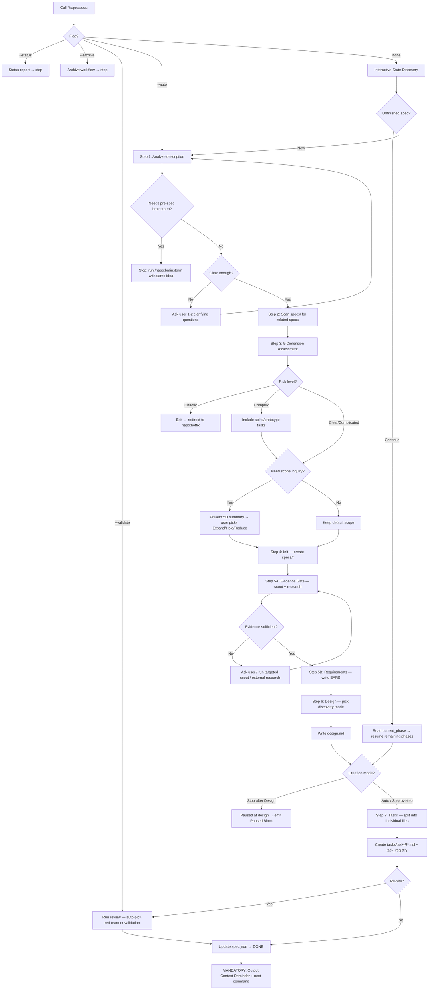

# Specs (SDD — Specification-Driven Development)

> A structured specification system that turns vague ideas into actionable, implementable task lists.

## Overview

10-step pipeline: `Analyze → Dependency Scan → Complexity Assessment → Init → Evidence Gate + Requirements → Design → Tasks → Review → Completion`. Flags + **Interactive State Discovery** choose *what to run and where to stop* — see **Default Behavior**.

**CRITICAL before starting:** scan `specs/` for incomplete work; if any is `in_progress` (read legacy `in-progress`) → ask continue vs new; detect cross-spec deps (`references/cross-spec-dependency.md`).

## Core Responsibilities & Rules

### Development Principles
- **YAGNI** — Don't add functionality until it's actually needed
- **KISS** — Prefer simple solutions over complex ones
- **DRY** — Don't repeat existing code/logic
- **Be honest, direct, to the point, concise.**

### Phase Separation Rules
- Each phase (Init → Requirements → Design → Tasks) must complete before the next begins
- No skipping — don't write design without requirements
- Exception: simple tasks may merge requirements + design into one step
- A `/hapo:specs <feature-description>` run defaults to **Interactive State Discovery**: it asks the Creation Mode (Auto / Stop after Design / Step by step) before running. `--auto` runs the full pipeline end-to-end without asking. Either way, phases never skip — each completes before the next begins, and Init is never a stop point.

### Scope Rules
- Respect `scope_lock` absolutely once user has confirmed
- Never silently expand or shrink scope
- If scope change needed → ask user, record reason in `spec.json`

### State & Integrity Rules
- Canonical active status: `in_progress` (legacy `in-progress` may be READ only; never emit it).
- `current_phase` must track the active phase (`init` … `review`).
- Deterministic validator enforces the structural rules — see Step 8.5.
- `ready_for_implementation` is a hard gate — never set it before the finalization audit passes.
- Non-trivial specs MUST have an evidence trail in `research.md` before finalizing requirements/design/tasks.

### Language & Canonical Rules
- **English is the canonical language for every spec artifact** — write them in English regardless of the session's response language.
- Non-English `language` setting MAY add a **reference-only translation mirror** under `i18n/<lang>/`. See `references/translation-mirror.md`.

### Output Criteria
- Never implement code — only create spec documents
- Return file paths and a brief summary
- Spec files must be self-contained; insert code samples when needed to clarify flow
- Comply with `./docs/development-rules.md` if it exists

### Hard Output Contract
For a normal `/hapo:specs <feature-description>` run, the persistent spec artifacts MUST use this shape:

```
specs/<feature>/
├── spec.json
├── requirements.md
├── research.md
├── design.md
├── tasks/
│   ├── task-R0-01-<slug>.md
│   ├── task-R1-01-<slug>.md
│   └── ...
└── reports/
    └── <optional-review-or-research-report>.md
```

Forbidden generated artifacts:
- Do NOT create `specs/<feature>/init.json`.
- Do NOT create `specs/<feature>/spec-state.json`.
- Do NOT create `specs/<feature>/hydration.md`.
- Do NOT create shorthand task files such as `tasks/task-R0-1.md`, `tasks/task-R1-1.md`, or `tasks/R0-1-<slug>.md`.
- The template file name is never the output file name. `templates/spec-state.json` is only the schema source for generated `spec.json`.
- Before marking a spec ready, run the deterministic validator:
  - `node .claude/scripts/validate-spec-output.cjs specs/<feature>`
  - Any validator failure blocks `ready_for_implementation = true`.
- Deterministic validator enforces the structural rules — see Step 8.5.

### Writing Style
- Concise, prefer bullet lists; no fluff
- Unresolved questions → list at the end of each document

## Default Behavior

> **This section is the entry/dispatch layer ONLY.** It decides *which part of the pipeline to run and where to stop*. It does NOT change any pipeline step, the validator, templates, or rules.

`hapo:specs` exposes exactly **four flags**: `--auto`, `--validate`, `--status`, `--archive`. Everything else is resolved by **Interactive State Discovery**. Bare `status` / `archive` / `resume` are silent back-compat aliases.

### Dispatch order

1. `--status` (or bare `status`) → run the status report (see **Subcommands**), then stop.
2. `--validate <feature>` → jump to **Step 8** (the `--validate` rules below are unchanged).
3. `--archive` (or bare `archive`) → run the archive workflow, then stop.
4. `--auto` → **non-interactive run**. If the argument matches an unfinished spec → resume it from `current_phase` and finish to Tasks. Otherwise create new and run the full pipeline (Step 1→10) end-to-end. Either way: auto-approve and skip the Creation Mode question; if a new description is missing, ask only for it; the hard safety gates still apply.
5. Otherwise (`/hapo:specs` or `/hapo:specs "<description>"`) → **Interactive State Discovery**.

### Interactive State Discovery (no-flag path)

1. **Detect state** — unfinished specs (`in_progress` / not ready) + git-branch match → `Continue <A> · Continue <B> · Create new`; else create-new.
2. **Create-new** — ask description if missing. Too short → 1-2 questions. Unclear architecture/acceptance/scope/multi-approach → `/hapo:brainstorm`. Simple → "spec may not be needed?". Complex → deep research + 3 scope Qs. Non-trivial → Step 5 Evidence Gate.
3. **Creation Mode Gate** — see below. Non-English → also offer **Translation Mirror**.
4. **Continue** unfinished → resume from `current_phase` with remaining stop points.
5. **Run** chosen scope; early stop → Step 9b; sync per `state-sync.md`.

### Creation Mode Gate

Shown once on the no-flag create path. Selects the **stop point only**.

| Option | Runs | Stops after | Approvals |
|---|---|---|---|
| **Auto (→ Tasks)** | Step 1→10 end-to-end | full (ready gate) | each phase `generated=true` + `approved=true` |
| **Stop after Design** | Step 1→6 | `design` (before Step 7) | requirements + design `approved=true`; `ready_for_implementation=false` |
| **Step by step** | one phase at a time | after each phase | per phase `generated=true`, `approved=false` until user approves |

`--auto` = Auto without the gate. Early stops leave `ready_for_implementation=false` and emit Step 9b. Resume via `/hapo:specs` Interactive State Discovery.

### Translation Mirror (optional reference copy)

Load `references/translation-mirror.md`. Canonical = English. Non-English interactive run may set `spec.json.translation` and regenerate `i18n/<code>/` after Steps 5–7 writes. `--auto` create skips the prompt unless already enabled. Mirror is reference-only (never validated / never SoT / ignored by develop).

### When called WITH `--validate` argument

System IMMEDIATELY jumps to **Step 8: Validation Review**.
The system MUST NOT execute Steps 1-7. Instead, load `references/review.md` and follow it **step-by-step**.

#### `--validate` Guardrails (NON-NEGOTIABLE)

1. **Red Team cannot be skipped by the system.** If auto-decision says "Red Team + Validate", you MUST run Red Team. A previous `code-auditor` review does NOT count — code-auditor reviews source code, NOT specifications. Only the USER can downgrade to "Validate only" by explicitly saying so.
2. **MUST use the 4 Personas** defined in `review.md` Part A Step 3 (Security Adversary, Failure Mode Analyst, Assumption Destroyer, Scope & Complexity Critic). Generic observations without persona attribution are REJECTED.
3. **MUST use the Finding Format** defined in `review.md` Part A (Severity, Location, Flaw, Failure scenario, Evidence, Suggested fix, Disposition, Rationale). Shortened or custom formats are REJECTED.
4. **MUST create `reports/red-team-report.md`** when Red Team runs (review.md Part A Step 8).
5. **MUST NOT create implementation code files** (`.ts`, `.js`, `.py`, etc.). The validate workflow produces ONLY markdown spec documents and reports. If a fix requires a new shared module, describe it in the relevant task file instead of creating the actual code file.
6. **MUST NOT over-engineer fixes.** Apply YAGNI — if user says "configure later", add an abstraction note to the task, do NOT generate 4 concrete provider implementations.
7. **MUST follow auto-decision table exactly.** Count task files + scan for keywords → pick mode. No self-justification to override the table result.
8. **MUST run deterministic validator.** Before reporting validation PASS, run `node .claude/scripts/validate-spec-output.cjs specs/<feature>`. If it exits non-zero, validation is FAIL/BLOCKED, `ready_for_implementation` remains `false`, and output MUST NOT suggest `/hapo:develop`.

## Workflow Diagram



**This diagram is the authoritative workflow.** If text below conflicts with the diagram, follow the diagram.

## Detailed Workflow

### Step 1: Analyze Description
- Load `references/ask-user-question-gates.md` before asking; do not ask what repo evidence or current docs can answer.
- Route to `hapo:brainstorm` before creating files when acceptance criteria are not concrete, scope is unknown, 2-3 viable architectures lack a winner, the feature spans 3+ subsystems, or the user wants to explore/compare/debate.
- **Multimodal & Document Auto-Ingestion (MANDATORY):** media → `hapo:ai-multimodal`; `.pdf` → `hapo:pdf`; `.docx` → `hapo:docx`; `.pptx` → `hapo:pptx`; `.xlsx`/`.csv` → `hapo:xlsx`. Append findings as the enriched description.
- Description < 20 words or lacks concrete nouns → 1-2 clarifying questions. Too simple → warn a spec may not be needed.

### Step 2: Cross-Spec Dependency Scan
Load: `references/cross-spec-dependency.md` — scan incomplete specs; compare overlapping files/deps; update `spec.json` bidirectionally if related.

### Step 3: Complexity Assessment & Scope Inquiry
Load: `references/scope-inquiry.md` (+ `references/ask-user-question-gates.md` for scope/evidence/contract/architecture decisions).
- 5 dimensions: Semantic Intent, Implementation Hypothesis, Gap Sizing, Risk/Cynefin, Blast Radius
- **Chaotic** → `hapo:hotfix`; **Complex** → spike/prototype tasks; **Critical Path** → rollback + test coverage
- Smell: >8 files / >2 new classes / >12 tasks → challenge; **>15 tasks → sibling specs**
- User: Expand / Hold / Reduce. Skip if trivial (< 20 words, 1 file, "just do it")

#### Execution Tier (auto-scale — after 5-Dimension assessment)
Record in `spec.json.design_context.execution_tier`.

| Tier | Trigger | Research | Discovery | Red-Team | Always runs |
|---|---|---|---|---|---|
| **Light** | Clear + Isolated + ≤2 tasks | skip (rationale) | minimal | Validate-only | scope_lock, EARS, **Layer 1+2** |
| **Standard** | default / 3-4 tasks | targeted | light | per Step 8 | all of the above |
| **Deep** | Complex/Critical / security-migration / 5+ tasks | full | full | Red-Team → Validate | all of the above |

Grounding + validator + scope_lock never skip. Auth/payment/migration/schema/privacy force Deep. Tier never changes Hard Output Contract or DoCT.

### Step 4: Init
- Check duplicate slugs; create `specs/<feature-name>/`
- Create `spec.json` from `templates/spec-state.json` (output name MUST be `spec.json`, never the template filename)
- Create empty `requirements.md` from `templates/requirements-init.md`
- Init `scope_lock`: `source`, `in_scope`, `out_of_scope`, `expansion_policy: requires-user-approval`
- Step 4 only initializes; Creation Mode / `--auto` decides how far — Init is never a stop point.

### Step 5: Evidence Gate, Requirements & Research
- Stop if init incomplete or requirements exist (unless regenerate). Respect `scope_lock`.
- Load `references/research-strategy.md` + `references/codebase-analysis.md`
- **Scout mandatory** when changing existing behavior, touching API/CLI/export/schema/auth/config/hook/runtime contracts, lacking paths, invalidating tests, resuming old specs, or crossing package boundaries.
- **External research mandatory** for third-party APIs/libs/policies/AI/security/auth/payment/privacy/standards, or "best/optimal/latest/recommended".
- **Skip only** for trivial one-file/docs/isolated new files or user-provided report — record rationale in `research.md`.
- Scout is targeted (not full-repo). External prefers official/primary sources with links + date.
- Write `research.md` first with Evidence Summary: scout result, external or skip rationale, selected decision, rejected alternatives, gaps, task/test implications.
- Unresolved architecture / acceptance / multi-approach → `/hapo:brainstorm`, don't force a spec.
- EARS requirements (`rules/ears-format.md`) with literal IDs `R{N}.{M}` (not bare `1. 2. 3.`) so Layer 1 sub-criterion coverage works via `_Requirements: 1.1_`.
- Feasibility vs `research.md`; unique numeric IDs; quality = Singular, Unambiguous, Testable + NFRs. Template `templates/research.md`. Update phase + timestamps.

### Step 6: Design
- Stop if requirements incomplete. Discovery: `minimal` / `light` (default) / `full`.
- Load `rules/design-principles.md`, `rules/phase-decision-matrix.md` (implementation slices, clusters, foundation, spike needs, integration/verification gates), `references/ask-user-question-gates.md` when needed, and `rules/design-discovery-[mode].md`.
- Record research findings; write `design.md` from `templates/design.md`. Decisions MUST trace to `research.md` evidence.
- Diagrams only for multi-step/cross-boundary flows. Auth/session/transport/persistence/artifact/runtime work MUST fill `Canonical Contracts & Invariants`; tasks inherit verbatim.
- Any spec whose tasks span both backend and frontend surfaces MUST declare shared data shapes as named contract blocks. Declare each as `<!-- contract:NAME -->` followed by a fenced block — per `templates/design.md`. Tasks that produce/consume it add `Contracts: NAME` and copy the block verbatim; the validator then hard-fails on cross-layer drift.
- Update phase, timestamps, discovery mode.

### Step 7: Task Breakdown
- Stop if `requirements.md` or `design.md` missing. Respect `scope_lock`.
- Load `rules/tasks-generation.md`, `rules/phase-decision-matrix.md` (implementation slice/task cluster, not `phase-XX.md`), `rules/task-scoring-rubric.md` (priority, split/merge, spike needs, deps, parallel, evidence depth), and `references/ask-user-question-gates.md` if scoring expands scope.
- **Scaffold is mandatory — raw `Write` to a task file is blocked.** PreToolUse `task-scaffold-guard.cjs` rejects `Write` to `specs/<feature>/tasks/task-*.md`. Path: scaffold → Edit:
  `node .claude/scripts/spec-scaffold.cjs <feature> --tasks "R0-01-slug,R1-01-slug,..." --tasks-only`
  Creates stubs from `templates/task.md`, merges `task_files` + `task_registry` (no overwrite of filled tasks). **Edit-fill** all `{{...}}` (`Edit`/`MultiEdit` ok; `Write` not). Fails open if scaffold missing; disable via `"spec": { "scaffold_guard": false }`.
- Leave NO `{{...}}` unfilled. Related Files/tests inherit scout paths — Layer 2 grounds them at Step 8.5; phantom paths hard-fail.
- Each task MUST include `Completion Criteria` and `## Evidence` (legacy heading aliases still parse). Choose proof type by surface (unit / component / E2E / visual / a11y / smoke / regression / perf-security when required).
- Preserve `scope_lock`; deferrals = named later tasks. UI/runtime specs need a final reachability task naming a real entrypoint.
- Register each task: `id`, `title`, `status` (`pending`), `dependencies` (relative paths), `blocker`, `started_at`, `completed_at`, `last_updated_at`.

#### Requirement-Covered Task Grouping (MANDATORY)
**Naming:** `tasks/task-R{N}-{SEQ}-<slug>.md` — R0 foundation, R1+ feature; SEQ two-digit; kebab slug.
Example: `task-R0-01-database-schema-foundation.md`, `task-R1-01-captions-observer.md`.

Split by dependency chain (schema → service → API → UI → integration). Tasks may cover multiple IDs; IDs may span tasks. Not all under R0. Every requirement ID must appear in some task's `## Requirements`. Blast-radius breakages → explicit fix tasks. Cross-req deps via `Dependencies:`.

#### Task File Quality Requirements (MANDATORY)
Self-contained and implementation-ready. Structure: **Context**, **Constraints**, **Steps**, **Requirements**, **Related Files**, **Completion Criteria**, **Evidence**, **Risk Assessment**.

**Template fidelity is mandatory:** preserve the task template headings exactly. Do NOT rename `## Context` to `## Objective`, do NOT replace `## Completion Criteria` with prose, do NOT remove `## Related Files`, `## Constraints`, or `## Risk Assessment`, and do NOT collapse `## Evidence` into generic QA scenarios. Compact wording is fine; missing sections are invalid.

Parallel: append `(P)` when no data/file/approval deps. **FORBIDDEN:** vague checkboxes without exact files/requirements/evidence.

#### Definition of a Complete Task (DoCT) — the quality bar

| DoCT element | Enforced by |
|---|---|
| **Related Files** name exact real paths (Create/Modify/Delete) | Layer 2 grounding (`spec-ground.cjs`) — phantom path fails |
| **Contract** (API/DB/event shape) stated concretely | Layer 1 contract-drift check (`<!-- contract:NAME -->`) |
| **Acceptance** measurable (no "fast/nice/safe" without a threshold) | EARS rule + reviewer judgment |
| **Evidence** uses commands that exist in the project (`package.json`) | Author + grounding spirit; never invent test commands |
| **Reachability** names a real entrypoint/caller | `Runtime reachability verification` (Layer 1 presence) + judgment |
| **Requirements mapping** present (`_Requirements: x.y_`) | Layer 1 coverage check |
| **FE fidelity** — if a visual reference is provided, task carries concrete values + `match <reference>` constraint | `tasks-generation.md` Frontend Fidelity Rule + reviewer/visual check |

Unfilled `{{...}}` fails DoCT. Layer 1+2 are the floor; reviewer judgment covers the rest.

### Step 8: Validation Review (Optional)
Load: `references/review.md` + `rules/design-review.md` + `references/ask-user-question-gates.md` before applying findings that change scope/contracts/tasks.
- Auto-depth: **< 3 tasks, no security** → Validate only; **≥ 5 OR security/migration** → Red Team then Validate; user request → respect
- `validation_recommended = true` for auth/session/privacy/deletion/migration/schema/AI-provider/extension-permissions or 5+ tasks
- Red Team always before Validate when both run. MUST NOT skip Red Team for code-auditor reviews. MUST NOT create implementation files.
- `validation.status = "completed"` only after findings propagated into requirements/design/tasks/spec.json.
- **Deterministic Gate (2 layers):** `validate-spec-output.cjs` + `spec-ground.cjs` after fixes. Either script failing overrides any LLM checklist result and blocks `ready_for_implementation = true`.

### Step 8.5: Finalization Audit (MANDATORY)
- Rebuild `task_files` + `task_registry` from real `tasks/` (sorted; preserve status when path matches).
- **Layer 1 — Structural:** `node .claude/scripts/validate-spec-output.cjs specs/<feature>` — non-zero = block.
- **Layer 2 — Grounding (MANDATORY):** `node .claude/scripts/spec-ground.cjs specs/<feature> [--root <work-context>]` — non-zero = block. Verifies every Modify/Delete/Read Related Files path exists or is Created earlier. Layer 1 pass + Layer 2 fail = NOT ready.

**Validator-enforced (do not re-check by hand — a clean exit clears all of these):** task_files/task_registry synced to disk; task naming `tasks/task-R{N}-{SEQ}-<slug>.md`; no forbidden artifacts; research.md Evidence Summary present; every requirement **and sub-criterion** covered by a task; each task keeps the full template (Context, Constraints, Steps, Related Files, Completion Criteria, Evidence, Risk Assessment) plus Runtime reachability; numeric requirement IDs only; validation_recommended vs validation.status; timestamps not reused from init; ready_for_implementation blocked while any error exists.

**Grounding-enforced:** every Modify/Delete/Read Related Files path exists or is Created earlier. Phantom paths hard-fail.

**Judgment-only audit:**
- FAIL: multi-output UI/runtime spec without final integration/reachability task.
- FAIL: accepted review decisions not reflected in Context/Steps/Requirements/Completion Criteria/Evidence/contracts.
- FAIL: stale Claude/Haiku strings outside `research.md` after provider switch.
- FAIL: privacy/delete-data without one canonical policy (hard-delete, or hash-based re-reg lock + retention) reused verbatim by tasks.
- FAIL: `validation.status=completed` without synced `validation_done`/`review_done`/`updated_at`/report metadata.
- `validation_recommended` without completed validation (or recorded risk acceptance) → keep `ready_for_implementation=false`.
- `translation.enabled` → re-sync `i18n/<code>/` after final write (mirror never blocks ready).
- Only after audit passes: `progress.tasks = "done"` and `ready_for_implementation = true`.

### Step 9: Completion — Context Reminder (MANDATORY)
Output a short summary, then this block EXACTLY (no awkward translations — keep professional):

**Command integrity:** The implementation handoff command is always `/hapo:develop <feature>`. Never suggest `/work`, `/code`, or any non-CafeKit alias as the next step for this workflow.

```
✅ Spec complete: specs/<feature>/
📌 Next step — run:
   /hapo:develop <feature>

💡 Tip: Run /clear or start a new chat session before implementing to reduce planning context carryover.
```

### Step 9b: Paused Block (early stop)

Early stop (**Stop after Design** / **Step by step**): no completion block, no validator. Print:

```
⏸ Spec paused at <phase>: specs/<feature>/
📌 Continue — run /hapo:specs and choose "Continue <feature>"
   (or /hapo:specs <feature> --auto to finish straight to Tasks)
```

`ready_for_implementation` stays `false`. Next `/hapo:specs` re-detects via Interactive State Discovery.

## Active Spec State

| Situation / phase | Action / suggestion |
|---|---|
| `in_progress` or branch match | Continue vs Create new |
| Nothing found | Create new → Creation Mode Gate |
| `init` / `requirements` / `design` done | write requirements / design / break into tasks |
| tasks done, validation incomplete | `/hapo:specs --validate <feature>` |
| ready_for_implementation = true | `/hapo:develop <feature>` |
| `blocked` | warn which spec blocks |

`spec.json` is the single source of truth — sync phase on each transition.

### spec.json Update Rules (MANDATORY)

| Field | Rule |
|---|---|
| Status | `in_progress` / `blocked` / `done` / `archived` only (never emit `in-progress`) |
| Timestamps | Each `timestamps.*_done` = actual ISO 8601 time at that phase; never reuse init |
| Approvals (Auto / full pipeline) | `generated=true` + `approved=true` per completed phase |
| Approvals (Stop after Design) | phases that ran: both true; later phases ungenerated; `ready_for_implementation=false` |
| Approvals (Step by step) | `generated=true`, `approved=false` until user approves |
| `task_files` / `task_registry` | Exact match to disk after Step 7; registry keys = relative paths with full registry fields |
| `validation_recommended` | `true` for auth/privacy/delete/migration/schema/extension/provider or 5+ tasks |
| `translation` | optional mirror metadata; never affects ready gate |
| `ready_for_implementation` | `true` only when requirements+design+tasks approved, `progress.tasks=done`, inventories match disk, and validation completed when recommended |

If any approval is `false`, keep `ready_for_implementation = false`. Specs with 5+ tasks stay not-ready until `--validate` writes `validation.status = "completed"`.

## Subcommands

| Command | Purpose | Reference |
|---|---|---|
| `/hapo:specs --status` | View status of all specs (alias: `status`) | — |
| `/hapo:specs --validate <feature>` | Validate spec (auto: red team + validate based on complexity) | `references/review.md` |
| `/hapo:specs --archive` | Archive completed specs + write journal (alias: `archive`) | `references/archive-workflow.md` |
| `/hapo:specs --auto [<desc>]` | Non-interactive: create (or resume) and run end-to-end to Tasks | — |
| `/hapo:specs [<desc>]` | Interactive State Discovery (continue unfinished, or create + Creation Mode Gate). Alias `resume` accepted. | — |

## Quality Standards

### Spec Content
- Junior-executable; every requirement testable; design states trade-offs; tasks have clear DoD

### Security & Performance
- OWASP-minded security assessment; bottlenecks + rollback for major changes

### Consistency
- Match codebase patterns; comply with `./docs/development-rules.md`, `./docs/code-standards.md`

### Maintainability
- Document rationale; extensible without over-engineering (function > class when enough)

### Pre-Finalization Checklist
Deterministic validator enforces the structural rules — see Step 8.5.

**Judgment-only:** EARS with measurable thresholds; discovery mode recorded; traceability matrix; Canonical Contracts filled + inherited; Mermaid for non-trivial flows; unit/integration/e2e strategy; clean provider wording outside research; validation decisions propagated into implementation-facing sections.

## When TO Use / NOT

✅ Complex features, pre-code docs, team review, audit trail
❌ Simple bugfixes, < 1 hour changes, emergency hotfixes

## Resources

**Templates:** `spec-state.json`, `requirements-init.md`, `requirements.md`, `design.md`, `research.md`, `task.md`; validator `.claude/scripts/validate-spec-output.cjs`

**Rules:** `ears-format.md`, `design-principles.md`, `design-discovery-full.md`, `design-discovery-light.md`, `design-review.md`, `phase-decision-matrix.md`, `tasks-generation.md`, `task-scoring-rubric.md`

**References:** `ask-user-question-gates.md`, `cross-spec-dependency.md`, `scope-inquiry.md`, `research-strategy.md`, `codebase-analysis.md`, `review.md`, `archive-workflow.md`, `translation-mirror.md`
