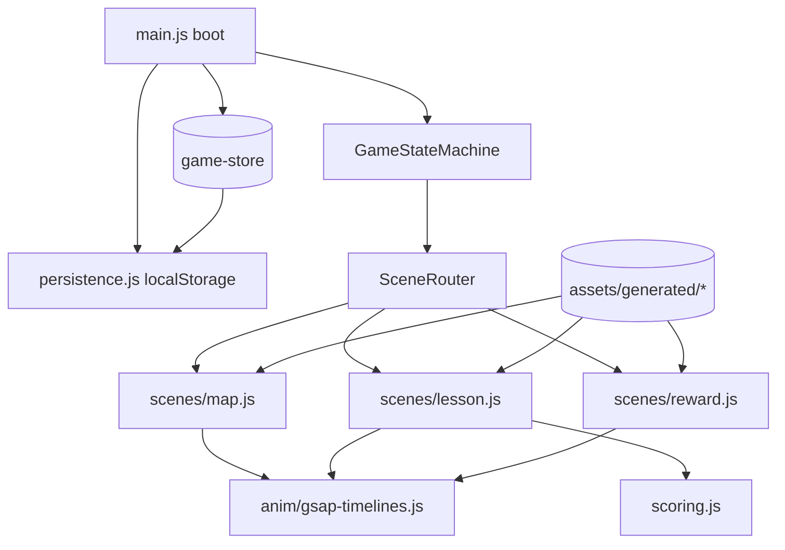
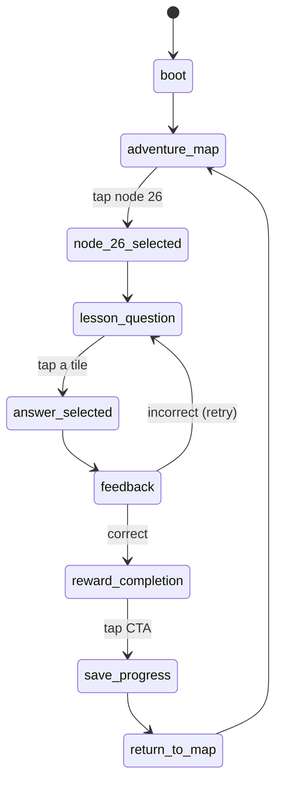

# Design — Place Value Bridge MVP

## Overview

**Purpose**: Deliver a fully polished, playable vertical MVP slice of *MathQuest: Star Trail* — the `place_value_bridge` loop — with completed assets, GSAP animation, scoring/business logic, and persistence.

**Users**: Children (Cambridge Stage 3–4 math learners) play the Map → Lesson → Reward loop; stakeholders review it as the art + functionality bar for the product.

**Impact**: Establishes the greenfield codebase, the asset-generation pipeline (gpt-image-2), the canonical game state machine, and the animation system that future slices extend.

### Goals
- Implement the exact 9-state machine, scoring rules, and animation cues from `mathquest_mvp_implementation_config.json`.
- Generate layered art (backgrounds + transparent sprites) matching the locked art direction.
- Satisfy all 6 acceptance criteria end-to-end with persistence-backed node unlock.

### Non-Goals
- Any node/lesson other than node 26 / `place_value_400_30_6`.
- Backend, accounts, networking, real audio engine, Shop/Practice/Quests content, monetization, analytics.

## Architecture

### Architecture Pattern & Boundary Map

Pattern: **Single state machine + scene router over layered DOM scenes**, with pure-logic modules (store, scoring, persistence) decoupled from rendering.



**Boundaries**:
- **Pure logic** (no DOM): `game-store.js`, `state-machine.js`, `scoring.js`, `persistence.js` — unit-testable.
- **Rendering** (DOM + assets): `scenes/*.js` — render from store, emit intents back to the state machine.
- **Animation**: `anim/gsap-timelines.js` — scenes call named timeline factories; reduced-motion handled centrally.

### Technology Stack

| Layer | Choice / Version | Role | Notes |
|-------|------------------|------|-------|
| Build | Vite 5 | Dev server + static build | Zero-config, framework-free |
| Language | Vanilla JS (ES modules) | App logic + scenes | YAGNI: no framework for 3 scenes |
| Animation | GSAP 3 | All animation cues | Timeline sequencing + reduced-motion |
| Persistence | Web Storage (localStorage) | Save/unlock | Versioned key `mathquest:save:v1` |
| Test | Vitest | Unit tests for pure logic | Same toolchain as Vite |
| Assets | gpt-image-2 | Backgrounds + transparent sprites | Reviewed against references |

### Directory Structure

```
index.html
package.json
vite.config.js
vitest.config.js
src/
  main.js                  # boot, wires store/persistence/state-machine/router
  config.js                # imports + freezes the MVP config JSON
  state/
    state-machine.js       # canonical 9-state enum + allowed transitions
    game-store.js          # mutable runtime state + subscribe
    persistence.js         # load/save localStorage, corrupt-safe
    scoring.js             # attempt history -> {score, stars, xp}
  scenes/
    scene-router.js        # mount/unmount by state
    map.js
    lesson.js
    reward.js
  anim/
    gsap-timelines.js      # named timeline factories + reduced-motion gate
  ui/
    components.js          # shared pill/card/button builders + ARIA helpers
  styles/
    main.css
assets/
  generated/               # gpt-image-2 output consumed at runtime
  references/ , screens/    # existing approved references (read-only)
test/
  scoring.test.js
  state-machine.test.js
  persistence.test.js
```

## Canonical Contracts & Invariants

These are inherited **verbatim** by all tasks. Source: `mathquest_mvp_implementation_config.json`.

### State Machine (must not skip)

Allowed transitions are enforced in `state-machine.js`; any other transition throws.

<!-- Updated: Red Team F1 — input-lock invariant -->
**Input-lock invariant (F1)**: The moment an answer tile or a reward CTA is activated, the scene MUST disable all sibling interactive controls (set `disabled` + remove from tab order) until the next scene mounts. Additionally, `transition(to)` is a **no-op** when `to === current state` (idempotent re-entry), so a stray repeat tap can never throw. Double-tap / rapid re-tap therefore cannot trigger an illegal transition crash.

<!-- Updated: Red Team F2 — hearts are advisory -->
**Hearts policy (F2)**: Hearts are **advisory/visual only**. A wrong answer decrements one filled heart, clamped at a floor of 0. Hearts NEVER block completion and there is NO fail/game-over state — the learner retries until the correct answer is chosen. The state machine has no `lesson_failed` node by design.

### Scoring Contract (`scoring.js`)
| Attempt outcome | score | stars |
|---|---|---|
| first_try (correct, no hint, no wrong) | 10 | 3 |
| after_hint (correct, hint used, no wrong) | 7 | 2 |
| after_one_incorrect (correct, exactly 1 wrong) | 5 | 2 |
| after_multiple_incorrect (correct, ≥2 wrong) | 3 | 1 |
- `completion_xp = 60` always awarded on success.
- Precedence when multiple apply: multiple_incorrect > one_incorrect > hint > first_try (worst-case wins).

### Persistence Contract (`persistence.js`)
- Key: `mathquest:save:v1`.
- Shape: `{ learner: {level, stars, streak, xp, active_node}, nodes: { "26": "completed", "27": "available", ... } }`.
- Load is corrupt-safe: JSON parse failure or schema mismatch → return `null` → caller seeds from config `initial_learner_state`.
<!-- Updated: Red Team F3/F4 — idempotent award + static level + dev reset -->
- **Idempotent completion (F3)**: The node-26 award is gated on `nodes["26"] !== "completed"`. On the first `save_progress` for node 26: `xp += 60`, `stars += earned`, `nodes["26"] = "completed"`, `nodes["27"] = "available"`. On any subsequent `save_progress` for an already-completed node 26: persist without re-adding XP/stars (no inflation).
- **Static level (F4)**: `level` is a stored static counter for this slice; it does NOT change from a single lesson. There is no XP→level formula (none exists in `json/`). Counters on return reflect updated `stars` and `xp` only; `level` stays 12.
- **Dev reset**: When the app boots with a `?reset` query param, clear `mathquest:save:v1` and re-seed from config `initial_learner_state` (node 26 active, 27 locked). Enables repeatable QA/acceptance walkthroughs. Dev-only convenience, not a user-facing feature.

### Asset Contract (`assets/generated/`)
| Asset | Type | Used by | Art rule |
|---|---|---|---|
| `bg_map.png` | background | map | floating islands, rainbow sky, glowing trail |
| `bg_lesson.png` | background | lesson | bright sky-blue, soft clouds |
| `bg_reward.png` | background | reward | magical night sky, castle, bridge |
| `fox_idle.png`, `fox_cheer.png`, `fox_jump.png` | transparent sprite | lesson/reward | orange fox, blue wizard outfit, yellow star |
| `node_glow.png`, `star_particle.png`, `sparkle.png` | transparent sprite | all | gold/green accents per palette |
| `bridge.png` | transparent sprite | reward | wooden glowing bridge |

All generated assets MUST match `01_color_palette_reference.png`, `02_fox_mascot_reference.png`, `03_ui_component_reference.png`, `04_map_world_reference.png`. Portrait scenes target 941×1672 reference framing.

<!-- Updated: Red Team F5 — star display contract -->
### Reward Star Display Contract (F5)
The reward scene always renders **three star slots**. It fills exactly `result.stars` (1–3) with the gold/glowing style and renders the remaining slots as empty/dimmed. The star-pop animation plays only on the filled slots. A 2-star result therefore shows 2 gold + 1 dimmed star (never 3 glowing), so the visual honestly reflects the earned tier.

<!-- Updated: Red Team F6 — asset load fallback -->
### Asset Load Fallback Contract (F6)
Each scene background `` sits over a solid palette-colored CSS fallback so a missing/failed generated asset degrades to a coloured panel rather than a broken-image icon. A lightweight check (build script or boot-time assert) verifies every referenced `assets/generated/*` file exists. No elaborate asset loader (YAGNI).

## Data Models

```js
// game-store runtime state
{
  state: 'boot',                 // current state-machine node
  learner: { level, stars, streak, xp, active_node, current_world },
  nodes: { 21:'completed', ... 26:'active', 27:'locked' },
  lesson: {
    attempts: [],                // [{choiceId, correct}]
    hintUsed: false,
    progress: { current: 4, total: 10 },
    hearts: { filled: 2, empty: 1 }
  },
  result: { score, stars, xp }   // filled at feedback->reward
}
```

## Requirements Traceability

| Requirement | Design element | Task |
|---|---|---|
| R1.1–R1.7 | `scenes/map.js`, top counters, nodes, bottom nav, node-select | R1-01 |
| R2.1–R2.7 | `scenes/lesson.js`, question card, tiles, support controls | R2-01 |
| R3.1–R3.6 | `scoring.js`, feedback timelines, hearts, XP | R3-01 |
| R4.1–R4.5 | `scenes/reward.js`, banner/stars/XP/CTA | R4-01 |
| R5.1–R5.4 | `persistence.js`, boot load, unlock on remount | R5-01 |
| R6.1–R6.3 | `anim/gsap-timelines.js`, reduced-motion gate | R6-01 |
| R7.1–R7.4 | `main.js` + `scene-router.js`, acceptance walkthrough | R7-01 |
| R8/R9/R10 (NFR) | transform/opacity anim, ARIA/contrast, corrupt-safe load | R6-01 / R1-01,R2-01 / R5-01 |
| Foundation | scaffolding, asset pipeline, state machine/store | R0-01, R0-02, R0-03 |

## Security & Privacy
- No PII, no network, no auth. localStorage holds only game progress. OWASP surface is minimal (static client app). Input is constrained to fixed answer tiles — no free-text/injection vectors.

## Risk Assessment

| Risk | Likelihood | Impact | Mitigation |
|---|---|---|---|
| Generated art drifts from references | Medium | High | Documented prompt set + visual review gate (R0-02) before scenes consume assets |
| GSAP timeline jank on mobile | Medium | Medium | transform/opacity only, cap particles, reduced-motion fallback |
| Illegal state transition | Low | High | Allowed-transition table throws; unit-tested |
| Corrupt localStorage breaks boot | Low | Medium | Corrupt-safe load → config fallback; unit-tested |
| Scoring precedence wrong | Low | Medium | Worst-case-wins rule + unit tests per branch |

## Test Strategy
- **Unit (Vitest)**: `scoring.js` (all 4 branches + xp), `state-machine.js` (legal/illegal transitions), `persistence.js` (save/load/corrupt fallback).
- **Component/runtime**: each scene renders correct DOM from store; controls keyboard-operable.
- **E2E/manual acceptance (R7-01)**: full loop, all 6 acceptance criteria, reduced-motion variant, node 27 unlock after reload.
- **Visual**: scenes compared against `assets/screens/0[1-3]_*.png`.

## Rollback
Single feature branch; greenfield. Rollback = revert branch. No data migration (localStorage is additive and versioned).

## Unresolved Questions
- None blocking. Asset acceptance is a visual gate, not an open design question.
