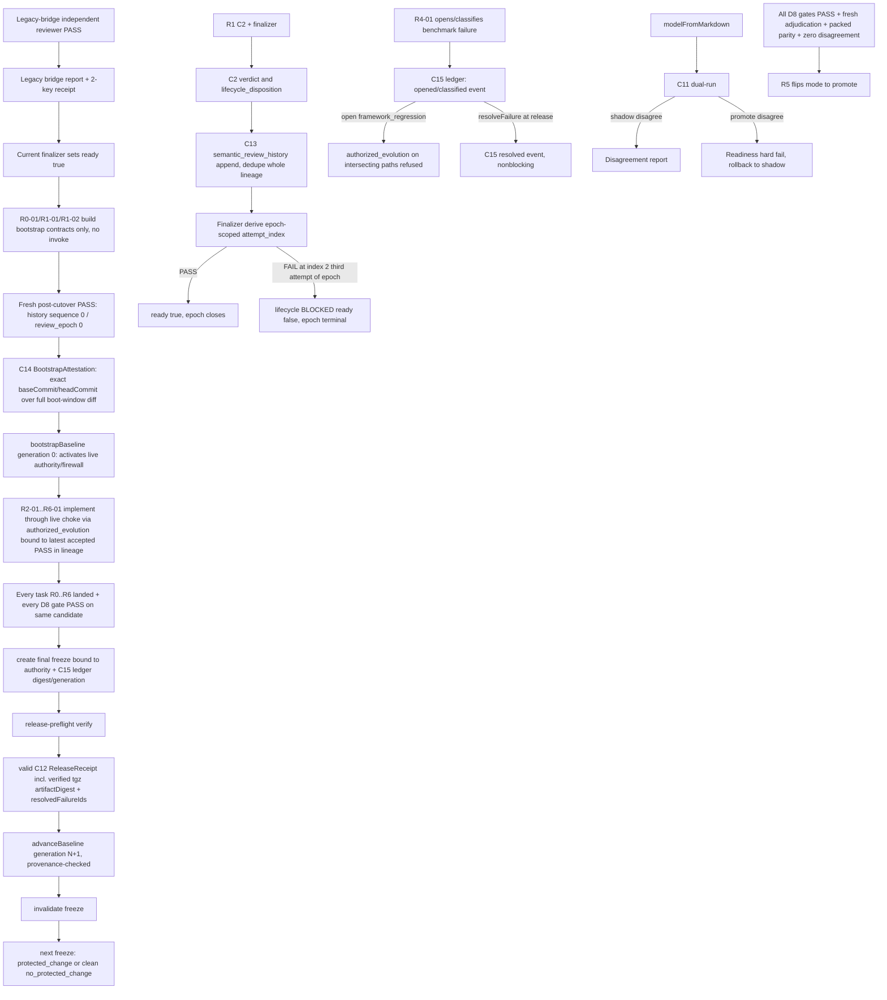

# Design

## Boundary

- **Owns:** Fail-closed baseline authority lifecycle grounded in an exact one-time C14 attestation (bootstrapReviewDigest bound to the fresh post-cutover seed review, no treeDigest field, baseCommit equality-verified against the durably captured `bootWindowBaseCommit` legacy-bridge artifact field written by a dedicated pre-implementation lifecycle worker, never a task-DAG member), reserved baseline transitions with exact predecessor provenance, a narrow sequence-bound boot-window exemption (I9) with no partial R0/R1 publish, non-self-referential freeze with generation binding plus a durable C15 benchmark-failure ledger digest+generation bound into the same freeze, freeze-carried `remediatedFailureIds` tracing only gate-proven remediation into an exact-equal C12 `resolvedFailureIds` (I12) that `resolveFailure` itself independently re-verifies against the persisted receipt bytes and id membership before ever appending (I13), D1 sole allowlist with two reserved control-plane paths, tagged C1 change-intent that gates unproven changes without freezing legitimate evolution and that must reference ledger failure_ids for benchmark_remediation, `authorized_evolution`'s durable-spec check on the real `workflow_policy.planning_depth` field with `authoring.requirements`/`authoring.design` validated as a separate lifecycle-state check and its PASS citation always rebinding to the latest lineage-matching entry so a legitimate post-PASS correction never self-locks (I14), C2 verdict vs lifecycle disposition and an epoch-scoped attempt-index repair_round (I10), durable semantic review lineage with whole-lineage dedupe and review_epoch (C13), the C12 release receipt contract with verified artifact bytes and resolved-failure tracking, complete C-IR dual-run with deterministic ASCII-comparator sort and exact promote criteria, global cross-boundary ownership derived from the complete anchorsByTask projection, never limited to declared boundaries (I7), semantic-firewall test discovery, public fixture field schema (planning_depth None|Compact|Full, no Standard), kernel ban wire, release gates, migration sequencing, an authoring-lifecycle ordering invariant binding validator-plus-grounder confirmation strictly before reviewer digest computation (I15), an L0 bridge preflight-then-stage lifecycle with rollback/quarantine short of the literal SPEC_READY promotion (I16), canonical source-vs-installed script authority forbidding a self-installed L0 bypass (I17), an append-only, fail-closed, provenanced C15 misclassification-correction mechanism that never silently unblocks a release (I18), an explicit single-process concurrent-writer declaration that does not overclaim atomic rename as concurrency arbitration (I19), a durable per-stage C16 `AuthoringValidationReceipt` binding exact digests for every authoring artifact so a `validated` reading is never trusted on the enum alone (I20), and a single atomic `spec-authoring-validation.cjs` coordinator as the sole writer of that receipt and any authoring-stage `validated` transition (D13, I21).
- **Reads:** Specs v2.1 scripts, B1 harness, package inventory tests, approved research, tracked plan.
- **Writes/exposes:** Modules and schemas named below; surgical package.json scripts preserving version; public pool fixtures; `*.semantic-firewall.test.js`; gitignore for freeze state.
- **Outside boundary:** Private/sealed bodies, inventing PASS while ready=false, Grok-as-gate, unrelated version bumps, domain case fixes.

## Typed Anchors

| ID | Type | Target | Role | Access | Action |
|---|---|---|---|---|---|
| A-D-01 | file | `specs/_shared/Research-stop-case-patching-specs-2026-08-15.md` | approved decision authority | read | read |
| A-D-02 | file | `plans/20260815-cafekit-semantic-eval-firewall.md` | tracked decision record | read | read |
| A-D-03 | file | `plans/specs-v2-remake-blueprint.md` | specs v2.1 blueprint constraint | read | read |
| A-D-04 | file | `docs/benchmark-workflow.md` | B1 operator docs constraint | read | read |
| A-D-05 | file | `packages/spec/src/claude/skills/specs/SKILL.md` | specs skill surface | read | read |
| A-D-06 | file | `README.md` | product north-star documentation | read | read |
| A-D-07 | command | `node packages/spec/src/claude/scripts/validate-spec-output.cjs specs/cafekit-semantic-eval-firewall` | structural validation entry | read | read |
| A-D-08 | command | `node packages/spec/src/claude/scripts/spec-ground.cjs specs/cafekit-semantic-eval-firewall --root .` | grounding entry | read | read |

## Decisions and Invariants

### D1 — Change-firewall: sole allowlist, baseline lifecycle, freeze binding

- **Decision:** Gate module `packages/spec/src/claude/scripts/change-firewall.cjs` exports loadBaselineAuthority, assertBaselineUsable, bootstrapBaseline, advanceBaseline, deriveProtectedChangedPaths, computeProtectedTreeDigest, computeProposalDigest, computeCandidateDigest, assertHotspotChangeAllowed, createFreezeManifest, verifyFreezeManifest, invalidateFreeze, and NO_CHANGE_ATTESTATION_DIGEST. The gate accepts a C1 **tagged change-intent**: `benchmark_remediation` (today's framework-regression-only path) or `authorized_evolution` (legitimate feature, compatibility, security, or maintenance change to the same protected paths, gated on a fresh durable spec plus independent PASS, never a bypass for an un-adjudicated benchmark failure) — see C1. The gate never blanket-freezes legitimate product development on protected paths; it blocks only unproven or unauthorized changes.
- **Sole normative protected allowlist (D1 is the only list):** exact directory prefixes and paths: `packages/spec/src/claude/scripts/`, `packages/spec/src/claude/skills/specs/`, `packages/spec/scripts/` (directory prefix; covers benchmark-workflow.mjs, release-preflight.mjs, semantic-firewall-test-discovery.cjs, run-skill-self-tests.mjs, benchmark-adjudicate.mjs, and candidate-isolation.mjs without a second list), `packages/spec/benchmarks/` (directory prefix) with reserved control-plane exceptions for `packages/spec/benchmarks/release-baseline.json` under C10 only and `packages/spec/benchmarks/benchmark-failure-ledger.json` under C15 only, `packages/spec/bin/phases/copy-payload.js`, `packages/spec/bin/__tests__/` (directory prefix; covers every owned proof/contract test under this path, including `package-inventory.test.js`, `validator-grounding.test.js`, `specs-v2-validator-grounder-contract.test.js`, `develop-contract.test.js`, and every `*.semantic-firewall.test.js` basename), `packages/spec/package.json`, `packages/spec/.gitignore`. **Excluded:** `packages/spec/.cafekit-release/**`. Prefix coverage is the sole machine-checkable rule; plan, requirements, and tasks must not maintain a second enumerated list — every task write_set is checked against this rule instead of being copied into it.
- **Reserved baseline file precedence:** `packages/spec/benchmarks/release-baseline.json` is control-plane authority, not ordinary hotspot content. `deriveProtectedChangedPaths` and proposal path-set derivation MUST remove this exact path from the candidate D1 set **before** computing the working-tree diff against `baselineCommit` — reserved-path exclusion is evaluated first and takes precedence over the generic `packages/spec/benchmarks/` prefix match, so the file's own bootstrap/advance writes never appear inside a derived "protected change" and never self-block authority rotation. Only named transitions bootstrapBaseline and advanceBaseline may write it, after verifying C10 schema, prior digest when required, generation+1, a valid independent-PASS digest (bootstrap) or C12 release receipt (advance), and current freeze/candidate where required. Exclusion from C1 derivation does not remove protection: an out-of-band edit (hand-edited bytes, wrong generation, broken prior-digest chain, or a shape outside the C10 discriminated union) still fails `loadBaselineAuthority`/`assertBaselineUsable` the next time freeze or preflight runs and exits 2 — the file is guarded by C10's own load/validate checks instead of the generic C1 gate.
- **Reserved ledger file precedence:** `packages/spec/benchmarks/benchmark-failure-ledger.json` is control-plane authority under **C15 BenchmarkFailureLedger**, not ordinary hotspot content, exactly parallel to the reserved baseline file above. `deriveProtectedChangedPaths` and proposal path-set derivation MUST remove this exact path from the candidate D1 set **before** computing the working-tree diff, so the ledger's own `openFailure`/`classifyFailure`/`resolveFailure` writes never appear inside a derived "protected change" and never self-block. Only these four named C15 transitions (`openFailure`, `classifyFailure`, `reclassifyFailure`, `resolveFailure`) may write it; every other command needing the ledger (`assertHotspotChangeAllowed`, `createFreezeManifest`, `verifyFreezeManifest`) may only load and read it via `loadFailureLedger`/`assertFailureLedgerUsable`. Exclusion from C1 derivation does not remove protection: a missing-when-required, malformed, or provenance-broken ledger still fails `loadFailureLedger`/`assertFailureLedgerUsable` the next time the gate, freeze, or preflight runs and exits 2 — there is no bypass for any `change_intent`, caller flag, or the legitimately-absent (zero-failures-ever-opened) state, which is bound via `NO_FAILURES_ATTESTATION_DIGEST` rather than skipped.
- **Baseline equality and empty protected paths (authority-state conditioned, no blanket rule):** validity depends on the current authority `state`, not on `baselineCommit == HEAD` alone:
  - `state = bootstrap`: derived protected paths empty always exits 2 — bootstrap is only valid bound to a real independent-PASS digest over a non-empty protected change set; there is no valid "no-change" bootstrap.
  - `state = released`: derived protected paths empty is always valid, including when `baselineCommit == HEAD` — this is the normal path for a clean npm pack/prepack after a release with no further D1 edits. `createFreezeManifest` must then emit `changeKind = no_protected_change`, omit the C1 proposal entirely, set `proposalDigest = NO_CHANGE_ATTESTATION_DIGEST`, and still bind `baselineAuthorityDigest`/`baselineGeneration` from the current authority record.
  - Non-empty derived protected paths, in either state, always require a C1 proposal whose variant-specific path field is the exact sorted-set match of the derived paths. Only `benchmark_remediation` carries `primary_failure_class`, which must be `framework_regression`; `authorized_evolution` has no class field and is judged only by its own C1 branch.
  - `baselineCommit` must be a git ancestor of HEAD or equal to HEAD; there is no blanket ban of HEAD equality after bootstrap, and no blanket "equality + empty always exits 2" rule that ignores authority state.
- **Normative sequence (boot-window exact, see D11/I9):** legacy-bridge independent PASS (itself gated on the lifecycle worker's green preflight over a staged, unconsumed artifact per D11/I16) unblocks coding on R0-01/R1-01/R1-02 only (the narrow boot-window) → those three tasks land C2/C13 cutover without invoking `bootstrapBaseline` and without any freeze/publish → a fresh, real, post-cutover semantic review runs on the then-current `semantic_model` digest and PASSes, becoming `semantic_review_history` entry `sequence 0` / `review_epoch 0` (the seed PASS) → a one-time C14 BootstrapAttestation (exact attested `baseCommit`/`headCommit` spanning the full boot-window diff, `bootstrapReviewDigest` bound to that seed PASS entry's `review_receipt_digest`, never a merge-base guess) → `bootstrapBaseline` authority generation 0 (requires non-empty protected paths) activates live C1/C9/C10/C15 gating → R2-01 through R6-01 implement under that live gating, each protected write authorized via `authorized_evolution` bound to the same seed PASS entry → only after every task R0-01..R6-01 has landed and every D8 release gate has passed on the same candidate: create the final fresh freeze bound to authority digest+generation+C15 ledger digest+generation → candidate verification → valid C12 release receipt matching freeze/candidate (artifactDigest independently re-hashed from the actual packaged .tgz) → `advanceBaseline` generation N+1 with provenance-checked `previousBaselineDigest` and invalidate freeze → next freeze required, which may legitimately be a `no_protected_change` freeze under the released-state rule above (clean next release). A release receipt covering only the boot-window (R0-01/R1-01/R1-02) is refused — there is no partial publish.
- **Self-derive:** deriveProtectedChangedPaths excludes the reserved release-baseline.json path first, then uses authority baselineCommit only — sourced from the C14 attestation at bootstrap and from the authority record for every routine freeze thereafter, never an implicit `origin/main`, empty tree, or ad hoc merge-base guess; git ACDMR plus untracked non-ignored under D1; excludes the freeze path; sorts unique; rejects empty caller substitution and base overrides.
- **Closed environment-override channel (no name-shape heuristic):** the only environment-variable input this gate ever inspects is the exact presence of six reserved keys — `CAFEKIT_BASE_COMMIT`, `CAFEKIT_BASELINE_COMMIT`, `CAFEKIT_BASE_REF`, `CAFEKIT_BASELINE_REF`, `CAFEKIT_BASE_PATH`, `CAFEKIT_BASELINE_PATH` — checked by exact key name (`Object.prototype.hasOwnProperty` on `process.env`) only, never by value and never logged; presence of any of these six exits 2 (R1.3). No other environment variable name is ever scanned, pattern-matched, or token-guessed: an env key this runtime never reads cannot influence baseline authority and is not an override attempt, so a third-party ambient var (e.g. `GITHUB_BASE_REF`) or an unrecognized name merely shaped like `*BASE*`/`*BASELINE*` (e.g. `OVERRIDE_BASE_COMMIT`, `FORCE_BASELINE_REF`) never false-positives and is never treated as a channel this boundary owns.
- **Freeze state:** fixed path `packages/spec/.cafekit-release/change-firewall-freeze.json`. R0 owns `.gitignore` entry for `.cafekit-release/`. Compute digests then write. Always required on release/prepack; missing/stale after advance exit 2. Empty paths use changeKind no_protected_change and NO_CHANGE_ATTESTATION_DIGEST per the released-state rule above, never during bootstrap. Non-empty paths require C1 path-set equality; digests live only in C9.
- **Production callers:** freeze in benchmark-workflow.mjs; verify in release-preflight.mjs; prepack/prepublishOnly; version field preserved.
- **Rejects ambiguity:** a blanket equality+empty rule that does not distinguish bootstrap from released state, freeze under benchmarks as digest input, C1-held digests, generic proposal for authority rotation, divergent allowlist lists, treating reserved-path exclusion as removing C10's or C15's own protection, treating every non-`framework_regression` class as a ban on all product change, using `authorized_evolution` to hide an un-adjudicated benchmark failure, an implicit merge-base guess standing in for an attested bootstrap base, treating a missing or malformed benchmark-failure ledger as a bypass instead of a fail-closed exit, treating the environment-override channel as an open-ended name-shape scan rather than the closed six-key `CAFEKIT_BASE_COMMIT`/`CAFEKIT_BASELINE_COMMIT`/`CAFEKIT_BASE_REF`/`CAFEKIT_BASELINE_REF`/`CAFEKIT_BASE_PATH`/`CAFEKIT_BASELINE_PATH` enumeration, and two implementers reading the boot-window (D11/I9) differently — the exemption is exactly R0-01/R1-01/R1-02 build-only, never a fourth task, never an implicit invocation of `bootstrapBaseline` before the seed PASS exists, and never a partial R0/R1 release; running any of these named transitions from a self-installed `.claude/`/`.codex/` projection instead of this checkout's canonical source scripts (I17); or assuming atomic rename alone arbitrates two genuinely concurrent callers instead of the single-process serialization this spec actually requires (I19).
- **Negative path:** base override (a CLI argument, a caller-supplied field outside exact schema, or presence of one of the six reserved `CAFEKIT_BASE_COMMIT`/`CAFEKIT_BASELINE_COMMIT`/`CAFEKIT_BASE_REF`/`CAFEKIT_BASELINE_REF`/`CAFEKIT_BASE_PATH`/`CAFEKIT_BASELINE_PATH` env keys — no other env name is ever a channel), bootstrap with empty protected paths, missing/stale freeze, authority generation mismatch, digest mismatch, out-of-band release-baseline.json edit failing C10 load/validate, a missing/malformed/out-of-band benchmark-failure-ledger.json edit failing C15 load/validate, a stale freeze after any accepted C15 ledger event of any current or future named type (never an enumerated, recount-prone list here), an `authorized_evolution` proposal with a stale/mismatched spec digest, a referenced PASS entry whose `semantic_digest` differs from the current `spec_semantic_digest`, missing independent-PASS receipt, any `authorized_evolution` proposal whose derived paths intersect an open (unclassified or classified `framework_regression`, unresolved) ledger entry — refused unconditionally, always exit 2, regardless of anything the proposal cites, because `authorized_evolution` has no `failure_ids` field and can never reference or bypass via one; the only route past an open ledger entry is a `benchmark_remediation` proposal whose `failure_ids` exactly and correctly names it, a `planned_write_set` that is not the exact derived-path match, `bootstrapBaseline` invoked before the seed C13 PASS entry exists, or any release receipt whose covered scope is only R0-01/R1-01/R1-02 → exit 2 (or refused). R0 owned tests must assert both that a legitimate bootstrap/advance/ledger transition never appears inside a derived C1 path-set, and that an out-of-band edit to release-baseline.json or benchmark-failure-ledger.json still fails closed.
- **Anchors:** A-D-02, A-D-01

### D2 — Kernel vocabulary domain-neutral; lenses question-only; ban always invoked

- **Decision:** Kernel owns domain-neutral primitives only. Lens packs via lens-registry.cjs. Ban in oracle-hardcode-ban.cjs. validate-spec-output.cjs must import and invoke ban unconditionally for Compact and Full. Fail closed on missing module, invalid lens keys, expected-answer field, benchmark identity oracle field, prompt-hash oracle, or skipped invocation. Integration/mutation test instruments ban and proves real entrypoint call. Single canonical owner-write anchor for validate-spec-output on R2; no duplicate consumer role on the same path.
- **Rejects ambiguity:** Optional require-wire; dual conflicting anchors for the same path.
- **Negative path:** Unwired ban fails validate and wire test.
- **Anchors:** A-D-05

### D3 — Frozen semantic review receipt C2

- **Decision:** After R1-01 cutover, validation.semantic_review uses exactly C2 keys including separate verdict and lifecycle_disposition. Digest remains computeSemanticDigest21 over authoring bytes and topology. Before cutover, legacy 2-key shape is the only shape the current finalizer accepts.
- **Rejects ambiguity:** Conflating reviewer FAIL with lifecycle BLOCKED; counterexample-only PASS after cutover.
- **Negative path:** Extra keys, missing keys, wrong types, wrong nullability fail structural validation.
- **Anchors:** A-D-05

### D4 — Finalizer only promoter; attempt-index repair_round; separate disposition

- **Decision:** Only spec-readiness.cjs atomic replace may set ready true, and only when C2 completed, verdict PASS, lifecycle_disposition CONTINUE, derived repair_round in 0..2, no blocking findings or unresolved_decisions, digest fresh, validate and ground clean. Before computing repair_round or appending anything, the finalizer first checks whether the latest entry of the current review_epoch already shows lifecycle_disposition BLOCKED and refuses the whole operation outright if so (no attempt_index computed for a fourth attempt — see I10/C13). repair_round is the C13 `attempt_index`: `attempt_index` 0, 1, 2 name the **first, second, and third attempt respectively**. PASS at attempt_index 0, 1, or 2 may promote. FAIL at attempt_index 0 or 1 → ready false, next attempt allowed. FAIL at attempt_index 2 (the third attempt) → lifecycle_disposition BLOCKED, ready false, blocking any fourth attempt (index 3 never occurs). The finalizer is the sole writer of `semantic_review_history`; caller-supplied `repair_round`, `semantic_review_history`, or `lineage_id` values are rejected outright when they diverge from the finalizer-derived state (see C13) — this is the single rule, never a silent ignore. `lineage_id` is stable across ordinary semantic authoring edits per I6; it is never reset by an authoring digest change, only by spec recreation (a genuinely new `created_at`). A required authoring stage becomes `validated` only via a current validator-plus-grounder pass over its own bytes, strictly before the reviewer computes any digest claiming to cover it — never the reverse order (see I15).
- **Rejects ambiguity:** Writing that non-PASS is both FAIL and BLOCKED as one field; trusting input repair_round; resetting lineage on authoring digest change.
- **Negative path:** FAIL with CONTINUE at index 2 is invalid; disposition BLOCKED without ready false fails owned tests; a caller-supplied repair_round/history that is silently accepted instead of rejected fails owned tests; a new entry silently computed and appended against an epoch whose latest entry already shows BLOCKED, instead of being refused outright before any attempt_index is derived, fails owned tests.
- **Anchors:** A-D-05

### D5 — Dual-run IR mode, wiring, disagreement, rollback under C11

- **Decision:** Mode file packages/spec/src/claude/scripts/semantic-ir-mode.json holds mode off|shadow|promote, mode_writer task id, updated_at ISO. Default after R3-01 is shadow. modelFromMarkdown and readiness both invoke C11 compare when shadow or promote. On shadow disagreement: write C11 disagreement report under packages/spec/reports/ir-disagreement/; markdown remains semantic_model authority; ready unaffected by disagreement alone. On promote disagreement: readiness hard-fails. Mode off disables compare. Owned ir-dual-run-wire.semantic-firewall.test.js fails if either caller is unwired. Equality and digests follow C11 only. **Exact promote criteria:** R5 may flip mode from `shadow` to `promote` only when, on the same candidate (same `candidateDigest`): every currently ordered D8 release gate (freeze, deterministic, mutation, metamorphic, sealed-interface contract, non-inferiority, Claude/Codex parity, cost) has passed; a fresh C5 independent adjudication record exists for that exact candidate; Claude/Codex packed parity is confirmed with zero divergence; and the C11 shadow dual-run shows zero disagreements for that candidate. When required host evidence is missing or blocked, mode shall remain `shadow` or `off` and readiness shall remain not-ready — never a simulated promote. **Rollback:** on any promote-mode disagreement, the writer (R5-01, or R3-01 if R5-01 is not the active writer) immediately writes mode back to `shadow`, the readiness decision for that cycle hard-fails, and promote is not sticky across the rollback — the next candidate must re-earn every gate above from `shadow` again.
- **Rejects ambiguity:** Orphan IR module; implementer-chosen projection or equality; promote surviving a rollback without re-earning every gate.
- **Negative path:** promote with disagreement hard-fails readiness; host-blocked evidence flipping to promote anyway fails owned tests.
- **Anchors:** A-D-03, A-D-05

### D6 — Three-pool firewall and public fixture owner

- **Decision:** Pool governance: public_regression n=8 in_repo, private_validation n=8 external_owner, sealed_holdout n=8 external_owner. Public assets under packages/spec/benchmarks/: public-regression.interface.json, public-regression.manifest.json, public-fixture-PR-01.json through public-fixture-PR-08.json. Each body conforms to C4 field-level schema. No private/sealed bodies or expected domain answer fields in-repo. The sealed generation rotates once per RC; tuning/authoring processes receive no sealed body, oracle, result, or case-level feedback. A retired sealed case remains external for two completed releases before it may be intentionally copied into public regression, with its former sealed generation recorded only as a non-sensitive label in the exposure ledger.
- **Machine authority:** `sealed-governance.mjs` validates a bro-owned external exposure ledger through the fixed untracked pointer `packages/spec/.cafekit-release/sealed-exposure-pointer.json`, conforming to `sealed-exposure-pointer.schema.json`. The pointer exact keys are schema_version, rc_version, sealed_generation, external_ledger_digest, prior_generation_digest, tuning_access_count fixed 0, created_at. The external ledger conforms to `sealed-exposure-ledger.schema.json` and has exact top-level keys `schema_version` fixed `"1"`, `ledger_id`, `generations`; `generations` is a non-empty ASCII-sorted array whose entries have exact keys `rc_version`, `sealed_generation`, `generation_digest`, `prior_generation_digest` nullable only on the first entry, `tuning_access_count` fixed 0, `created_at`, `retirements`; each retirement has exact keys `case_label`, `case_digest`, `retired_at_release_generation`. Runtime invocation is exactly `sealed-governance.mjs verify --external-ledger <absolute-file>`: the script accepts no environment/cwd/HOME fallback, requires an explicitly supplied absolute regular non-symlink file outside the checkout and package tree, hashes its exact bytes to match the fixed pointer, loads the current published C10 generation itself from fixed project authority, and never prints case bodies. It refuses the same generation on two RC versions, a nonzero tuning access count, duplicate labels, unsorted or duplicate generations, or a broken digest/predecessor chain. Public promotion requires a retirement record whose `retired_at_release_generation` is at least two less than the current published C10 release generation; only non-sensitive case labels and digests may cross into the public manifest. The external body and ledger never enter git/npm.
- **Rejects ambiguity:** Public pilot as sealed evidence; fixtures as bare IDs without fields.
- **Negative path:** Private or sealed body path under packages/spec fails closed.
- **Anchors:** A-D-04

### D7 — Candidate isolation and independent adjudication

- **Decision:** `candidate-isolation.mjs` creates a unique realpath-resolved root outside the checkout and package tree for every run. Before any mutation it normalizes the relative target lexically, rejects absolute/parent traversal, resolves and realpaths the deepest existing parent component, and proves that parent is contained by the fixed root; every traversed component and the final target must be non-symlink. It writes a uniquely named temp file in that verified parent, fsyncs, atomically renames within the same directory, re-lstats/re-realpaths the result, cleans temp output on failure, and only then returns the canonical path. Thus no byte can be written outside the root before containment is known. It emits a `CandidateRunRecord` with exact keys `schema_version` fixed `"1"`, `run_id`, `candidate_id`, `candidate_digest`, `task_slot_id`, `corpus_generation`, `corpus_digest`, `failure_id` nullable, `artifacts` (non-empty ASCII-sorted objects with exact `path`, `digest`, `media_type`), `telemetry` (no quality/readiness booleans), `started_at`, `completed_at`; unknown keys fail. It never contains arm, oracle, rubric detail, expected answers, or source-path escape. C5 binds this exact record and cannot replay across identities.
- **Rejects ambiguity:** Runner quality booleans alone set release ready.
- **Negative path:** Missing adjudication or arm/oracle fields blocks release.
- **Anchors:** A-D-04

### D8 — Ordered release gates, repair budget, matrix

- **Decision:** Gates order and exact C7 keys: `freeze`, `deterministic`, `mutation`, `metamorphic`, `sealed_interface`, `non_inferiority`, `claude_codex_parity`, `cost`. Every result binds the same run/candidate and carries typed evidence plus its independently recomputed digest; missing/unknown/stale/mismatched evidence is non-PASS. The controller stops before cost on a correctness non-PASS. C7 below defines every evidence key and PASS predicate; schema authors may encode those definitions but may not invent adjacent semantics. `non_inferiority` passes only when candidate minus baseline adds zero hard-failure ids and candidate aggregate is at least baseline; equality passes and no statistical margin weakens either condition. repair_round follows D4. Claude/Codex are blocking; Grok is optional stress.
- **Rejects ambiguity:** Mean score or Grok alone greenlights; a fourth attempt occurring after the third attempt (index 2) is BLOCKED.
- **Negative path:** FAIL at index 2 (third attempt) still promoting ready, or a fourth attempt (index 3) being reached at all, fails owned tests.
- **Anchors:** A-D-04, A-D-02

### D9 — B1 internal and unshipped

- **Decision:** B1 internal; inventory and copy-payload exclude B1 and private/sealed payloads. **Rationale (settled scope decision, not unresolved):** the benchmark harness (B1) is source-only release-governance tooling that gates CafeKit's own release process — it is never a Claude/Codex runtime payload shipped to end users. Shipping it would bloat the npm package and risk exposing oracle/rubric material to installers.
- **Rejects ambiguity:** Monorepo presence is ship permission; treating B1 exclusion as still open for debate.
- **Negative path:** Inventory fails if B1 is product ship surface.
- **Anchors:** A-D-04

### D10 — Machine ownership write_sets and sequencing

- **Decision:** Typed ownership boundaries with disjoint write_sets; dependency-ordered sequential same-path handoffs. Ownership-contention checking is **global and pairwise across every boundary in `coordination.boundaries`, not only within one boundary**: for any two tasks anywhere in the topology, if both hold a write (create/modify) anchor for the exact same target, that pair must be a producer/consumer pair with a direct DAG edge — the earlier task in DAG order owns the write anchor that comes first, the later (dependent) task carries both its own write anchor (for its own further change) and a separate `consumer`/read anchor for the same target, and the registry DAG must place the dependent task after the producer (a direct `dependencies` entry, not merely a transitive one). That direct edge is evidenced by **exactly one** `dependency` boundary per producer/consumer pair (schema carries a single `deliverable`; a second boundary for the same pair would duplicate the producer in the registry-dependency projection and always fail it) — a pair sharing several same-target write conflicts is proven by one representative dependency boundary plus the shared registry edge, not one boundary per shared path. A same-target write pair with no direct DAG edge at all is a defect, whether or not the two tasks share one `ownership` boundary. Every create or modify proof target listed under owner, including all R5 proof surfaces. Dual-writer negative fixture expects validate-spec-output exit 1 for both an in-boundary same-target pair and a cross-boundary same-target pair with no direct DAG edge. No extra OS lock.
- **Global-scan mechanism (exact, not left to per-boundary iteration):** the candidate pair set for this check MUST be derived directly from the complete `anchorsByTask` write-anchor projection — every task's every write anchor, collected independently of which (if any) `coordination.boundaries` entries happen to reference them — never only from `ownership.write_sets` declarations or from iterating the already-declared `dependency` boundaries. Concretely: build a `target -> [task]` map from every write anchor in the topology; for every target with two or more writer tasks, that exact pair is proven safe only when **some** `dependency`-type boundary connects those two tasks in the correct producer→consumer DAG direction — **any single existing boundary between that pair covers every target they share**, regardless of which specific target its own `deliverable` field names (this is the mechanism that makes the one-boundary-per-pair rule above actually machine-true instead of aspirational prose); a pair with no such boundary at all is a defect, exit 1, **even when the shared target was never named as any boundary's `deliverable` and even when the two tasks do not otherwise share an `ownership` boundary** — an omitted boundary is exactly the failure mode this scan exists to catch, not a case it silently tolerates. Within this feature, `validate-spec-output.cjs` is R1-01's sole write anchor (R1-01 is the file's canonical owner); R1-01 implements/hardens this global scan as part of its own edit to that file. R6-01 holds only a `consumer`/read anchor on the same file — it owns the dual-writer negative-fixture proof, never the scan mechanism's own implementation (see R6-01, R8.2).
- **Rejects ambiguity:** Checklist-only sequencing; treating same-boundary contention as the only case that matters; one dependency boundary per shared path (breaks the registry-projection check); deriving candidate pairs only from declared boundaries instead of the full `anchorsByTask` projection (this is exactly how a real same-target pair can go undetected merely because nobody remembered to name it in any boundary).
- **Negative path:** Overlapping writers in one ownership boundary, or overlapping writers across two different boundaries with no direct DAG edge between them, fail validation exit 1. A same-target pair named in **no** `coordination.boundaries` entry at all (an entirely omitted boundary) fails the same way — the scan does not require a target to have been pre-declared anywhere to be checked.
- **Anchors:** A-D-02

### D11 — Legacy bootstrap bridge after reviewer PASS only, with an exact one-time boot-window (defer, no bootstrap exemption)

- **Decision:** No implementation while ready=false. After independent PASS: write specs/cafekit-semantic-eval-firewall/reports/bootstrap-legacy-bridge-review.json with explicit PASS, zero blockers, reviewed_criteria covering all RN.M, semantic_digest, and an exact `bootWindowBaseCommit` field — the full 40-hex git commit object id that is the actual repository HEAD at the exact moment this report is written, before any R0-01 code lands; derive legacy 2-key receipt; run current finalizer + validator + grounder (this source checkout's own canonical `packages/spec/src/claude/scripts/`/`packages/spec/scripts/` entrypoints — never a self-installed or hand-copied `.claude/`/`.codex/` consumer projection, see I17) to set ready true before any code. **`bootWindowBaseCommit` is a durably captured fact, never a later reconstruction:** it is written once, at bridge time, via a real `git rev-parse HEAD` at that exact moment — not inferred later from git history, not a merge-base guess — and is the sole source `bootstrapBaseline` reads for C14's `baseCommit` (see C14). **Boot-window trust boundary (exact, not implementer-chosen):** the legacy-bridge PASS unblocks coding on **exactly R0-01, R1-01, R1-02, in that sequential order, and no other task** — these three land the bootstrap contracts themselves (C1/C9/C10/C14/C15 schemas, the change-firewall module, C2/C13 cutover) but MUST NOT invoke `bootstrapBaseline`, MUST NOT create a real freeze, and MUST NOT run `advanceBaseline`/publish during this window; there is no implicit "R0 is exempt, everything after goes through the choke" reading and no per-implementer discretion over which tasks are in the window. Once R1-01/R1-02 land C2/C13 cutover, a **fresh, real, independent semantic review MUST run on the then-current `semantic_model` digest** (not the disposable legacy 2-key bridge report) and PASS; the finalizer appends this as `semantic_review_history` entry `sequence 0` / `review_epoch 0` — the true first entry of the durable lineage. Only after that seed PASS exists: (1) a C14 BootstrapAttestation is formed with `baseCommit` = the exact `bootWindowBaseCommit` field from the bridge report above (never independently re-derived or guessed) and `headCommit` = the actual current HEAD at that later moment, spanning the **exact full protected diff of the whole boot-window** (R0-01+R1-01+R1-02 changes, never an empty or partial diff), and `bootstrapReviewDigest` bound to the seed PASS entry's `review_receipt_digest`; (2) `bootstrapBaseline` verifies `baseCommit` equals the bridge report's `bootWindowBaseCommit` exactly (exit 2 on mismatch) and then writes generation 0, activating live C1/C9/C10/C15 authority/firewall for the first time; (3) every `authorized_evolution` proposal for R2-01 through R6-01's own protected writes MUST bind `spec_ref` to this same feature spec and `independent_pass_receipt_digest` to the **latest accepted PASS in this same lineage per I14** — ordinarily this exact seed entry, and only a later entry in the same lineage if a legitimate post-seed requirements/design correction required a fresh re-PASS (never a PASS from a different spec/lineage, and never the disposable legacy bridge report); R2-01 through R6-01 now implement fully through the live choke. **No partial publish:** the final freeze, C12 ReleaseReceipt, and `advanceBaseline` (real "released" state) MUST NOT run until every task R0-01..R6-01 has landed and every D8 release gate has passed on the same candidate — a release receipt whose covered scope is only the boot-window (R0-01/R1-01/R1-02) is refused. Normative sequence for authority: legacy-bridge PASS → R0-01/R1-01/R1-02 build (no invoke) → fresh seed PASS (sequence 0/review_epoch 0) → C14 attestation over the full boot-window diff → bootstrapBaseline generation 0 → R2-01..R6-01 through live choke → final freeze → verify → release receipt → advanceBaseline.
- **Legacy-bridge artifact lifecycle and ownership (exact, pre-implementation L0 gate — never a task-DAG member, never a heuristic check):** the bridge report is not written by any of the 10 feature tasks and is not itself a task-graph node (adding it as one would create a bootstrap cycle, since R0-01 already depends on it existing). Three ordered steps happen, strictly in this order, entirely before R0-01 begins: (1) a **fresh, independent reviewer** performs the semantic review and produces the PASS verdict evidence (the same review mechanism already used generically by this project's finalizer) — the reviewer does not itself write the bridge artifact; (2) a **dedicated lifecycle worker**, acting only after that PASS verdict evidence exists, **preflights** — on a scratch/in-memory candidate never persisted to the tracked bridge path — every condition the finalizer itself will require (structural validator clean, grounder clean, every required authoring stage already `validated` per I15/C16 — applied directly, not through the not-yet-built `spec-authoring-validation.cjs`, under D13's narrow, one-time legacy-bootstrap exception — a fresh independent reviewer PASS whose `semantic_digest` equals the CURRENT `spec_semantic_digest`, zero unresolved blocking findings/decisions); only a green preflight is followed by (3) the same worker's **sole real write**, strictly before any R0-01 file is created or modified, of `specs/cafekit-semantic-eval-firewall/reports/bootstrap-legacy-bridge-review.json`, capturing `bootWindowBaseCommit` via a real `git rev-parse HEAD` executed at that exact moment (never a value computed earlier or later, and never written from a red/failed preflight — see I16). The artifact's key set is exactly: `schema_version` fixed `"1"`, `verdict` fixed `"PASS"`, `blocking_count` fixed `0`, `reviewed_criteria` (array covering every RN.M), `semantic_digest` (sha256 colon plus 64 lowercase hex), `bootWindowBaseCommit` (full 40-hex git commit object id), `written_at` (ISO string) — a closed set, no additive fields. **Staged/unconsumed until literal SPEC_READY, rollback/quarantine on finalizer failure (I16):** once written, this artifact is staged — it authorizes the boot-window build-only construction but is never itself the `SPEC_READY` state, which is reached only when the finalizer's own atomic promotion (`spec-readiness.cjs`) sets `ready_for_implementation=true` on this same digest. A finalizer failure, error, or abort strictly before that atomic promotion completes requires the exact artifact and any temp/scratch evidence files to be moved to quarantine (or deleted) — never edited in place, never left staged for reuse against a different digest; recovery is fixing the root cause, then a fresh independent review plus a fresh preflight on the corrected digest, never a resume from quarantine. **Machine-checkable verification (not heuristic):** R0-01's own owned test suite (`change-firewall.semantic-firewall.test.js`) asserts, as a precondition before any of its own change-firewall assertions run, that this artifact already exists and exactly matches this key set — an absent or malformed artifact fails R0-01's owned tests nonzero and blocks any further R0-01 verification from proceeding; R0-01 itself never creates or modifies this artifact, only asserts it (see R1.14). This is separate from, and precedes, C14's own later runtime check (`bootstrapBaseline` independently re-verifying `baseCommit` equals this same field, exit 2 on mismatch) — the R0-01 precondition check catches an absent/malformed artifact at authoring/verification time, long before `bootstrapBaseline` is ever invoked.
- **Rejects ambiguity:** Coding while ready=false; emergent order without named transitions; treating any task beyond R0-01/R1-01/R1-02 as boot-window-exempt; invoking `bootstrapBaseline` against the disposable legacy 2-key bridge report instead of the fresh seed PASS; two implementers independently choosing different exemption scopes or different boot-window boundaries; publishing after only R0/R1 land; heuristically reconstructing `bootWindowBaseCommit` from git history or a merge-base guess instead of reading the durably captured bridge-report field; treating the seed PASS entry as the only citation R2-01..R6-01 may ever use even after a legitimate post-seed correction (see I14); leaving the bridge artifact ownerless or assigning it to any of the 10 feature tasks (would create a bootstrap cycle); writing the bridge artifact without a prior green preflight, or editing a staged artifact in place instead of quarantining it on finalizer failure (I16); running the L0-gate finalizer/validator/grounder from a self-installed `.claude/`/`.codex/` copy instead of this checkout's canonical source scripts (I17).
- **Negative path:** Develop while ready=false blocked by hard gate; `bootstrapBaseline` invoked before the seed `semantic_review_history` entry exists fails closed; `baseCommit` diverging from the bridge report's `bootWindowBaseCommit` fails closed; a fourth task's protected write during the boot-window (before generation 0 exists) with no C1 proposal is indistinguishable from any other unauthorized protected edit and fails closed once authority exists, and is a scope defect if attempted at all; a release receipt covering only R0-01/R1-01/R1-02 is refused; the bridge artifact absent or malformed at R0-01's precondition check fails R0-01's owned tests nonzero, before any bootstrap-time check ever runs; a red preflight followed by a real write anyway, or a staged artifact edited in place after a finalizer failure instead of quarantined, is a scope defect at bridge-ceremony time (I16).
- **Anchors:** A-D-02, A-D-01

### D12 — Semantic-firewall test reachability invariant

- **Current topology count:** The current canonical DAG contains 10 task files, including lifecycle-only R1-03. Any earlier round-history phrase saying “9 feature tasks” is descriptive history only and is superseded by this count plus `spec.json.task_registry`.

- **Decision:** R0 owns semantic-firewall-test-discovery.cjs wired into run-skill-self-tests.mjs. Discovery: sorted basenames of packages/spec/bin/__tests__/*.semantic-firewall.test.js. Aggregate runs all discovered. Repeatable --require-semantic-test basename fails if missing, not executed, or fails. V1–V11 require only their task basenames. R0 creates `bootstrap-activation.semantic-firewall.test.js` during the boot-window so lifecycle-only R1-03 may execute it without modifying source or test files; R0's own completion command still requires only change-firewall.semantic-firewall.test.js and release-preflight.semantic-firewall.test.js.
- **Rejects ambiguity:** Green without dedicated basename; R0 requiring future-task tests.
- **Negative path:** Missing required basename yields nonzero.
- **Anchors:** A-D-02

### D13 — Atomic authoring-validation coordinator (C16 sole writer)

- **Decision:** A new module `packages/spec/src/claude/scripts/spec-authoring-validation.cjs` (R0-01-owned shared primitive: `packages/spec/src/claude/scripts/spec-authoring-digest.cjs`, exporting raw-byte digest helpers, the tasks-bundle digest, and the `RESEARCH_ABSENT_DIGEST`/`TASKS_ABSENT_DIGEST` sentinels; coordinator itself R1-01-owned) is the sole atomic writer of any `authoring.requirements`/`authoring.design`/`authoring.research`/`authoring.tasks` transition to `validated` and of the new C16 `AuthoringValidationReceipt` at `validation.authoring_validation`. It builds an in-memory candidate spec.json (never persisted mid-run), invokes the canonical `validate-spec-output.cjs` and `spec-ground.cjs` (read/invoke only — their own source is never modified for this purpose beyond validate-spec-output.cjs's own R1-01-owned fail-closed freshness check below) over that exact candidate's current bytes, computes the C16 digests via the shared `spec-authoring-digest.cjs` primitive, and — only when every check passes cleanly — atomically replaces spec.json (write-temp-then-rename) with the updated `authoring.*` enum values and the fresh receipt written together in one operation. Any failure, partial check, or exception leaves spec.json completely unchanged; there is no partial persisted state and no separate step that writes the enum without the receipt or vice versa. `validate-spec-output.cjs` independently fails closed (exit nonzero) whenever it observes `authoring.<field> = validated` with the C16 receipt absent, missing an entry for that field, or digest-mismatched against that field's current bytes — it does not trust the coordinator ran correctly, it re-derives freshness itself using the same shared `spec-authoring-digest.cjs` primitive. `change-firewall.cjs`'s `authorized_evolution` check (R0-01) applies the identical freshness algorithm, via the same shared primitive, against `spec_ref`'s own `authoring.requirements`/`authoring.design` and receipt, rather than trusting the enum alone. `spec-scaffold.cjs` never writes `validated` for any authoring field — it writes only `draft` or `absent`, so a scaffold-driven edit can never leave a stale `validated` reading uncorrected regardless of what the receipt says; only the coordinator, after a fresh clean pass, may flip a field to `validated`.
- **Legacy-bootstrap exception (narrow, one-time, closes R11-C1's boot-window gap):** `spec-authoring-validation.cjs` does not exist until R1-01 lands it (D11/I9's boot-window, second of the three exempt tasks). Before that module exists — including this feature's own pre-cutover authoring cycle, covering this very remediation round — the D11 legacy-bridge lifecycle worker's preflight (I16) and any authoring-validation performed on this feature's own `requirements.md`/`design.md`/`research.md`/task files apply the identical freshness algorithm directly: invoke `validate-spec-output.cjs`/`spec-ground.cjs` against the exact in-memory candidate, then independently recompute and compare the per-stage digest immediately before writing the bridge artifact or citing a fresh PASS. This is a narrow, one-time exception scoped strictly to bootstrapping this feature's own spec before the coordinator's own code lands; it is never a permanent alternate runtime path once R1-01's coordinator exists, and it never accepts or reuses digest evidence computed against a different digest than the one currently under review (no cross-digest evidence, matching I14's own non-circularity rule).
- **Rejects ambiguity:** The `draft|validated` enum alone as sufficient freshness proof; any writer other than the coordinator setting a stage to `validated`; a partial coordinator run that persists the enum without the matching receipt or vice versa; treating the legacy-bootstrap exception above as license for a permanent direct-validation path after the coordinator exists.
- **Negative path:** `authoring.<field> = validated` with the receipt absent, missing that field's entry, or digest-mismatched fails the validator, the finalizer's `clean validate` precondition, and `authorized_evolution`'s C1 check identically, all treating the stage as `draft`.
- **Anchors:** A-D-07, A-D-08

### D14 — Reproducible control-plane transition witness

- **Decision:** Every C10 authority record and every C15 appended event carries `transition_witness` with exact keys `transition`, `predecessor_generation`, `predecessor_digest`, `input_digest`, `writer_version`, `resulting_generation`. The named writer computes `input_digest` over canonical validated transition input before writing. C10 uses one append-only envelope at `release-baseline.json`; the exact preceding record is therefore present in the same atomically replaced file. C15 already uses an append-only event ledger; the exact preceding event prefix is present in that same file. Each loader starts from the genesis entry, recomputes every permitted transition in order from exact prior canonical record or event-prefix bytes and persisted non-secret inputs, and refuses the entire file at the first witness that is not reproducible. No git lookup, caller-supplied predecessor, or separate sidecar is permitted. The first bootstrap/open event alone uses null predecessor fields.
- **Rejects ambiguity:** Treating generation plus predecessor digest alone as proof of a named transition; trusting caller-authored witness fields without recomputation.
- **Negative path:** Wrong transition, stale predecessor, skipped generation, mismatched input digest, unsupported writer version, or an out-of-band record exits 2.
- **Anchors:** A-D-01, A-D-02

### D15 — Bootstrap activation is a lifecycle task, not an implementation exemption

- **Decision:** R1-03 owns only the fixed runtime activation receipt `packages/spec/reports/bootstrap-activation.json`; it modifies no source/test/package file. R0-01 owns both `packages/spec/benchmarks/bootstrap-activation.schema.json` and `packages/spec/bin/__tests__/bootstrap-activation.semantic-firewall.test.js` during the boot-window. The receipt has exactly `schema_version` fixed `"1"`, `semantic_digest`, `seed_review_receipt_digest`, `bootstrap_attestation_digest`, `baseline_authority_digest`, `baseline_generation` fixed 0, `baseline_commit`, `activated_at`; every digest is sha256-prefixed lowercase hex, commit is full 40-hex, and unknown keys fail. R1-03 starts after R0-01/R1-01/R1-02 and the fresh seed PASS, invokes R0's existing bootstrapBaseline, atomically writes then byte-re-reads this receipt, and never accepts a caller path override. R2/R3/R4 depend on R1-03 and independently hash the exact receipt bytes, validate the schema, and require its authority digest/generation/commit to equal the currently loaded C10 tail record before protected writes. Package inventory treats `packages/spec/reports/**` as source-only execution evidence and excludes it from npm payload.
- **Rejects ambiguity:** Extending the boot-window coding exemption to a fourth source-edit task; treating task completion alone as bootstrap evidence; allowing R3 to start before live authority.
- **Negative path:** Missing or stale activation receipt, authority digest mismatch, or generation not 0 blocks every downstream task.
- **Anchors:** A-D-01, A-D-02

### I1 — Material guess count zero

An implementer reading the spec and grounded anchors must not invent product or architecture decisions that materially change behavior.

### I2 — No false-ready without explicit PASS

ready_for_implementation true is impossible without explicit review PASS, lifecycle CONTINUE, and zero unresolved blockers after the finalizer change lands, and is impossible via self-license while ready=false before the legacy bridge.

### I3 — Public corpus is not sealed evidence

Improvements measured only on public regression cannot claim generalization or release readiness.

### I4 — Oracle hardcode ban is pattern-exact and always invoked

Kernel and validator bans use the three machine-checkable patterns in R2.3 only; ban tests use generic seeded fixtures; validate-spec-output always invokes the ban for Compact/Full.

### I5 — Dual-run temporary with removal gate

Shadow mode has promote or rollback criteria; dual-run must not live forever without a decision.

### I6 — Review lineage is durable and non-resettable

`semantic_review_history.lineage_id` persists for the life of one spec.json record (keyed by immutable `feature_name` + `created_at`) and is never reset by editing requirements.md, design.md, or task files. Only recreating the spec (a genuinely new `created_at`) starts a new lineage; there is no silent mid-authoring reset.

### I7 — One canonical writer per exact path, globally

For any exact repo-relative path that carries a write (create/modify) anchor anywhere in this feature's topology, exactly one task is its canonical writer at any point in the sequence; every other task touching that same path is either a read-only consumer, or a later sequential writer with a direct DAG edge (a `dependency` boundary) from the earlier writer to it (see D10). Because a `dependency` boundary's schema carries exactly one `deliverable`, a producer/consumer pair sharing more than one such path is proven by **one** dependency boundary naming one representative deliverable between them plus the direct `dependencies` registry edge it establishes — not by one boundary per shared path, which would duplicate the producer in the registry-dependency projection check and always fail it. The later writer also carries its own separate read anchor for each such shared path. This holds across every `coordination.boundaries` entry, not only within one `ownership` boundary. **The scan that finds these pairs is always derived from the complete `anchorsByTask` write-anchor set, never limited to whatever `coordination.boundaries` entries a human happened to declare** — an entirely omitted boundary for a real same-target write pair is exactly the defect this invariant exists to catch, not an edge case it tolerates; a pair is proven safe by the existence of **any** qualifying dependency boundary connecting the two tasks (in the correct DAG direction), independent of which specific target that boundary names as its own `deliverable`.

### I8 — Change firewall gates unproven changes, not legitimate evolution

The change-firewall's protected-path gate exists to block unproven or unauthorized changes, never to freeze legitimate feature, compatibility, security, or maintenance development. `authorized_evolution` (C1) is the sanctioned path for such changes, gated on a fresh durable spec and an independent PASS; it must never be used to bypass an un-adjudicated benchmark failure, which must go through `benchmark_remediation` instead. This is exact under C15: only `benchmark_remediation` may carry `failure_ids`, and only a `benchmark_remediation` whose `failure_ids` exactly and correctly names every intersecting open ledger entry may proceed. `authorized_evolution` has no `failure_ids` field at all — an `authorized_evolution` proposal whose derived paths intersect any open (unclassified or classified `framework_regression`, unresolved) C15 ledger entry is refused unconditionally, with no citation, wording, or field on the proposal capable of passing it through instead.

### I9 — Boot-window exemption is exact, narrow, and sequence-bound

The legacy-bridge PASS exempts implementation coding on **exactly R0-01, R1-01, R1-02, in that sequential order** — never a fourth task, never a reordering, and never an implicit extension to "everything before bootstrap runs." Those three tasks build the bootstrap contracts (C1/C9/C10/C14/C15, C2/C13 cutover) but do not invoke `bootstrapBaseline`, create a real freeze, or run `advanceBaseline`. `bootstrapBaseline` fires only after a fresh, real, post-cutover semantic review PASSes on the then-current digest (the seed `semantic_review_history` entry at `sequence 0`/`review_epoch 0`, see D11); its C14 attestation spans the exact full boot-window diff. R2-01 through R6-01 implement entirely under live C1/C9/C10/C15 gating, each citing the **latest accepted PASS in this same lineage per I14** under `authorized_evolution` — ordinarily the seed entry itself, and only a later entry in the same lineage if a legitimate post-seed requirements/design correction required a fresh re-PASS (I14 never lets this self-lock). The final freeze, C12 receipt, and `advanceBaseline` never run until every task R0-01..R6-01 has landed and every D8 gate has passed on the same candidate — there is no partial R0/R1 publish. This invariant exists precisely so two different implementers reading this spec cannot each invent their own boot-window boundary or invocation order.

### I10 — Attempt budget is scoped to the PASS-closed review epoch, not the whole lineage

`semantic_review_history.entries[].review_epoch` counts how many prior `PASS` entries exist in the lineage; `attempt_index` counts `FAIL` entries since the most recent prior `PASS` in that same epoch (or since lineage start if no `PASS` has occurred yet) — not the whole lineage's total FAIL count. A `PASS` entry closes its epoch (it is stamped with that epoch's own number); the next entry after a `PASS` opens `review_epoch + 1` at `attempt_index 0`. `FAIL` at `attempt_index 2` sets `lifecycle_disposition BLOCKED` and is terminal for that epoch — there is no fourth attempt within it and no mechanism in this feature that reopens a `BLOCKED` epoch; recovery requires a genuinely new spec lineage (I6). The finalizer enforces this by an explicit reject-before-append check: before computing `review_epoch`/`attempt_index` for any new entry or appending it, the finalizer first inspects the latest entry already recorded for the current `review_epoch`; if that latest entry already shows `lifecycle_disposition BLOCKED`, the finalizer refuses the entire operation outright — no `attempt_index` computed, no entry appended, no readiness decision changed — rather than silently deriving an out-of-range fourth-attempt index (see C13). Whole-lineage digest dedupe (checking every existing entry, not only the latest) is unaffected by epoch scoping and runs independently of this check, so a replay of an already-`BLOCKED` epoch's own digest is still recognized as the idempotent no-op it already was.

### I11 — Release publication is three ordered, independently idempotent single-file writes, never a faked cross-file transaction

Publishing a release is exactly **three** single-file-atomic persistence events, never two, always in this fixed order, never reordered or run concurrently, and never claimed as one cross-file transaction: **(A)** persist the canonical C12 receipt bytes at `packages/spec/.cafekit-release/release-receipt.json` (write-temp-then-rename); **(B)** rotate the C10 authority record (`release-baseline.json`) — the sole publication checkpoint; **(C)** append a C15 `resolved` event to `benchmark-failure-ledger.json`, once per `resolvedFailureIds` id. `advanceBaseline` owns (A) and (B) as two sequential sub-steps of its own single invocation; `resolveFailure` owns (C), invoked separately, once per id, by the same release-orchestration call site (R5-01's `benchmark-workflow.mjs`) strictly after `advanceBaseline` returns success. Immediately after (A)'s physical write completes — on the idempotent-repair branch and on a genuinely new first publish alike — `advanceBaseline` re-reads the exact canonical bytes that write actually produced and verifies them against the supplied receipt (an exact byte match, or equivalently a freshly recomputed digest plus exact C12 schema match) strictly before (B) ever runs; any mismatch — a physically corrupted write, a concurrent clobber, or a filesystem fault — throws fail-closed, (B) never executes, and the C10 authority is left exactly as it was, never rotated and never reported `published`. Each of the three events is independently atomic (its own write-temp-then-rename) and independently idempotent; the three-event sequence as a whole is never atomic, and no code path may pretend otherwise. A crash between any two events leaves an exact, well-defined, observable residual — never described as "nothing written" once (A) has run — and is always recovered by re-invoking the same two calls (`advanceBaseline` then the `resolveFailure` loop) with the same receipt; no separate reconciliation command exists. `advanceBaseline`'s own idempotency check (its entry to the already-published case) never blindly trusts a matching digest alone — it verifies, and if necessary idempotently repairs, the canonical receipt evidence before returning success (see C12 for the exact step ordering, residuals, and repair logic).

### I12 — remediatedFailureIds traces only gate-proven remediation, never freely asserted

`createFreezeManifest` sets C9's `remediatedFailureIds` by copying the accepted C1 `benchmark_remediation.failure_ids` array **exactly**, and only after `assertHotspotChangeAllowed` has already proven the open-failure path-union invariant for those exact ids (their combined `opened.paths` union equals the derived `changedPaths`) — never independently chosen, supplemented, or caller-supplied at freeze time. For `authorized_evolution` and for `changeKind = no_protected_change`, `remediatedFailureIds` is always the empty array — neither path ever remediates a ledger entry. `C12.resolvedFailureIds` must be the exact sorted-unique-set equal of the freeze's own `remediatedFailureIds`; `advanceBaseline` verifies this equality and exits 2 on any divergence, so a release receipt can never claim to resolve a failure that was not actually proven-remediated at gate/freeze time. `resolveFailure` (C15) is only ever invoked, per `resolvedFailureIds`, over ids that trace this exact chain — C1 gate proof → freeze binding → receipt equality → ledger resolution — closing any path where an unrelated, opportunistically-cited failure could be marked resolved by a release that never actually addressed it. There is no separate proposal store: C9 (the freeze) is the sole durable vehicle carrying this gate-time proof forward to C12 (the receipt); a stale or missing freeze is always exit 2, so a release retry after invalidation always re-derives `remediatedFailureIds` fresh rather than reusing a prior value.

### I13 — resolveFailure independently re-derives and validates the exact published receipt, never trusting a caller's claim

`resolveFailure` never trusts a caller-supplied `release_receipt_digest` string or a caller's assertion that `failure_id` belongs to a given release — a matching current-authority digest alone is not sufficient proof. It must: (1) load the current C10 authority (unchanged from I11) and require `state = released`; (2) read the exact C12 receipt bytes from the canonical persisted path `packages/spec/.cafekit-release/release-receipt.json`, resolved from a **fixed trusted project/runtime root** — production `resolveFailure` accepts no per-call caller-supplied path argument at all; (3) recompute `releaseReceiptDigest` over those exact bytes and require an exact match against the current authority's own published `releaseReceiptDigest` — a mismatch means the persisted bytes do not correspond to what C10 actually published, exit 2, no write; (4) validate those bytes conform to the exact C12 key set before trusting any field inside them, exit 2 on a malformed receipt; (5) require `failure_id` to be a member of that receipt's own `resolvedFailureIds` array before appending a `resolved` event — an id absent from the array is refused (exit 2) even when the current published digest is otherwise correct and even when the id names a real, currently open `framework_regression` ledger entry. `advanceBaseline` durably persists these exact validated receipt bytes at that same canonical path as event (A) of I11, strictly before it rotates the authority (event B), and its own idempotency check independently re-verifies (and, if the canonical file has been lost or corrupted since a prior publish, idempotently repairs it from cryptographically-proven-correct supplied bytes) this same evidence before ever returning success — so a published authority record is never left without a corresponding, independently re-readable receipt for `resolveFailure` to find (see C12). This closes the gap where `resolveFailure`'s only check was a scalar digest match plus an unverified caller claim about which ids that digest resolves — a caller (or a bug in the orchestration loop) could otherwise cite an unrelated open failure alongside the correct current digest and have it marked resolved without `resolveFailure` ever inspecting the receipt that supposedly authorizes it. **Path authority:** owned tests may construct an isolated instance of the change-firewall module bound to a different trusted root (its containment verified once at construction time), but no production `advanceBaseline`/`resolveFailure` call ever accepts an arbitrary path argument that could substitute an uncontained location.

### I14 — authorized_evolution rebinds to the latest lineage-matching PASS; a legitimate post-PASS spec correction never self-locks

`authorized_evolution`'s `independent_pass_receipt_digest` is never frozen to one single entry for the life of a spec. It must reference the **latest accepted PASS** in the cited spec's own `semantic_review_history` lineage: among all entries with `verdict = PASS` whose own stored `semantic_digest` equals the CURRENT `spec_semantic_digest`, the one with the numerically highest `sequence` (sequence is unique and strictly monotonic, so this selection is unambiguous — never a lower-sequence match when a higher-sequence match exists in the same lineage, never an entry from a different `lineage_id` or a different spec, never a digest-mismatched entry regardless of its own sequence). In the ordinary case where no requirements/design edit intervenes, this resolves to the seed PASS (`sequence 0`/`review_epoch 0`, see D11/I9) because it is the only, and therefore latest, matching entry. If a legitimate correction to requirements.md/design.md changes the spec's current digest after that PASS, the now-superseded entry's own stored digest no longer equals current bytes, so it can never be cited again — but this is recoverable, not a dead end: a fresh, real, independent review re-PASSes on the new digest, becomes a new entry at a higher `sequence` in the **same** `lineage_id` (I6), and immediately becomes the new latest accepted PASS that every subsequent `authorized_evolution` proposal (including any of R2-01..R6-01's remaining boot-window proposals under D11/I9) rebinds to. This is distinct from C14's `bootstrapReviewDigest`, which is a one-time historical fact fixed forever to the original seed entry (C14 is consumed exactly once, at bootstrap, and is never re-derived) — I14 governs only the ongoing `authorized_evolution` citation used by every protected write after that point, not the one-time bootstrap attestation itself.

### I15 — Authoring lifecycle: validated only via a current validator-plus-grounder pass, strictly before reviewer digest

`authoring.requirements`, `authoring.design`, and, when present, `authoring.research`/`authoring.tasks` transition from `draft` to `validated` only as the direct, current-run output of `validate-spec-output.cjs` and `spec-ground.cjs` both completing cleanly over that stage's exact current bytes — never a manual flip, never inferred from a prior run, and never set by the semantic reviewer or the finalizer. The semantic reviewer computes `semantic_digest` (and every `graph_coverage`/counterexample claim it produces) only over bytes for which every required stage already shows `validated`; a reviewer that computes a digest over draft bytes and only later has authoring state flipped to `validated` by some unrelated event produces a receipt whose digest no longer corresponds to what the now-`validated` state claims to cover — this ordering (validate+ground → `validated` → reviewer digest) is mandatory and is never reversed. Any edit to a stage's authored bytes after it was marked `validated` immediately reverts that stage to `draft` until validator and grounder both re-confirm it over the new bytes; a `validated` flag left stale against since-changed bytes is treated identically to `draft` by every downstream consumer — `authorized_evolution`'s C1 durable-spec check (R1.7) and the finalizer's C13 lineage both included. This closes the gap where `authorized_evolution` could read `authoring.requirements`/`authoring.design = validated` while the actually-reviewed digest was computed against an earlier, already-superseded draft.

### I16 — L0 bridge: preflight-then-stage, staged/unconsumed until literal SPEC_READY, rollback/quarantine on finalizer failure

The dedicated lifecycle worker (D11) preflights, on a scratch/in-memory candidate never persisted to the tracked bridge path, every condition the finalizer will itself require before ever writing `bootstrap-legacy-bridge-review.json`: structural validator clean, grounder clean, every required authoring stage already `validated` (I15), a fresh independent reviewer PASS whose `semantic_digest` equals the CURRENT `spec_semantic_digest` (never a stale one), and zero unresolved blocking findings/decisions. Only when this dry preflight is green does the worker perform the real, tracked write of the bridge artifact — a preflight failure never becomes a written artifact, and the worker retries the preflight rather than patching a partially-written artifact into compliance. Once written, the bridge artifact is staged/unconsumed: it authorizes the boot-window (R0-01/R1-01/R1-02) build-only construction but is never itself the literal `SPEC_READY` state — that state is reached only when the finalizer's own atomic promotion (`spec-readiness.cjs`) sets `ready_for_implementation=true` on this same digest. If the finalizer fails, errors, or is aborted at any point strictly before that atomic promotion completes, the exact bridge artifact and any temp/scratch evidence files the finalizer or the lifecycle worker produced are moved to quarantine (or deleted, when quarantine storage is unavailable) — never edited in place, never left staged for a caller to retry against a different digest, and never reused to authorize a subsequently corrected spec. Recovery requires diagnosing and fixing the actual root cause of the finalizer failure, then re-running a fresh independent review and a fresh preflight against the corrected current digest — never resuming from a quarantined artifact.

### I17 — Canonical source-vs-installed script authority; no self-install to bypass L0

Within this repository's own source checkout (the `packages/spec` monorepo authoring this feature spec), every verification, review, grounding, and L0-gate command — `validate-spec-output.cjs`, `spec-ground.cjs`, `spec-readiness.cjs`, `spec-semantic-model.cjs`, and the change-firewall/benchmark scripts — is invoked from its canonical tracked source path under `packages/spec/src/claude/scripts/` (or `packages/spec/scripts/` for the benchmark/release tooling), never from a `.claude/scripts/` or `.codex/scripts/` projected copy. The `.claude/`/`.codex/` projections exist only for a downstream consumer project that installed CafeKit via `npx @haposoft/cafekit`; they are a packaged, versioned mirror of the same source, never an alternate authority for this feature's own verification. No lifecycle worker, reviewer, or verifier may self-install, hand-copy, or otherwise materialize a `.claude/`/`.codex/` projection inside this source checkout to run an L0-gate check against it — doing so would validate a copy this feature's own tasks do not own or track, sidestepping the very D1 allowlist and ownership boundaries this spec exists to enforce. Every anchor and verification entrypoint in this design targets the canonical source path exactly for this reason (see A-D-07, A-D-08).

### I18 — C15 misclassification correction is append-only, fail-closed, provenanced, and never silently unblocks

A `classified` event later discovered to have named the wrong `primary_failure_class` is corrected only by a new, append-only `reclassified` event (C15) — never by rewriting, deleting, or reordering the original `classified` event. A `reclassified` event requires a fresh, non-reused C5 `adjudication_digest` (identical non-reuse rule as `classified`) and an exact `previous_primary_failure_class` field matching the `failure_id`'s currently-derived class at append time (a stale or racing correction attempt is refused, exit 2); it is refused outright (exit 2, no write) once the same `failure_id` already has a `resolved` event — a post-resolution discovery is a new, separately opened incident (`openFailure` with a new `failure_id`), never a retroactive rewrite of already-published release history. `deriveFailureState` folds the most recent classification-type event (`classified` or `reclassified`, by array order) for a `failure_id`, so a correction from a wrongly lenient class back to `framework_regression` immediately makes that entry blocking again — a misclassification can never permanently and silently clear the path for `authorized_evolution`/`benchmark_remediation` on the affected paths once the correction lands; conversely, a correction away from `framework_regression` still requires the same fresh-adjudication proof `classified` requires, so no classification change in either direction is ever asserted without independent evidence.

### I19 — Concurrent-writer model: single-process serialization prevents lost updates, not filesystem atomicity alone

Every read-modify-write transition on a control-plane authority/ledger/freeze file in this feature — `bootstrapBaseline`, `advanceBaseline`, `createFreezeManifest`/`verifyFreezeManifest`/`invalidateFreeze`, `openFailure`/`classifyFailure`/`reclassifyFailure`/`resolveFailure` — assumes and requires a single-process, serialized caller: at most one of these transitions executes at a time against a given tracked file, driven by the single release/benchmark orchestration entrypoint (`benchmark-workflow.mjs`) or an equivalent single-invocation CLI call, never two overlapping processes racing to read, compute, and write the same file. This is the sole concurrency-safety mechanism this spec adopts, chosen as the minimal fit for the current single-process orchestrator; it is a caller-serialization contract, not a runtime lock, and this spec does not implement cross-process file locking, optimistic-concurrency retries, or any other arbitration mechanism for two genuinely concurrent writers. The write-temp-then-rename pattern used throughout (C9/C10/C12/C15) guarantees only that any single write is atomic and crash-safe — a reader never observes a half-written file — and that a resumed retry after a crash is safe (I11); it does **not**, by itself, prevent a lost update between two overlapping read-modify-write sequences, because the read and the eventual rename are two separate steps with no lock spanning them, and no text in this design may be read as claiming atomic rename alone provides that protection. If a future requirement needs genuinely concurrent callers, it must add an explicit locking or optimistic-concurrency mechanism as new, separately reviewed scope — out of scope here (YAGNI) because the current orchestrator is single-process.

### I20 — C16 receipt, not the enum alone, is the sole authoring-freshness evidence

An `authoring.requirements`/`authoring.design`/`authoring.research`/`authoring.tasks` field reading `validated` is never, by itself, sufficient proof that the corresponding bytes are fresh. Freshness is proven only by the C16 `AuthoringValidationReceipt` at `validation.authoring_validation`: a stage is fresh if and only if the receipt is present and its stored digest for that stage exactly equals a digest freshly recomputed, at read time, over that stage's exact current bytes using the shared `spec-authoring-digest.cjs` primitive (R0-01-owned). Every consumer that reads authoring state — `validate-spec-output.cjs`'s own structural check, the finalizer's `clean validate` precondition, and `authorized_evolution`'s C1 durable-spec check (R1.7) — applies this identical algorithm via the same shared primitive; none of them may reimplement a separate, potentially divergent freshness check, and none may treat the enum value alone as sufficient. This closes the gap where a content edit to `requirements.md`/`design.md` after validation could leave `authoring.requirements`/`authoring.design` reading `validated` with nothing durable to prove — or disprove — that the reviewed bytes are still current.

### I21 — spec-authoring-validation.cjs is the sole, atomic, all-or-nothing authoring-transition writer

`packages/spec/src/claude/scripts/spec-authoring-validation.cjs` is the only code path permitted to set an authoring stage to `validated` or to write `validation.authoring_validation`. It always does both together, in one atomic replace (write-temp-then-rename) over an in-memory candidate already proven clean by a current-run `validate-spec-output.cjs` + `spec-ground.cjs` pass; a failed, partial, or exceptional run leaves spec.json completely untouched — there is no intermediate state where the enum is updated but the receipt is not, or vice versa. No other writer — `spec-scaffold.cjs`, the semantic reviewer, the finalizer, or a hand-edit — may ever perform this transition; `spec-scaffold.cjs` writes only `draft` or `absent` for these fields (never `validated`), removing the asymmetric preserve-on-migrate behavior that previously left `requirements`/`design` readings unconditionally trusted across an edit. This holds without exception once the coordinator exists; the one narrow, temporally-bounded exception during this feature's own pre-cutover bootstrap is stated exactly in D13.

### Named Contracts

#### C1 — ChangeProposal

- **Owner:** R0-01
- **Consumers:** R1-01, R1-02, R2-01, R6-01
- **Shape/behavior:** Tagged union on `change_intent`. Both variants: unknown keys fail closed; neither may contain treeDigest, baselineCommit, packageVersion, candidateDigest, baselineAuthorityDigest, or baselineGeneration; for changeKind no_protected_change, proposal is absent and NO_CHANGE_ATTESTATION_DIGEST is used in C9 only.
  - **`benchmark_remediation`** — keys exactly: change_intent fixed `"benchmark_remediation"`, proposal_id string, invariant_id string, hypothesis string, owner_layer enum authoring_kernel|structural_compiler|semantic_reviewer|readiness_finalizer|benchmark_controller|independent_adjudicator|release_process, primary_failure_class enum framework_regression|model_runtime_error|prompt_ambiguity|domain_research_failure|infrastructure|oracle_defect|mixed|unknown, paths non-empty array of exact repo-relative file paths, failure_ids non-empty sorted-unique array of C15 `benchmark-failure-ledger.json` `failure_id` strings, evidence non-empty string array, true_positive_family non-empty string array, negative_control_family non-empty string array, rollback_condition string, optional held_out_result string, optional ceremony_delta string. `assertHotspotChangeAllowed` accepts this variant only when derived protected changedPaths and `paths` are sorted-set equal, `primary_failure_class` is exactly `framework_regression`, every id in `failure_ids` resolves (per C15 `deriveFailureState`) to a currently open (`opened`-only or classified `framework_regression` without `resolved`) ledger entry whose `opened.paths` union equals `paths` exactly, and the other required semantic fields are non-empty. A `primary_failure_class` other than `framework_regression` is refused **inside this variant only** — it is not a blanket refusal of every change to a protected path (see `authorized_evolution`).
  - **`authorized_evolution`** — keys exactly: change_intent fixed `"authorized_evolution"`, proposal_id string, spec_ref string (repo-relative path to a durable Compact or Full spec directory), spec_semantic_digest sha256 colon plus 64 lowercase hex, independent_pass_receipt_digest sha256 colon plus 64 lowercase hex, planned_write_set non-empty sorted-unique array of exact repo-relative paths, rollback_condition string, negative_control_family non-empty string array. `assertHotspotChangeAllowed` accepts this variant only when: the spec at `spec_ref` exists with its own `workflow_policy.planning_depth` — the real durable-spec field — equal to `Compact` or `Full` (never `None`); **separately**, as its own distinct lifecycle-state check and never as a stand-in for `planning_depth`, that spec's `authoring.requirements` and `authoring.design` both equal `validated` (the real `draft|validated|absent` lifecycle enum for those two artifacts — authoring state and planning depth are two independent fields and this gate never conflates them); `spec_semantic_digest` equals that spec's CURRENT `semantic_model` digest (fresh, not stale); `independent_pass_receipt_digest` equals the **latest accepted PASS** in that spec's lineage per I14 — the `semantic_review_history` entry with `verdict = PASS` and the numerically highest `sequence` among all entries **whose own stored `semantic_digest` field also equals that same current `spec_semantic_digest`** — never a lower-sequence match when a higher-sequence matching entry exists in the same lineage (a superseded citation), never an entry from a different spec/lineage, and never a digest-mismatched entry merely cited; `planned_write_set` is the exact sorted-set match of the derived protected changedPaths; and `rollback_condition` plus `negative_control_family` are present. The gate MUST refuse `authorized_evolution` when any of the same derived paths resolves (per C15 `deriveFailureState`) to a currently open (`opened`-only or classified `framework_regression` without `resolved`) ledger entry — such a change must go through `benchmark_remediation` instead, citing that entry's `failure_id`; `authorized_evolution` is never a bypass for an un-adjudicated benchmark failure. For this feature's own boot-window (D11/I9), every R2-01..R6-01 `authorized_evolution` proposal binds `spec_ref` to this same spec and `independent_pass_receipt_digest` to the latest accepted PASS in this spec's own lineage per I14 — ordinarily the seed `sequence 0`/`review_epoch 0` entry itself, and only a later entry in that same lineage if a legitimate post-seed requirements/design correction required a fresh re-PASS (I14 names the exact, unambiguous selection rule and why this never self-locks).
- **C16 freshness is part of the canonical C1 branch:** the `validated` enum check above is necessary but never sufficient. `assertHotspotChangeAllowed` must invoke the shared `spec-authoring-digest.cjs` primitive and require the current requirements/design bytes to match C16 exactly; absent/mismatched receipt is draft-equivalent and fails.
- **Compatibility:** Additive optional fields forbidden until schema version bump; a third `change_intent` variant requires a schema version bump. `failure_ids` references C15 ledger entries by opaque string label only, never a digest, so C1 and C15 remain non-circular: C15's own `classified`/`resolved` events reference fresh C5/C7/C12 digests, never a C1 proposal digest.

#### C2 — SemanticReviewReceipt

- **Owner:** R1-01
- **Consumers:** R1-02, R3-01, R5-01
- **Shape/behavior:** Object keys exactly: status enum not-run|completed; semantic_digest null or sha256 colon plus 64 lowercase hex; verdict null when not-run else enum PASS|FAIL; lifecycle_disposition null when not-run else enum CONTINUE|BLOCKED; findings array of objects with exact keys id string, severity enum Critical|High|Medium|Low, location string, summary string minLength 8, blocking boolean, disposition enum open|accepted|mitigated; unresolved_decisions array of objects with exact keys id string, summary string minLength 8, blocking boolean; graph_coverage array of objects with exact keys surface enum criterion_local|cross_criterion|runtime_path|assumption_provenance|compatibility_migration, covered boolean, notes string; reviewed_criteria array of unique RN.M strings; counterexamples array of objects with exact keys criterion, case_kind, scenario, expected, decision_refs, verification_ref as schema 2.1; repair_round integer 0..2 when completed and 0 when not-run finalizer-derived attempt index; reviewer_evidence null or object with exact keys assurance enum Routine|Elevated|Strict and summary string minLength 8. not-run requires digest null, verdict null, lifecycle_disposition null, empty arrays, repair_round 0, reviewer_evidence null. completed requires digest non-null, verdict non-null, lifecycle_disposition non-null, reviewed_criteria covering all RN.M, graph_coverage including all five surfaces at least once. PASS with CONTINUE requires zero blocking findings and zero blocking unresolved_decisions. Non-PASS at repair_round 2 requires lifecycle_disposition BLOCKED. Digest binding uses computeSemanticDigest21. The completed receipt's own canonical bytes hash to `review_receipt_digest` (see C13); that digest is the sole reference C13 stores in `semantic_review_history` — the receipt itself remains the single copy of findings, unresolved_decisions, and counterexamples.
- **Compatibility:** Legacy receipts with only reviewed_criteria and counterexamples are incomplete under C2 and cannot PASS after cutover.

#### C3 — FinalizerPromoteGate

- **Owner:** R1-02
- **Consumers:** R5-01, R6-01
- **Shape/behavior:** Atomic ready true only if validate clean, ground clean, C2 completed, verdict PASS, lifecycle_disposition CONTINUE, derived repair_round 0..2, no blocking findings or unresolved_decisions, digest fresh. Before deriving repair_round or appending anything, first checks whether the latest entry already recorded for the current review_epoch carries lifecycle_disposition BLOCKED; if so, refuses the entire operation outright — no attempt_index computed, no entry appended, no readiness decision changed (see C13). Otherwise derives repair_round as the C13 attempt_index (count of prior FAIL entries in the same review_epoch of the same semantic_review_history lineage); appends the current completed receipt to that history atomically with the readiness decision (idempotent on a replayed review_receipt_digest); rejects any caller-supplied repair_round, semantic_review_history, or lineage_id that diverges from the finalizer-derived state. Index-2 non-PASS forces disposition BLOCKED and ready false.
- **Compatibility:** Removes unconditional ready true assignment.

#### C4 — PoolGovernanceAndPublicInterface

- **Owner:** R4-01
- **Consumers:** R4-02, R5-01
- **Shape/behavior:** pool-governance.schema.json plus public-regression.interface.json plus public-regression.manifest.json plus eight fixture bodies. Each public-fixture-PR-0N.json object keys exactly: task_slot_id string matching PR-0N pattern, planning_depth enum None|Compact|Full, assurance_level enum Routine|Elevated|Strict, prompt_summary string minLength 8 teaching-only without expected domain answers, failure_relation string minLength 8, negative_control_hint string minLength 8, and `answer_pattern`. `answer_pattern` has exact keys `predicates`, `value_shapes`, `lexical_boundaries`: each is a non-empty array of typed domain-neutral constraints; a predicate names only a semantic relation/operator, a value shape names only type/cardinality/nullability/range, and a lexical boundary names only forbidden/required token classes without including an expected answer literal. Unknown operators, free-form expected values, oracle digests, expected_domain_answer, private bodies, or sealed bodies fail closed. Private and sealed pool entries are external digest pointers carrying generation only. Sealed generation rotates every RC, is tuning-inaccessible, and may be promoted to public only after two completed releases.
- **Compatibility:** Sidecar until b1.v1 migrates; no private bodies in git.

#### C5 — AdjudicationRecord

- **Owner:** R4-01
- **Consumers:** R5-01
- **Shape/behavior:** Exact keys `schema_version` fixed `"1"`, `record_id`, `run_id`, `candidate_id`, `candidate_digest`, `failure_id` nullable, `candidate_run_digest`, `artifact_digest`, `corpus_generation`, `corpus_digest`, `oracle_digest`, `rubric_digest`, `reviewer_id`, `reviewer_capability`, `freshness_nonce`, `issued_at`, `verdicts`. `reviewer_id`/capability must name an allowlisted independent adjudicator; `freshness_nonce` is single-use within a corpus generation; `candidate_run_digest` binds the exact D7 record; artifact/candidate/failure/corpus fields must equal that record and the C15 opened event when present. The canonical C5 bytes are supplied to classification and release decision consumers, which recompute their digest and refuse bare-digest, stale, replayed, or differently-bound records. Runner output alone is insufficient for release ready.
- **Artifact aggregation and replay authority:** `artifact_digest` is sha256 over stable JSON of the D7 record's entire ASCII-sorted `artifacts` array, never one selected artifact. A durable append-only nonce ledger at `packages/spec/reports/adjudication-nonce-ledger.json` stores exact corpus-generation/nonce/record-digest/time tuples; `benchmark-adjudicate.mjs` atomically checks-and-appends before returning C5. Reusing a nonce in the same generation fails even if other bytes differ; identical replay is idempotent only for the same tuple. The fixed report is excluded from package inventory and caller override is forbidden.
- **Compatibility:** Append-only relative to frozen run receipts.

#### C6 — Metamorphic relation registry and mutant applicability

- **Owner:** R4-02
- **Consumers:** R5-01
- **Shape/behavior:** Exact top-level keys `schema_version` fixed `"1"`, `relations`, `critical_mutants`. Each relation exact keys: `relation_id`; `preconditions` as non-empty predicate objects with exact keys path, operator, value where operator enum is equals|not_equals|contains|absent|present; `operation` as an object with exact keys kind, parameters where kind enum is reorder_independent|rename_ids_bijective|markdown_format_only|add_irrelevant_context|toggle_single_risk; `preserved_fields` non-empty sorted semantic paths; `permitted_delta` and `forbidden_delta` as objects with exact keys path, change where change enum is unchanged|added|removed|value_changed; `reviewed_by` non-empty reviewer id. Each mutant exact keys `mutant_id`, `class`, `operation`, `target_surface`, `applicability`, `expected_detection`; class enum omitted_criterion|weakened_boundary|missing_failure_path|broken_dependency|stale_provenance|expected_answer_leakage; operation enum delete_node|replace_operator|delete_edge|replace_digest|inject_literal; applicability uses the same closed predicates and deterministically decides whether the mutant counts. Generated relations cannot self-approve. Release proves every applicable critical mutant killed, every relation contract preserved, one valid negative control survives, and one invalid mutant is detected.
- **Compatibility:** Human-reviewed registry; no auto-promote of generated relations.

#### C7 — ReleaseDecision

- **Owner:** R5-01
- **Consumers:** R6-01
- **Shape/behavior:** Exact keys `schema_version` fixed `"1"`, `decision_id`, `run_id`, `candidate_id`, `candidate_digest`, `adjudication_digest`, `baseline_digest`, `gate_results`, `overall_status`, `repair_round`, `matrix_members`, `decided_at`, `decision_digest`. `gate_results` has exactly the eight D8 keys; each value has exact keys `status`, `run_id`, `candidate_digest`, `evidence_kind`, `evidence`, `evidence_digest`, `observed_at`. `status` is `PASS|FAIL|BLOCKED`; `evidence_kind` is fixed to its gate name; `evidence_digest` is recomputed over canonical typed `evidence`, never trusted. Every nested array named below is ASCII-sorted and unique. Exact evidence contracts and PASS predicates are: (1) `freeze`: keys `freeze_digest`, `baseline_authority_digest`, `baseline_generation`, `protected_paths_digest`, `proposal_digest`; PASS requires every value equal the independently loaded C9/current C10/proposal bytes. (2) `deterministic`: keys `suite_digest`, `total`, `passed`, `failed`; PASS requires total positive, passed equal total, failed zero. (3) `mutation`: keys `registry_digest`, `critical_total`, `critical_killed`, `overall_total`, `overall_killed`, `material_guess_survivor_ids`; PASS requires critical_total positive and fully killed, overall_total positive and overall_killed divided by overall_total at least 0.90, survivor ids empty. (4) `metamorphic`: keys `registry_digest`, `deterministic_total`, `deterministic_passed`, `noncritical_total`, `noncritical_passed`, `critical_failure_ids`; PASS requires deterministic_total positive and fully passed, critical failures empty, and either noncritical_total zero or noncritical_passed divided by it at least 0.95. (5) `sealed_interface`: keys `pointer_digest`, `external_ledger_digest`, `sealed_generation`, `task_count`, `tuning_access_count`, `retirement_violation_ids`; PASS requires pointer/ledger recomputation, generation equals the RC pointer, task_count exactly 8, tuning count zero, violation ids empty; it never contains body, oracle, or case result. (6) `non_inferiority`: keys `baseline_hard_failure_ids`, `candidate_hard_failure_ids`, `additional_hard_failure_ids`, `rubric_digest`, `metric_rows`, `baseline_aggregate_score`, `candidate_aggregate_score`; each metric row has exact `metric_id`, `weight`, `baseline_normalized_score`, `candidate_normalized_score`, with rows ASCII-sorted, unique, weights non-negative summing exactly 1, scores finite in [0,1], and aggregates recomputed as weighted sums; additional ids must equal candidate minus baseline, and PASS requires them empty plus candidate aggregate at least baseline. (7) `claude_codex_parity`: keys `claude_artifact_digest`, `codex_artifact_digest`, `normalized_graph_digest`, `divergence_ids`, `claude_host_status`, `codex_host_status`; host status enum is `PASS|BLOCKED`; PASS requires both hosts PASS, both artifacts independently verified against the same normalized graph digest, and divergence ids empty; blocked host evidence yields BLOCKED, never PASS. (8) `cost`: keys `budget_class`, `elapsed_seconds`, `token_count`, `independent_review_rounds`, `within_budget`; budget class enum `small|complex`; small limits elapsed at most 600 seconds, complex at most 2400 seconds, both limit tokens to 500000 and review rounds to 2; `within_budget` is recomputed from those limits and must be true for PASS. `overall_status = PASS` only when all eight gate statuses PASS, every result binds the enclosing run/candidate, Claude/Codex occur in `matrix_members`, and supplied canonical C5 bytes recompute to `adjudication_digest`. `decision_digest` hashes canonical bytes excluding itself. Missing/stale/differently-bound/malformed evidence fails; correctness failure stops before cost; index-2 BLOCKED remains ready false.
- **Compatibility:** Without live runs, exploratory or not-ready; never fake sealed PASS.

#### C8 — IrModeState

- **Owner:** R3-01
- **Consumers:** R1-02, R5-01
- **Shape/behavior:** semantic-ir-mode.json keys exactly `mode` enum off|shadow|promote, `mode_writer` task id, `candidate_digest` nullable sha256, `release_decision_digest` nullable sha256, `adjudication_digest` nullable sha256, `transition` enum initialize_shadow|promote|rollback|disable, `previous_mode` nullable enum, `updated_at` ISO. `off` may use null bindings; `shadow`/`promote` must bind the current candidate and canonical C5/C7 evidence. Promote requires D5's exact gates on those same digests. Rollback records the failed promote candidate and previous mode, writes shadow, and never reuses the old decision on the next candidate.
- **Transition table:** `off -> shadow` uses initialize_shadow and may bind null candidate/C5/C7 because it enables comparison before evaluation; `shadow -> promote` uses promote and requires non-null same-candidate C5/C7 plus all D5 gates; `promote -> shadow` uses rollback and must retain the failed candidate/C5/C7 bindings as audit evidence; `off|shadow|promote -> off` uses disable and clears all three bindings. No other transition is legal. A later candidate starts from shadow with new bindings and cannot reuse a rollback decision.
- **Compatibility:** Missing file means mode off.

#### C9 — FreezeManifest

- **Owner:** R0-01
- **Consumers:** R1-01, R5-01, R6-01
- **Shape/behavior:** JSON at packages/spec/.cafekit-release/change-firewall-freeze.json written only after digests computed. Required keys exactly: baselineAuthorityDigest sha256 colon plus 64 hex of current authority record bytes, baselineGeneration non-negative integer equal to authority generation, baselineCommit string equal to authority baselineCommit, failureLedgerDigest sha256 colon plus 64 hex of the current C15 benchmark-failure-ledger.json bytes or NO_FAILURES_ATTESTATION_DIGEST when the ledger file does not exist, failureLedgerGeneration non-negative integer equal to the ledger's own `generation` or null when the ledger file does not exist, remediatedFailureIds sorted-unique array of C15 `failure_id` strings (see I12 for exact provenance — never independently chosen at freeze time), changeKind enum protected_change|no_protected_change, proposalDigest sha256 colon plus 64 hex of C1 bytes or NO_CHANGE_ATTESTATION_DIGEST when no_protected_change, treeDigest sha256 colon plus 64 hex, changedPaths sorted unique array empty only when no_protected_change, packageVersion string, candidateDigest sha256 colon plus 64 hex over stable binding of baselineAuthorityDigest, baselineGeneration, baselineCommit, failureLedgerDigest, failureLedgerGeneration, remediatedFailureIds, changedPaths, treeDigest, proposalDigest, packageVersion without including candidateDigest. Schema packages/spec/benchmarks/change-firewall-freeze.schema.json. verifyFreezeManifest re-derives excluding freeze path; never mutates; missing/malformed/mismatch or authority digest/generation mismatch exit 2; **any ledger digest/generation mismatch against the freeze's bound values also exits 2** — any accepted C15 ledger event of any current or future named transition (stated generically, never as an enumerated event-type list that would need updating on a future addition) since the freeze was created makes that freeze stale exactly like an authority rotation does, and it must be recreated. changeKind may be no_protected_change only when the current C10 authority `state` is `released` (see D1); freeze creation reads authority state before choosing changeKind, so bootstrap can never produce a no_protected_change freeze. After advanceBaseline, freeze is invalid and must be recreated. Freeze creation always loads and binds the ledger — there is no code path, flag, or `change_intent` that omits `failureLedgerDigest`/`failureLedgerGeneration` or treats a missing ledger as "skip the check" rather than the explicit `NO_FAILURES_ATTESTATION_DIGEST`/`null` state. **`remediatedFailureIds` exact population (I12, closes the resolve-bypass gap):** `createFreezeManifest` sets `remediatedFailureIds` by copying the accepted C1 `benchmark_remediation.failure_ids` array **exactly**, and only after `assertHotspotChangeAllowed` has already proven, for those exact ids, that their combined `opened.paths` union equals the derived `changedPaths` — never independently chosen, reordered, or supplemented at freeze time. For `authorized_evolution` and for `changeKind = no_protected_change`, `remediatedFailureIds` is always the empty array — neither path ever remediates a ledger entry, and `createFreezeManifest` never populates it from any other source in those cases. Freeze creation always computes `remediatedFailureIds` fresh from the current gate result; it is never carried forward from a prior, now-invalidated freeze — a missing or stale freeze is always exit 2 (R1.4), so a release retry after invalidation always re-derives this field from scratch rather than reusing stale data. **C9 is the sole canonical, exact field-list authority for `candidateDigest`'s binding** — every other document (requirements.md, spec.json's projection, task prose, plan.md) that mentions the field set must mirror this list exactly; none of them may maintain an independent, potentially stale, enumeration (see R1.5).
- **Compatibility:** Additive fields forbidden until schema version bump.

#### C10 — ReleaseBaselineAuthority

- **Owner:** R0-01
- **Consumers:** R5-01, R6-01
- **Shape/behavior:** Tracked JSON `packages/spec/benchmarks/release-baseline.json` is one append-only envelope with exact top-level keys `schema_version` fixed `"2"`, `records`. `records` is a non-empty array ordered by generation; `loadBaselineAuthority` validates the complete array and returns its tail as the current authority, while every consumer-facing authority digest is the digest of that tail record's canonical bytes. Each record is a discriminated union on state: (1) state bootstrap, generation 0, baselineCommit (set from the C14 BootstrapAttestation's exact `baseCommit`, never blank or guessed), baselinePackageVersion, bootstrapReviewDigest sha256 colon plus 64 hex of the seed `semantic_review_history` entry's `review_receipt_digest`, previousBaselineDigest null, transition_witness; it must not include releasedCandidateDigest or releaseReceiptDigest and empty derived protected paths are invalid. (2) state released, generation integer at least 1, baselineCommit equal to release commit, baselinePackageVersion, releaseReceiptDigest sha256 colon plus 64 hex, previousBaselineDigest sha256 colon plus 64 hex of the preceding record's canonical bytes, transition_witness; empty derived protected paths are valid. Named transitions only: `bootstrapBaseline` atomically creates the envelope with exactly the generation-0 record after valid C14 and non-empty protected paths; `advanceBaseline` validates C12/current freeze/candidate, appends exactly one prior-generation-plus-one released record, and atomically replaces the whole envelope, then invalidates freeze. Neither transition rewrites/removes/reorders any prior record. Freeze and preflight are read-only; reserved-path exclusion in D1 applies before diff derivation. Schema `packages/spec/benchmarks/release-baseline.schema.json` describes this exact envelope and closed record union.
- **Predecessor provenance (exact, no self-declaration):** `previousBaselineDigest` is never caller-supplied. For every released record, the loader canonicalizes the immediately preceding in-envelope record, recomputes its digest, requires exact equality, requires generation prior plus one, and replays the named transition against the persisted non-secret input binding in `transition_witness`. For generation 0 it requires null predecessor fields and valid C14 input binding. **Load rules:** absent file permits only first `bootstrapBaseline`; both committed and uncommitted envelopes are validated identically from genesis through tail, without trusting git status; any hand edit, deletion/reorder, broken digest, skipped/duplicate generation, invalid state transition, or witness mismatch exits 2. Git may establish repository provenance, but it is never the predecessor byte store and never substitutes for the in-file chain.
- **Threat model (explicit non-goal):** this detects honest-agent error — an accidental hand-edit, a buggy script, or a third party without repository commit access — not a hostile actor who already holds legitimate commit/push authority on this same repository or account. No purely file-based provenance check can defend against a fully privileged insider rewriting history, and this contract does not claim to.
- **Concurrency (I19):** `bootstrapBaseline`/`advanceBaseline`'s write-temp-then-rename gives single-write atomicity and crash-safety only; it assumes a single-process, serialized caller and does not by itself arbitrate two genuinely concurrent invocations racing to read-modify-write this file.
- **Transition witness (D14):** Both variants require exact `transition_witness`. `bootstrapBaseline` binds canonical C14 input with null predecessor; `advanceBaseline` binds canonical C12 input and the exact immediately preceding in-envelope record bytes. `loadBaselineAuthority` replays the whole envelope and refuses any record not reachable through those named transitions.
- **Compatibility:** Additive fields forbidden until schema version bump.

#### C11 — CanonicalSemanticModelIR

- **Owner:** R3-01
- **Consumers:** R1-02, R5-01
- **Shape/behavior:** Projected semantic_model object keys exactly version string "2", criteria, anchors, design_records, verification_definitions. criteria items keys exactly id, text, kind, owner. anchors items keys exactly id, type, target, role, access, action. design_records items keys exactly id, kind, title, text. verification_definitions items keys exactly id, subject_criteria, subject_owner, proof_criteria, proof_owner, evidence_anchor, decision_refs, method, expected, negative, reachability; **method is a tagged union on `kind`**: variant `command` has keys exactly `kind`, `value` (`kind` fixed `"command"`); variant `inspection` has keys exactly `kind`, `target`, `anchor_ref` (`kind` fixed `"inspection"`); no third shape is valid. reachability keys exactly entrypoint, anchor_refs. Normalize: LF line endings for multi-line text fields; collapse internal whitespace runs to single space for criterion and record text titles only when producing compare bytes; unique IDs; **all top-level arrays (criteria, anchors, design_records, verification_definitions) and all nested set arrays (subject_criteria, proof_criteria, decision_refs, reachability.anchor_refs, after de-duplication) sort using one exact ASCII ordinal string comparator**: for strings a, b compare UTF-16 code unit by code unit and return -1/0/1 on the first difference (equivalent to `a < b ? -1 : a > b ? 1 : 0` in JavaScript) — this is not `localeCompare`, ICU collation, or an implementer-chosen "natural sort"; IDs and set values in this contract are restricted to ASCII, so the ordinal comparator is deterministic across hosts and Node builds; object keys via stable JSON key sort. Equality is byte equality of stable normalized JSON. semanticDigest is sha256 of those canonical bytes formatted sha256 colon plus 64 lowercase hex. Disagreement report JSON keys exactly: paths array of JSON Pointer strings, leftValueDigest sha256 colon plus 64 hex, rightValueDigest sha256 colon plus 64 hex, legacyDigest, irDigest, mode, run_id string, timestamp ISO string; must not contain private fixture bodies. Mode authority: off no compare; shadow markdown authority report-only on disagreement; promote IR authority hard-fail readiness on disagreement; rollback returns to shadow or off deterministically by writer task.
- **Compatibility:** Matches schema 2.1 MODEL_FIELDS and item fields in spec-semantic-model.cjs, including the existing command/inspection method tagged union. R3-01 replaces existing `localeCompare`-based sort call sites in spec-semantic-model.cjs with the ASCII ordinal comparator above and proves cross-host sort parity in owned tests.

#### C12 — ReleaseReceipt

- **Owner:** R5-01
- **Consumers:** R0-01
- **Shape/behavior:** JSON object with keys exactly: schema_version fixed string "1"; receipt_id non-empty string; status fixed string "published"; baselineAuthorityDigest sha256 colon plus 64 lowercase hex equal to the current C10 authority record digest; baselineGeneration non-negative integer equal to the current authority generation; freezeDigest sha256 colon plus 64 lowercase hex over the current C9 FreezeManifest bytes; candidateDigest sha256 colon plus 64 lowercase hex equal to the current freeze candidateDigest; treeDigest sha256 colon plus 64 lowercase hex equal to the current freeze treeDigest; packageVersion non-empty string equal to the current freeze packageVersion; releaseCommit a valid full git object id that is a descendant of or equal to the current authority baselineCommit; artifactPath a repo-relative path restricted to `packages/spec/.cafekit-release/` naming a real npm `.tgz` file; artifactDigest sha256 colon plus 64 lowercase hex over the packaged release artifact bytes; resolvedFailureIds sorted-unique array of C15 `failure_id` strings that must be the **exact sorted-set equal** of the current freeze's own `remediatedFailureIds` (C9, I12) — never independently chosen, supplemented, or trimmed at receipt-authoring time; empty exactly when the freeze's `remediatedFailureIds` is empty. releaseReceiptDigest is computed externally as sha256 of the canonical stable-JSON receipt bytes; it is never a field inside the receipt itself, so no circular digest is possible. Once validated, `advanceBaseline` durably persists these exact receipt bytes at the canonical path `packages/spec/.cafekit-release/release-receipt.json` (gitignored/mutable, same directory as the freeze state) as event (A) — strictly before it rotates the authority record (event B, I11) — and its own idempotency check independently re-verifies, and idempotently repairs when necessary, this same canonical evidence rather than trusting a digest match alone. This is the sole source `resolveFailure` independently re-reads to verify what was actually published (I13), never a caller-supplied digest or claim.
- **advanceBaseline: exact validate-before-mutate order, idempotent resume with evidence repair, no faked cross-file atomicity (I11).** Publishing a release is exactly three independent single-file-atomic persistence events — **(A)** persist the canonical C12 receipt bytes, **(B)** rotate the C10 authority record (the sole publication checkpoint), **(C)** append a C15 `resolved` event per id — never a cross-file transaction, and this contract does not pretend otherwise. `advanceBaseline` owns (A) and (B) as two sequential sub-steps of one invocation; `resolveFailure` (C15) owns (C), invoked separately by R5-01's orchestration strictly after `advanceBaseline` returns success. `advanceBaseline`'s exact sequence, always in this order and never reordered or parallelized:
  - **(1) Idempotency check, before any other read or write:** compute `releaseReceiptDigest` over the supplied receipt bytes. If it already equals the *current* C10 authority's own published `releaseReceiptDigest` **and** authority `state = released`, this exact release was already published — by this call or a prior one — and `advanceBaseline` does **not** blindly return success on the digest match alone. Instead: **(1a)** read the canonical persisted receipt at `packages/spec/.cafekit-release/release-receipt.json` (resolved from a fixed trusted root — no per-call caller path); if it exists, conforms to the exact C12 schema, and its own recomputed digest equals the authority's published digest, the evidence is intact — return success immediately without touching the freeze, candidate, or ledger, and without re-validating anything else (the ordinary idempotent-resume case, e.g. after a crash following a prior successful (B)). **(1b)** If that canonical file is missing, unreadable, or fails schema/digest verification, but the *supplied* receipt bytes for this call independently conform to the exact C12 schema and their own recomputed digest equals the authority's published digest, those supplied bytes are the same cryptographically-proven-correct evidence, merely lost from disk: repair (A) idempotently by writing those exact bytes to the canonical path (write-temp-then-rename), re-read and re-verify the write (schema + digest), then return success — this is **recovery of evidence for an already-published fact, not a new publication**, and requires no re-validation of the freeze, candidate, or any other current-state field. **(1c)** If the supplied bytes themselves fail schema validation, or their own recomputed digest does not equal the authority's published digest, exit 2 without writing — never reconstruct or guess receipt content from an unverified source.
  - **(2) Otherwise** (the supplied receipt's digest does not match the current published digest — a genuinely new release candidate), `advanceBaseline` performs every read-only validation — baselineAuthorityDigest/baselineGeneration equal the current authority, freezeDigest equals the current on-disk freeze bytes, candidateDigest/treeDigest/packageVersion equal the current freeze, `resolvedFailureIds` is the exact sorted-set equal of the current freeze's `remediatedFailureIds` (I12; any divergence exits 2 without writing — this is what makes it impossible for a receipt to claim resolution of an id that was never actually proven-remediated at gate/freeze time), releaseCommit exists and is reachable from the current baseline, status is exactly "published", **and independently re-hashes the actual bytes at `artifactPath` to confirm they equal `artifactDigest`** — rejecting a symlinked, missing, or content-mismatched `artifactPath` with exit 2 before any write; the artifact is never trusted from the receipt's own claim alone; any mismatch exits 2 without writing anything.
  - **Event (A):** only after every check in (2) passes, `advanceBaseline` durably persists the exact validated receipt bytes at the canonical path `packages/spec/.cafekit-release/release-receipt.json` (write-temp-then-rename, its own atomic op) — strictly **before** any authority mutation. **Read-after-write verification, symmetric with (1b) (closes the gap where a first publish trusted its own write call blindly):** immediately after this write, `advanceBaseline` re-reads the canonical file it just produced and verifies it — an exact byte match, or equivalently a freshly recomputed digest plus exact C12 schema match — against the receipt bytes it just supplied, exactly the same verification (1b)'s repair path already performs on its own write. A mismatch (a physically corrupted write, a concurrent clobber, or a filesystem fault) throws fail-closed immediately, strictly before (B) ever runs — the C10 authority is left exactly as it was, never rotated, and `advanceBaseline` never returns `published`. **Observable residual on a crash between (A) and (B):** the canonical receipt file exists and is valid, but the C10 authority record and the C15 ledger are both unchanged — a staged, not-yet-published receipt, never described as "nothing written." A retry re-enters at (1)/(2): the idempotency check at (1) will not yet match (authority is still unrotated), so retry proceeds through (2) and (A) again — (A) is naturally idempotent (identical bytes replace identical bytes) — then (B).
  - **Event (B):** only after (A) has completed, `advanceBaseline` performs its one atomic authority write and the sole "this release is published" checkpoint: the new released C10 authority stores this externally computed `releaseReceiptDigest` and `previousBaselineDigest` per C10's provenance rule, sets `generation = priorGeneration + 1`, sets `baselineCommit = releaseCommit`, and invalidates the current freeze — written via a single-file atomic replace (write-temp-then-rename). `advanceBaseline` itself never calls `resolveFailure` and never touches the ledger.
  - **Event (C):** separately, and strictly *after* `advanceBaseline` has returned success (whether freshly published in this call, idempotently confirmed via (1a), or idempotently repaired via (1b)), the release orchestration (R5-01, `benchmark-workflow.mjs`) invokes `resolveFailure` once per id in `resolvedFailureIds` — a set already verified (in (2), or already proven correct at original publish time on the idempotent path) to exactly equal the freeze's gate-proven `remediatedFailureIds` (I12) — in any order among ids. `resolveFailure` never trusts that it is being called at the right time, and never trusts a caller-supplied digest or id claim (I13): it independently re-loads the *current* C10 authority, independently re-reads the exact receipt bytes from the canonical `release-receipt.json` (guaranteed present by (A)'s completion, including via the (1b) repair path), recomputes `releaseReceiptDigest` over those bytes, and refuses (exit 2, no write) unless `state = released`, the recomputed digest exactly equals the authority's own published `releaseReceiptDigest`, the receipt bytes conform to the exact C12 schema, and the `failure_id` it is asked to append is itself a member of that receipt's own `resolvedFailureIds` array — so neither a caller-side ordering bug that invoked `resolveFailure` before (B) ever committed this receipt, nor a caller citing an unrelated open failure alongside a correct digest, can ever record a spurious `resolved` event. `resolveFailure` is independently idempotent per id (see C15).
  - **Crash/resume semantics, exact (three events, not two):** a crash before (A) leaves nothing written — retry re-enters at (1)/(2). A crash after (A) but before (B) leaves the staged, valid, unpublished receipt described above — retry re-enters at (1)/(2)/(A), idempotent, then (B). A crash after (B) but before any (C) call leaves C10 already rotated (and the freeze already, correctly, invalid) — resuming is re-invoking `advanceBaseline` again (the hardened idempotency check at (1), which verifies or repairs the canonical receipt rather than blindly trusting the digest match) followed by re-running the `resolveFailure` loop, which independently skips any id already resolved with a matching digest and completes the rest; a crash mid-(C)-loop across multiple ids resumes the same way, per id. A crash, disk fault, or tamper that destroys or corrupts the canonical receipt file *after* (B) has already published is recovered by the (1b) repair path on the next `advanceBaseline` retry, using the same supplied receipt bytes that originally justified the publish — never a re-derivation from freeze/candidate state and never treated as a new publication. No separate reconciliation command exists or is needed — resume is always "call the same two functions again with the same receipt." **Concurrency (I19):** every step above assumes a single-process, serialized caller for a given release; the write-temp-then-rename atomicity of (A)/(B)/(C) guarantees crash-safe resume, not arbitration between two genuinely concurrent `advanceBaseline`/`resolveFailure` invocations — that is out of scope, and this contract does not claim otherwise.
- **Compatibility:** Additive fields forbidden until schema version bump.

#### C13 — SemanticReviewHistory

- **Owner:** R1-01
- **Consumers:** R1-02, R5-01
- **Shape/behavior:** `spec.json.validation.semantic_review_history` object with keys exactly `lineage_id`, `entries`. `lineage_id` is sha256 colon plus 64 lowercase hex over a stable-JSON object over the immutable top-level spec.json fields `feature_name` and `created_at`; scaffold and finalizer derive it, callers never set it directly. `entries` is an append-only array; each entry has keys exactly `sequence`, `semantic_digest`, `review_receipt_digest`, `verdict`, `lifecycle_disposition`, `blocking_count`, `attempt_index`, `review_epoch`. `sequence` starts at 0 and increases by exactly 1 per real append. `semantic_digest` and `review_receipt_digest` are sha256 colon plus 64 lowercase hex; `review_receipt_digest` hashes the full completed C2 receipt bytes so history never duplicates findings, unresolved_decisions, or counterexamples — only the digest and the minimal derivation fields below are stored. `verdict` is PASS or FAIL; `lifecycle_disposition` is CONTINUE or BLOCKED; `blocking_count` is a non-negative integer equal to the count of blocking findings plus blocking unresolved_decisions on the receipt that produced this entry. `review_epoch` is a non-negative integer equal to the count of prior entries in the same `lineage_id` whose `verdict` is `PASS` (epoch 0 before any PASS; a `PASS` entry is stamped with the epoch it closes, and the next entry after it opens `review_epoch + 1`). `attempt_index` is 0..2 and equals the count of prior entries in the **same `review_epoch`** whose `verdict` is FAIL — not the whole lineage's FAIL count (see I10) — with 0, 1, 2 naming the first, second, and third attempt of that epoch respectively; FAIL at 2 sets `lifecycle_disposition BLOCKED` and blocks a fourth attempt of that epoch from ever occurring (index 3 never appears within it, and a `BLOCKED` epoch is never reopened — see I10). The current completed C2 receipt is appended atomically with the readiness decision it produced; a receipt whose `review_receipt_digest` equals **any existing entry's digest anywhere in the same lineage — not only the latest entry** — is a replay and is not appended again and does not increment `attempt_index` or `review_epoch` (idempotent, deduped against the full lineage; this whole-lineage dedupe rule is unchanged by epoch scoping). **Reject-before-append check (exact mechanism, closes the "does the fourth attempt actually get refused" gap):** before computing `attempt_index`/`review_epoch` for a new entry or appending it, the finalizer first inspects the latest entry already recorded for the current `review_epoch` in this lineage (if any). If that latest entry already carries `lifecycle_disposition = BLOCKED`, the finalizer refuses the entire operation outright — it does not compute an `attempt_index` for what would be a fourth attempt, does not append any entry, and does not set `ready_for_implementation`; it exits with an explicit epoch-blocked refusal before any other C2/C13 processing runs. This check is unconditional and runs before dedupe/idempotency handling, so a replay of an already-`BLOCKED` epoch's own digest is still recognized as the idempotent no-op it already was (whole-lineage dedupe above), while any genuinely new, non-replay receipt arriving against a `BLOCKED` epoch is refused outright rather than silently computing an out-of-range `attempt_index`. `lineage_id` is stable across ordinary semantic authoring edits — it changes only when the spec itself is recreated (a new `created_at`), never as a side effect of editing requirements.md/design.md/tasks (see I6). Any caller-supplied `semantic_review_history`, `repair_round`, `review_epoch`, or `lineage_id` value that does not match what the finalizer itself would derive is rejected (structural error), never silently coerced — this is the single rule; there is no separate "ignore" path.
- **Compatibility:** New object; absent history means lineage not yet started (first completed receipt establishes sequence 0).

#### C14 — BootstrapAttestation

- **Owner:** R0-01
- **Consumers:** none persisted — a one-time input to `bootstrapBaseline` only; never referenced again once generation 0 is written.
- **Shape/behavior:** JSON object (caller-supplied input, never persisted verbatim) with keys exactly: baseCommit full 40-hex git commit object id, headCommit full 40-hex git commit object id, bootstrapReviewDigest sha256 colon plus 64 hex of the seed `semantic_review_history` entry's `review_receipt_digest` (the fresh, real, post-C2/C13-cutover PASS at `sequence 0`/`review_epoch 0` — see D11/I9; never the disposable legacy 2-key bridge report), packageVersion string equal to package.json version at headCommit. There is no `treeDigest` field: `baseCommit` already pins the exact tree state, so `bootstrapBaseline` independently re-derives the protected tree digest at `baseCommit` itself via `computeProtectedTreeDigest` rather than trusting a caller-attested value — a redundant, spoofable field is not carried. `bootstrapBaseline` verifies: `baseCommit` equals the exact `bootWindowBaseCommit` field durably captured in the legacy-bridge artifact (`specs/cafekit-semantic-eval-firewall/reports/bootstrap-legacy-bridge-review.json`, see D11) at the moment of the legacy-bridge ceremony, before any boot-window code landed — `bootstrapBaseline` independently reads this already-written field from that artifact and requires an exact string match, exit 2 on any mismatch, never a merge-base guess or later git-history reconstruction; `baseCommit` is also a real git commit object that exists and is an ancestor of or equal to `headCommit` (a redundant sanity check, no longer the primary source of truth for `baseCommit`); `headCommit` equals the actual current HEAD at the moment `bootstrapBaseline` runs (a stale attestation whose `headCommit` no longer equals HEAD is rejected); `bootstrapReviewDigest` matches the real seed PASS entry's `review_receipt_digest` — never a merge-base-guessed or superseded value. Protected changed paths for the bootstrap change-set are self-derived from the `baseCommit`..`headCommit` diff under D1 (excluding the reserved release-baseline.json and benchmark-failure-ledger.json paths) exactly as `deriveProtectedChangedPaths` does elsewhere, spanning the exact full boot-window diff (D11/I9); the caller never supplies `changedPaths` directly. On success, `bootstrapBaseline` writes C10 generation 0 with `baselineCommit = baseCommit` explicitly — never blank, never a merge-base guess, never an implicit `origin/main` or empty tree. This attestation is consumed exactly once, at bootstrap; every routine freeze/verify afterward reads only the authority record (`loadBaselineAuthority`) and never re-derives from an attestation or an implicit base.
- **Compatibility:** One-time input shape, not a persisted long-lived contract. Additive fields forbidden until schema version bump.

#### C15 — BenchmarkFailureLedger

- **Owner:** R0-01 (schema, loader, and every named transition; sole file write anchor for both `packages/spec/benchmarks/benchmark-failure-ledger.json` and `packages/spec/benchmarks/benchmark-failure-ledger.schema.json`)
- **Consumers:** R4-01 (invokes `classifyFailure` after producing a fresh C5 adjudication record, and `reclassifyFailure` when a prior classification is later discovered wrong), R5-01 (invokes `resolveFailure` when a C12 receipt's `resolvedFailureIds` is non-empty)
- **Shape/behavior:** Tracked JSON `packages/spec/benchmarks/benchmark-failure-ledger.json`. Top-level keys exactly: `schema_version` fixed `"1"`; `generation` non-negative integer, incremented by exactly 1 per real named-transition append (the first `openFailure` ever writes generation 0); `previousLedgerDigest` sha256 colon plus 64 lowercase hex of the ledger's own prior bytes as `loadFailureLedger` actually returned immediately before the write, or `null` only at generation 0 — same provenance rule as C10's `previousBaselineDigest`, same honest-agent-only threat model, no self-declaration; `events` append-only array, each a tagged union on `type`: `opened` — keys exactly `type` fixed `"opened"`, `failure_id` non-empty string unique across the whole ledger (never reopened once it appears), `paths` non-empty sorted-unique array of exact repo-relative file paths, `candidate_digest` sha256 colon plus 64 hex of the candidate artifact bytes that surfaced the failure (D7/C5), `evidence_digest` sha256 colon plus 64 hex over the raw evidence bytes supporting the claim, `occurred_at` ISO string; `classified` — keys exactly `type` fixed `"classified"`, `failure_id` string matching an existing `opened` event with no prior `classified` event, `primary_failure_class` enum framework_regression|model_runtime_error|prompt_ambiguity|domain_research_failure|infrastructure|oracle_defect|mixed|unknown, `adjudication_digest` sha256 colon plus 64 hex of a **fresh** C5 AdjudicationRecord produced for this classification (never reused from an unrelated run), `occurred_at` ISO string; **`reclassified`** (correction mechanism, I18) — keys exactly `type` fixed `"reclassified"`, `failure_id` string matching an existing `classified` (or previously `reclassified`) event for that id with no `resolved` event yet, `previous_primary_failure_class` the exact enum value equal to that `failure_id`'s currently-derived `primary_failure_class` at append time (a mismatch — a stale or racing correction — is refused, exit 2, no write), `primary_failure_class` the corrected enum value, `adjudication_digest` sha256 colon plus 64 hex of a **fresh** C5 AdjudicationRecord produced for this correction (never reused from the original `classified` event or any unrelated run), `occurred_at` ISO string; `reclassifyFailure` refuses (exit 2, no write) a `failure_id` with no prior `classified`/`reclassified` event, a `previous_primary_failure_class` not matching the current derived class, a reused/stale `adjudication_digest`, or a `failure_id` that already has a `resolved` event — a post-resolution correction is a new, separately opened incident via `openFailure` with a new `failure_id`, never a retroactive rewrite of already-published release history; `resolved` — keys exactly `type` fixed `"resolved"`, `failure_id` string matching an existing `classified` (or `reclassified`) event whose current `primary_failure_class` is `framework_regression` and with no prior `resolved` event, `decision_digest` sha256 colon plus 64 hex of the C7 ReleaseDecision recording the release's overall PASS, `release_receipt_digest` sha256 colon plus 64 hex equal to that release's externally computed C12 `releaseReceiptDigest`, `occurred_at` ISO string. **`resolveFailure` exact precondition (I11/I13, closes "resolved only after a published receipt/C7 PASS" and "resolved only for an id the receipt actually names"):** before appending, `resolveFailure` independently re-loads the *current* `release-baseline.json` C10 authority itself — never trusting the caller's claim — and requires `state = released`. It never trusts a caller-supplied `release_receipt_digest` argument: it independently reads the exact C12 receipt bytes from the canonical persisted path `packages/spec/.cafekit-release/release-receipt.json`, resolved from a fixed trusted project/runtime root — production `resolveFailure` accepts no per-call caller-supplied alternate path (owned tests may construct an isolated instance bound to a different, once-verified trusted root instead) — recomputes `releaseReceiptDigest` over those exact bytes, and refuses (exit 2, no write) unless that recomputed digest exactly equals the authority's own currently published `releaseReceiptDigest` and the bytes conform to the exact C12 key set. This is checkable and self-enforced precisely because C10 only ever records the single most-recently-published receipt digest, so `resolveFailure` can never succeed for a receipt that `advanceBaseline` has not already durably committed and persisted (D8's gate ordering, R6.1/R6.3, is what separately guarantees the underlying C7 decision was a real PASS before this code path is ever reached at all — `resolveFailure` does not re-open or re-parse the C7 artifact itself). It additionally requires the `failure_id` it is asked to append to be a member of that same receipt's own `resolvedFailureIds` array — an id absent from the array is refused (exit 2) even when the current published digest is otherwise correct and even when the id names a real, currently open `framework_regression` entry in this same ledger, closing the path where an unrelated open failure could be cited alongside a correct digest and marked resolved without ever being checked against what the receipt actually names (I13). **Per-id idempotency:** replaying `resolveFailure` for a `failure_id` that already has a `resolved` event whose `release_receipt_digest` matches the one supplied is a no-op success (not appended twice, not an error); a `failure_id` already resolved with a *different* `release_receipt_digest` is a fail-closed conflict (exit 2, never silently overwritten or coerced). `deriveFailureState(failure_id)` folds the events for machine state, using the **most recent** classification-type event (`classified` or `reclassified`, by array order) as the current `primary_failure_class`: no `opened` → unknown (invalid reference); `opened` only → open, unclassified, blocking; `opened` + latest-classification(`framework_regression`), no `resolved` → open, blocking; `opened` + latest-classification(`framework_regression`) + `resolved` → resolved, nonblocking; `opened` + latest-classification(not `framework_regression`) → nonblocking immediately (classification alone clears it; `resolveFailure` refuses non-`framework_regression` ids). A `reclassified` event that corrects the latest classification back to `framework_regression` immediately re-derives the entry as blocking again (I18); a `reclassified` event is never accepted once `resolved` already exists for that `failure_id`. `assertHotspotChangeAllowed` MUST refuse `authorized_evolution` unconditionally when any derived path resolves to an open entry (there is no `failure_ids` field on `authorized_evolution` and no wording capable of passing it through instead — see I8); it accepts a `benchmark_remediation` only when its `failure_ids` exactly names every open entry intersecting the derived paths and their combined `opened.paths` union equals the proposal's `paths` exactly. `createFreezeManifest`/`verifyFreezeManifest` always load and bind the ledger's own digest+generation (C9) so any `opened`/`classified`/`resolved` event since the last freeze stales it. Schema `packages/spec/benchmarks/benchmark-failure-ledger.schema.json`.
- **No bypass:** `loadFailureLedger`/`assertFailureLedgerUsable` fail closed (exit 2) on a malformed ledger — a broken `generation`/`previousLedgerDigest` chain, a non-append rewrite of a past event, an unknown event `type`, or a shape outside this exact union — for every caller and every `change_intent`, with no flag to skip the load or validation. A ledger that has never had `openFailure` called (file does not exist) is the legitimate zero-open-failures state, not malformed; it is bound into C9 via `NO_FAILURES_ATTESTATION_DIGEST`/`null` generation rather than omitted.
- **Transition witness and C5 verification (D14):** Every appended event includes exact `transition_witness`; the loader recomputes it from prior ledger bytes and canonical transition input. `classifyFailure`/`reclassifyFailure` receive canonical C5 bytes, recompute `adjudication_digest`, and verify exact run/candidate/failure/evidence bindings plus allowlisted reviewer and unused freshness nonce before append; a bare digest is never sufficient.
- **Exact-key clarification:** In each C15 event variant above, “keys exactly” means the union of that variant's listed keys **plus the one required common key `transition_witness`** and no others. `transition_witness` is therefore not optional and never violates the exact event union.
- **Compatibility:** New tracked control-plane file, reserved under D1 exactly like `release-baseline.json`. Additive fields forbidden until schema version bump. Non-circular: `failure_id` is an opaque string label only, never a digest; `classified`/`reclassified`/`resolved` events reference fresh downstream C5/C7/C12 digests, never a C1 proposal digest, so C1 and C15 do not reference each other in a loop. `reclassifyFailure` never mutates or removes a prior `classified` event — correction is strictly additive (append-only), fail-closed on a stale/mismatched `previous_primary_failure_class` or reused `adjudication_digest`, and always provenanced by its own fresh adjudication digest (I18).

#### C16 — AuthoringValidationReceipt

- **Owner:** R1-01 (sole writer, via `spec-authoring-validation.cjs`; digest primitives in R0-01-owned `spec-authoring-digest.cjs`)
- **Consumers:** R1-02 (`spec-readiness.cjs`, indirectly via `validate-spec-output.cjs`'s exit code — never a duplicated reimplementation), R0-01 (`change-firewall.cjs`'s `authorized_evolution` check)
- **Shape/behavior:** `spec.json.validation.authoring_validation` is `null` until the coordinator's first successful run; once present, an object with exact keys `schema_version` fixed `"1"`, `requirements`, `design`, `research`, `tasks` — each an object with exact keys `digest` (sha256 colon plus 64 lowercase hex, or the exact literal sentinel `RESEARCH_ABSENT_DIGEST`/`TASKS_ABSENT_DIGEST` for `research`/`tasks` when absent) and `validated_at` (ISO string, the moment the coordinator's atomic replace committed). `requirements`/`design` digests are a raw-byte sha256 of that stage's exact current file bytes, no normalization. `research`'s digest is a raw-byte sha256 of `research.md` when `authoring.research != absent`, else `RESEARCH_ABSENT_DIGEST`. `tasks`'s digest is a sha256 over the stable-JSON canonical bytes of an array of objects, each with exact keys `path` and `digest` — one object per task file under this spec's `tasks/` directory, `path` the exact repo-relative path and `digest` the raw-byte sha256 of that task file's exact current bytes — sorted by `path` using the same exact ASCII ordinal string comparator C11 already mandates (never `localeCompare`), or `TASKS_ABSENT_DIGEST` when zero task files exist. **Non-circular:** none of these digests are computed from `semantic_digest`, `review_receipt_digest`, or this receipt's own serialized bytes — only from the four authored artifacts' own raw or bundled bytes.
- **Freshness algorithm (exact, machine-checkable):** a stage `s` is fresh if and only if `authoring.s = "validated"` and `validation.authoring_validation` is present and `validation.authoring_validation[s].digest` exactly equals a digest freshly recomputed, at read time, over stage `s`'s exact current bytes by the rule above. Any other combination — `validated` with the receipt `null`, with no entry for `s`, or with a digest mismatch — reads as `draft` to every downstream consumer, with no exception. This algorithm lives once in the shared `spec-authoring-digest.cjs` primitive; the validator, the coordinator, and `authorized_evolution`'s C1 check each call it rather than reimplementing their own comparison.
- **Write path (sole, atomic):** only `spec-authoring-validation.cjs` (D13/I21) may write this object, always together with the corresponding `authoring.*` enum flips, in one atomic write-temp-then-rename replace of spec.json following a clean current-run `validate-spec-output.cjs` + `spec-ground.cjs` pass over an in-memory candidate. No partial write exists: a run that fails any check leaves both the enum and the receipt exactly as they were.
- **Compatibility:** New object under the existing `validation` key (no new top-level spec.json key), additive within schema 2.1 — consistent with how `semantic_review_history` (C13) was previously added under the same key without a schema version bump. Additive fields forbidden until schema version bump.

## Flow

## Data and Consistency

- C2 after cutover; legacy 2-key only for one-time bridge.
- repair_round is the C13 attempt_index, scoped to the current PASS-closed review_epoch (count of prior FAIL entries since the last PASS in the lineage, or since lineage start if no PASS yet — not the whole lineage's FAIL count), finalizer-derived; 0/1/2 name the first/second/third attempt of that epoch, FAIL at 2 blocks a fourth attempt of that epoch from ever occurring and is epoch-terminal (I10); lifecycle_disposition separate from verdict.
- semantic_review_history.lineage_id is stable across ordinary semantic edits; only spec recreation starts a new lineage (I6). Dedupe on `review_receipt_digest` covers the whole lineage, not only the latest entry, and is unaffected by epoch scoping.
- release-baseline.json sole base authority; freeze binds authority digest+generation; reserved-path exclusion happens before derivation, so the file never self-blocks (D1). `baselineCommit` at bootstrap comes from an exact C14 attestation, never a merge-base guess, and `bootstrapReviewDigest` binds the fresh seed `semantic_review_history` PASS entry (sequence 0/review_epoch 0), never the disposable legacy bridge report. C14's `baseCommit` itself is verified equal to the legacy-bridge artifact's durably captured `bootWindowBaseCommit` field (D11) — a fact recorded once at bridge time, never a later heuristic reconstruction.
- `authorized_evolution`'s durable-spec check reads the real `spec.workflow_policy.planning_depth` field (Compact or Full, never None) at `spec_ref`; `authoring.requirements`/`authoring.design` being `validated` is checked separately as its own lifecycle-state gate, never as a stand-in for planning_depth — the two fields are independent (C1).
- `authorized_evolution`'s `independent_pass_receipt_digest` always rebinds to the **latest accepted PASS** in the cited spec's lineage — the highest-`sequence` entry whose own stored `semantic_digest` equals the current digest (I14) — never frozen to one entry forever; a legitimate post-PASS requirements/design correction is recovered by a fresh re-PASS becoming the new latest entry, never a self-lock. This is distinct from C14's `bootstrapReviewDigest`, a one-time historical fact fixed to the original seed entry.
- `resolveFailure` never trusts a caller-supplied digest or id claim (I13): it independently re-reads the exact C12 receipt bytes from the canonical persisted path `packages/spec/.cafekit-release/release-receipt.json`, resolved only from a fixed trusted root (no per-call caller path on production calls), recomputes the digest, exact-matches it against the current C10 authority's published `releaseReceiptDigest`, validates the exact C12 schema, and requires `failure_id` to be a member of the receipt's own `resolvedFailureIds` before appending — closing the path where an unrelated open failure cited alongside a correct digest could be marked resolved unchecked.
- `remediatedFailureIds` (C9) traces only gate-proven remediation: copied exactly from an accepted `benchmark_remediation.failure_ids` after the path-union proof, or empty for `authorized_evolution`/`no_protected_change`; `resolvedFailureIds` (C12) must be its exact sorted-set equal, verified by `advanceBaseline` (I12) — closing the path where a release could opportunistically claim an unrelated failure as resolved.
- Empty derived protected paths are invalid during bootstrap and always valid during released state (D1) — not a blanket HEAD-equality rule.
- C1 never holds the release-candidate lifecycle binding digests — `baselineAuthorityDigest`, `baselineCommit`, `treeDigest`, `candidateDigest`, `packageVersion`, `baselineGeneration` — C9 alone binds those as the sole candidate/freeze binder. This is distinct from C1's own spec/review authority digests: `authorized_evolution`'s `spec_semantic_digest` and `independent_pass_receipt_digest` are legitimate C1 fields (they authenticate which spec and which independent PASS authorize the change) and are not release-candidate binding digests, so their presence on C1 is not a contradiction of C9's sole-binder role. C1 is a tagged change-intent (`benchmark_remediation` | `authorized_evolution`) — the gate never blanket-blocks legitimate product evolution on protected paths (I8). Only `benchmark_remediation` carries `failure_ids`; `authorized_evolution` has no such field and is refused unconditionally when it intersects an open C15 ledger entry.
- `previousBaselineDigest` provenance is exact — hashed from the authority record `loadBaselineAuthority` actually returned, never self-declared or caller-supplied (C10); this defends against honest-agent error, not a same-account hostile insider. C15's `previousLedgerDigest` follows the identical rule.
- C12 ReleaseReceipt digest is computed externally, never embedded inside the receipt, so advanceBaseline rotation cannot be circular; artifactDigest is independently re-hashed from the real `.tgz` bytes at an explicit `packages/spec/.cafekit-release/` path; `resolvedFailureIds` drives C15 `resolveFailure` only for ids classified `framework_regression`.
- C11 sole equality for dual-run, using the exact ASCII ordinal comparator, not localeCompare. IR mode flips to promote only under D5's exact gate list, on the same candidate, with a rollback that is never sticky.
- D1 sole allowlist via directory-prefix coverage; C10 and C15 are the two reserved control-plane baseline transitions.
- C14 has no `treeDigest` field — `baseCommit` already pins the tree, so `bootstrapBaseline` re-derives it rather than trusting a caller-attested copy.
- The boot-window (D11/I9) is exactly R0-01/R1-01/R1-02, build-only, no invoke; `bootstrapBaseline` fires only after the fresh seed PASS; final freeze/receipt/advance never run until every task R0-01..R6-01 has landed and every D8 gate has passed — no partial R0/R1 publish.
- C9 freeze binds C15 ledger digest+generation alongside authority digest+generation; any ledger event since the last freeze stales it exactly like an authority rotation does.
- Publishing a release is three independent single-file-atomic events, never two and never a faked cross-file transaction (I11): (A) `advanceBaseline` persists the canonical C12 receipt bytes, (B) `advanceBaseline` rotates the C10 authority (the publication checkpoint), (C) `resolveFailure` appends a C15 `resolved` event per id, always in that order. Immediately after (A) physically writes, on either branch, `advanceBaseline` re-reads the exact bytes that write produced and verifies them against the supplied receipt before (B) ever runs; a mismatch throws fail-closed with authority left exactly as it was. A crash after (A) but before (B) leaves a staged, valid, unpublished receipt with C10/ledger unchanged — never "nothing written." `advanceBaseline`'s idempotency check never blindly trusts a matching digest: it verifies the canonical receipt evidence and, if lost or corrupted after a prior successful (B), idempotently repairs it from the supplied (already digest-proven) bytes before returning success — recovery of evidence, never a new publication. `resolveFailure` always runs after (B), independently re-checks the current C10 authority and the persisted receipt before appending (so it can never resolve against a release that was never actually published), and is idempotent per id; a crash anywhere is recovered by re-invoking the same two calls with the same receipt, never a separate reconciliation path.
- Ownership contention checking (D10/I7) is global and pairwise across every `coordination.boundaries` entry — a same-target write pair anywhere in the topology requires an explicit dependency boundary and direct DAG edge, not just disjointness within one ownership boundary. The candidate pairs themselves are always derived from the complete `anchorsByTask` write-anchor projection, never limited to whatever boundaries a human declared — an entirely omitted boundary for a real same-target pair is the defect, not an exemption; any single qualifying dependency boundary between a pair covers every target they share, regardless of which target it names as its own `deliverable`.
- The legacy-bridge artifact (`bootstrap-legacy-bridge-review.json`) is not a task-DAG member — it is a pre-implementation L0 gate written once by a dedicated lifecycle worker, strictly after the reviewer's PASS and strictly before any R0-01 edit; R0-01's owned tests assert its exact schema as a precondition, never creating or modifying it themselves (D11).
- A required authoring stage becomes `validated` only via a current-run `validate-spec-output.cjs` + `spec-ground.cjs` pass over its own exact bytes, strictly before the reviewer computes any digest claiming to cover it; any edit reverts that stage to `draft` until re-confirmed, and a stale `validated` flag is treated as `draft` by every downstream consumer (I15).
- Freshness of that `validated` reading is durably provable, not just asserted: C16's `validation.authoring_validation` binds an exact per-stage digest (raw bytes for requirements/design, raw bytes or `RESEARCH_ABSENT_DIGEST` for research, an ASCII-sorted stable-JSON bundle digest or `TASKS_ABSENT_DIGEST` for tasks), and `spec-authoring-validation.cjs` is the sole atomic writer of both the receipt and the enum together (D13) — no partial state, no other writer, and every consumer (validator, finalizer, `authorized_evolution`) applies the identical freshness algorithm via the shared `spec-authoring-digest.cjs` primitive (I20/I21).
- The L0 bridge artifact is preflighted — on an unpersisted candidate — against every finalizer-required condition before it is ever written, remains staged/unconsumed until the finalizer's own atomic `ready_for_implementation=true` promotion (the literal SPEC_READY event), and is quarantined (never edited in place, never reused across digests) on any finalizer failure short of that promotion (I16).
- Every L0-gate/verification command runs from this checkout's own canonical `packages/spec/src/claude/scripts/`/`packages/spec/scripts/` source, never a self-installed `.claude/`/`.codex/` consumer projection (I17).
- A C15 misclassification is corrected only by a fresh, append-only, fresh-adjudicated `reclassifyFailure` event, never an in-place rewrite; `deriveFailureState` folds the most recent classification event, so a correction back to `framework_regression` immediately re-blocks the entry and a misclassification can never permanently, silently open a release path (I18).
- Every read-modify-write authority/ledger/freeze transition assumes a single-process, serialized caller; write-temp-then-rename gives single-write atomicity and crash-safe resume only, never arbitration between two genuinely concurrent invocations — concurrent invocation is out of scope and must be serialized by the caller, and no text here claims atomic rename alone prevents a lost update (I19).

## Errors and Recovery

| Trigger | Response | Terminal |
|---|---|---|
| Caller base override (CLI argument, caller-supplied field outside exact schema, or presence of one of the six reserved `CAFEKIT_BASE_COMMIT`/`CAFEKIT_BASELINE_COMMIT`/`CAFEKIT_BASE_REF`/`CAFEKIT_BASELINE_REF`/`CAFEKIT_BASE_PATH`/`CAFEKIT_BASELINE_PATH` env keys — no other env name is ever a channel) | exit 2 | no accept |
| Bootstrap state with empty derived protected paths | exit 2 | no accept |
| Released state with empty derived protected paths | valid no_protected_change freeze | proceed to pack |
| C14 attestation headCommit != current HEAD, or baseCommit not an ancestor | exit 2 | no bootstrap |
| C14 baseCommit diverging from the legacy-bridge artifact's bootWindowBaseCommit field | exit 2 | no bootstrap |
| authorized_evolution spec_ref with workflow_policy.planning_depth = None, or authoring.requirements/authoring.design not validated | exit 2 | no accept |
| authorized_evolution with stale spec digest, a PASS entry whose own semantic_digest differs from current, missing independent PASS, or planned_write_set mismatch | exit 2 | no accept |
| authorized_evolution whose derived paths intersect an open (unclassified or classified framework_regression, unresolved) C15 ledger entry — refused unconditionally, no citation can pass it through | exit 2 (must use benchmark_remediation citing failure_ids) | no bypass |
| benchmark_remediation whose failure_ids do not exactly match every intersecting open ledger entry's opened.paths | exit 2 | no accept |
| Missing, malformed, or out-of-band-edited benchmark-failure-ledger.json | exit 2 on next load/verify | no bypass |
| Freeze bound ledger digest/generation stale against current ledger | exit 2 | no ship |
| bootstrapBaseline invoked before the seed semantic_review_history entry (sequence 0/review_epoch 0) exists | exit 2 | no bootstrap |
| Release receipt covering only the boot-window (R0-01/R1-01/R1-02) | refused | no partial publish |
| Missing/stale freeze after advance | exit 2 | no ship |
| Authority generation or digest mismatch | exit 2 | no ship |
| Out-of-band (non-transition) edit of release-baseline.json | exit 2 on next load/verify | no write survives |
| previousBaselineDigest not reproducible from a real predecessor | exit 2 | no advance |
| C12 ReleaseReceipt field mismatch against current freeze/candidate | exit 2 | no advance |
| C12 artifactPath symlinked, missing, or content mismatch | exit 2 | no advance |
| C12 resolvedFailureIds diverging from the current freeze's remediatedFailureIds | exit 2 | no advance |
| createFreezeManifest populating remediatedFailureIds for authorized_evolution or no_protected_change (non-empty) | exit 2 | no accept |
| advanceBaseline invoked when current C10 authority.releaseReceiptDigest already equals this receipt's own, canonical receipt evidence intact (1a) | idempotent no-op success, no re-write, no re-check of freeze/candidate/ledger | already published |
| advanceBaseline invoked when current C10 authority.releaseReceiptDigest already equals this receipt's own, but the canonical receipt file is missing/corrupt while the supplied bytes independently verify against it (1b) | idempotent repair: supplied bytes re-written to the canonical path, re-verified, success | evidence recovered, not a new publish |
| advanceBaseline's already-published digest matches, but the supplied bytes fail C12 schema or their own recomputed digest does not equal the published one (1c) | exit 2, no write | never reconstruct or guess |
| Crash after event (A) (receipt persisted) but before event (B) (authority rotated) | retry re-enters (1)/(2)/(A) idempotently, then (B) | staged, unpublished receipt — not "nothing written" |
| Event (A)'s read-after-write verification fails on a genuinely new first publish (physically corrupted write, concurrent clobber, or filesystem fault) — symmetric with the (1b) repair-write check | exit 2, event (B) never runs | authority never rotates, never reports published |
| resolveFailure invoked before advanceBaseline's event (B) has committed this exact release_receipt_digest to C10 (caller-ordering bug or crash-before-rotation retry) | exit 2, no event appended | no resolve before publish |
| resolveFailure replayed for a failure_id already resolved with the same release_receipt_digest | idempotent no-op success, not appended twice | no duplicate event |
| resolveFailure invoked for a failure_id already resolved with a different release_receipt_digest | exit 2 | no coercion |
| resolveFailure's recomputed digest over the canonically persisted receipt bytes does not exactly match the current authority's published releaseReceiptDigest | exit 2, no write | receipt bytes untrusted |
| resolveFailure invoked for a failure_id absent from the persisted receipt's own resolvedFailureIds, even with a correct current digest and a real open framework_regression entry | exit 2, no write | id not proven by this release |
| authorized_evolution citing a lower-sequence matching-digest PASS when a higher-sequence matching entry exists in the same lineage (a superseded citation) | exit 2 | no accept |
| Legacy-bridge artifact (bootstrap-legacy-bridge-review.json) absent or malformed at R0-01's owned precondition check | R0-01 owned tests fail nonzero | no further R0-01 verification proceeds |
| Crash between advanceBaseline's event (B) (authority write) and any resolveFailure event (C) call, mid-loop across multiple ids included | resumed by re-invoking advanceBaseline (hardened idempotent check) then the resolveFailure loop (per-id idempotent, no duplicate) | no reconciliation command needed |
| Replayed review_receipt_digest anywhere in semantic_review_history lineage | idempotent, not appended twice, attempt_index unchanged | no duplicate entry |
| Caller-supplied repair_round/history/lineage_id divergence | rejected | no coercion |
| FAIL at repair_round index 2 (third attempt of the current review_epoch) | lifecycle BLOCKED, ready false, no fourth attempt of that epoch reached, epoch never reopens | stop |
| IR promote flip without every D5 gate passed on the same candidate | refused | mode stays shadow/off |
| IR promote disagreement | readiness fail, mode rolled back to shadow | not-ready |
| Required semantic-firewall basename missing | runner nonzero | not green |
| Overlapping writers on one exact path with no dependency boundary, in-boundary, cross-boundary, or the target named in no boundary at all (an entirely omitted declaration) | validate exit 1 | topology invalid |
| Reviewer computes semantic_digest over a required authoring stage that does not yet show validated (draft), or a validated flag survives a since-changed stage without validator/grounder re-confirmation | treated as draft by every downstream consumer; digest not authoritative | receipt stale (I15) |
| Lifecycle worker writes the bridge artifact without a green preflight on the current digest | scope defect; artifact never written on a red preflight | no bridge |
| Finalizer fails, errors, or aborts strictly before the atomic ready_for_implementation=true promotion after the bridge is staged | bridge artifact and temp/scratch evidence quarantined or deleted, never edited in place, never reused for a different digest | recovery requires root-cause fix, fresh review, fresh preflight (I16) |
| L0-gate/verification command run from a self-installed or hand-copied `.claude/`/`.codex/` projection instead of this checkout's canonical source path | invalid verification; must re-run against the canonical source entrypoint | not accepted as L0 evidence (I17) |
| reclassifyFailure with a mismatched previous_primary_failure_class, a reused/stale adjudication_digest, or against a failure_id that already has a resolved event | exit 2, no write | no silent correction |
| Two overlapping processes racing to read-modify-write the same authority/ledger/freeze file | undefined by this contract; caller MUST serialize | no lost-update protection claimed (I19) |
| Finalizer computes attempt_index/appends against a review_epoch whose latest entry already shows lifecycle_disposition BLOCKED | refused outright before any attempt_index is computed, no entry appended | epoch stays terminal (I10/C13) |
| `authoring.<field> = validated` with `validation.authoring_validation` absent, missing that field's entry, or digest-mismatched against current bytes | treated as `draft` by validator, finalizer, and `authorized_evolution` alike | stage not fresh (I20/C16) |
| Any writer other than `spec-authoring-validation.cjs` (scaffold, reviewer, finalizer, hand-edit) sets an authoring stage to `validated` or writes `validation.authoring_validation` | scope defect; not recognized as a valid transition by any consumer applying the C16 freshness algorithm | no alternate writer (I21/D13) |
| `spec-authoring-validation.cjs` run fails, partially completes, or throws mid-check | spec.json left completely unchanged — no partial enum flip, no partial receipt write | all-or-nothing (D13/I21) |

## Security and Privacy

- Package tree versus bro-owned external eval store.
- No sealed prompts or oracle plaintext in git.
- Freeze state gitignored; not shipped.
- Disagreement reports without private bodies.
- Threat model for C10 provenance is honest-agent tamper detection (accidental edits, buggy scripts, third parties without commit access), fail-closed; it does not claim protection against a hostile actor already holding legitimate commit/push authority on the same account. C15's identical provenance rule carries the same threat model.
- B1 benchmark harness stays source-only release-governance tooling and is never packaged as Claude/Codex runtime payload (D9), limiting both package bloat and oracle/rubric exposure.
- C15 benchmark-failure-ledger.json contains only failure_id labels, repo-relative paths, ISO timestamps, and digests (candidate/evidence/adjudication/decision/receipt); it never stores prose, oracle content, or sealed corpus bodies, so it carries no privacy or ship-boundary exposure beyond what C5/C9/C10/C12 already expose as digests.

## Migration and Compatibility

Every numbered phase below emits a machine-readable `MigrationPhaseReceipt` with exact keys `schema_version`, `phase_id`, `predecessor_receipt_digest`, `candidate_digest`, `success_gates`, `evidence_digests`, `rollback_trigger`, `rollback_target`, `status`, `completed_at`, `receipt_digest`. `receipt_digest` excludes only itself; phase 1 alone has null predecessor. A later phase refuses a missing, non-PASS, stale-candidate, or non-adjacent predecessor receipt.

R6-01 owns `migration-receipt-chain.cjs`, its exact schema, and fixed unshipped store `packages/spec/reports/migration-phase-receipts.json`. The module exports loadChain, appendPhaseReceipt, verifyChain, and assertReleaseCandidateComplete; it atomically appends only the next declared phase and independently recomputes receipt/evidence digests. `benchmark-workflow.mjs` consumes it before final freeze/receipt/advance. Markdown checklist is projection only.

1. Legacy-bridge independent PASS and captured `bootWindowBaseCommit`; rollback target: no bridge artifact.  
2. Staged bridge → canonical finalizer literal SPEC_READY; rollback target: quarantined bridge/evidence and ready false.  
3. Sequential boot-window construction R0-01 → R1-01 → R1-02, build-only; rollback target: prior phase receipt with no baseline/freeze.  
4. Fresh post-cutover seed PASS at history sequence 0/review_epoch 0; rollback target: ready false and fresh review required.  
5. C14 attestation → bootstrapBaseline generation 0; rollback trigger: any attestation/diff mismatch, leaving authority absent.  
6. R2/R3/R4/R4-02 under live authorized_evolution; rollback target: shadow/off and last passing bootstrap authority.  
7. R5 gates and R6 ownership/migration proof; rollback target: no release receipt, no authority advance, IR shadow.  
8. Only after all task and D8 receipts bind the same candidate: final freeze → verify → C12 receipt → advanceBaseline; rollback target before publication is invalidated freeze/no receipt, while post-publication recovery follows I11.  

## Verification Definitions

- **V1**: Criteria R1.1, R1.2, R1.3, R1.4, R1.5, R1.6, R1.7, R1.8, R1.9, R1.10, R1.11, R1.12, R1.13, R1.14; Owner R0-01; Decision refs D1, D11, D12, I1, I8, I9, I11, I12, I13, I14, I16, I17, I18, I19, C1, C9, C10, C12, C14, C15; Method command `node packages/spec/scripts/run-skill-self-tests.mjs --require-semantic-test change-firewall.semantic-firewall.test.js --require-semantic-test release-preflight.semantic-firewall.test.js`; Expected exit 0 with baseline lifecycle no deadlock, freeze generation binding plus C15 ledger digest/generation binding, tagged C1 (benchmark_remediation requiring failure_ids and authorized_evolution both accepted under their own exact rules, authorized_evolution never accepting a failure_ids field), authorized_evolution's durable-spec check reading the real workflow_policy.planning_depth field with authoring.requirements/authoring.design validated as a separate lifecycle check, authorized_evolution's independent_pass_receipt_digest rebinding to the latest accepted PASS in the lineage (highest sequence with matching current digest) rather than being locked to the original seed entry after a legitimate post-seed correction, C9 sole digests including remediatedFailureIds copied exactly from an accepted benchmark_remediation only after the path-union proof (empty for authorized_evolution/no_protected_change), C14 attested bootstrap with no treeDigest field, no merge-base guess, and baseCommit verified equal to the legacy-bridge artifact's bootWindowBaseCommit field, the legacy-bridge artifact's existence and exact schema asserted as an owned precondition before any other R0-01 assertion runs, C15 ledger no-bypass load/validate, reserved transitions for both release-baseline.json and benchmark-failure-ledger.json, boot-window exemption exactly scoped to R0-01/R1-01/R1-02 with bootstrapBaseline refusing to run before the seed PASS exists, advanceBaseline's three-event publication sequence (A: persist canonical receipt, B: rotate C10 authority — the publication checkpoint, C: resolveFailure per id) with a hardened idempotency check that verifies the canonical receipt evidence rather than trusting a digest match alone, idempotently repairing it from the supplied (already digest-proven) bytes when the canonical file is lost or corrupted after a prior publish, resolveFailure independently re-reading and recomputing the digest over the persisted receipt bytes from a fixed trusted path (never trusting a caller-supplied digest or path) and requiring failure_id membership in the receipt's own resolvedFailureIds before appending, a simulated crash-and-retry after event (A) but before (B) correctly resuming from the staged, unpublished receipt (never described or treated as "nothing written"), and a simulated crash-and-retry between (B) and (C) resolving correctly with no reconciliation command, discovery, sentinel nonzero when injected, a reclassifyFailure correction (fresh non-reused adjudication_digest, matching previous_primary_failure_class) accepted before resolution and immediately re-deriving a lenient-then-corrected framework_regression entry as blocking again, and the legacy-bridge precondition read against this checkout's own canonical source path; `authorized_evolution`'s durable-spec check applying the shared `spec-authoring-digest.cjs` freshness algorithm (I20) against `spec_ref`'s C16 receipt rather than trusting `authoring.requirements`/`authoring.design = validated` alone, accepted only when both stages are digest-fresh; Negative/failure equality+empty greens, post-advance stale freeze greens, an authorized_evolution proposal accepted despite intersecting an open ledger entry or despite a None planning_depth or non-validated authoring state, an authorized_evolution proposal accepted with a validated authoring enum but an absent/mismatched C16 receipt digest (must be treated as draft and refused), a benchmark_remediation accepted without exactly matching failure_ids, remediatedFailureIds populated for authorized_evolution or no_protected_change, a stale C14 headCommit or a bootWindowBaseCommit mismatch being accepted, bootstrapBaseline running before the seed PASS exists, an authorized_evolution proposal citing a superseded (lower-sequence) matching PASS when a newer matching entry exists, resolveFailure succeeding before advanceBaseline's event (B) has committed and persisted the receipt, resolveFailure accepted for a failure_id absent from the persisted receipt's resolvedFailureIds despite a correct current digest, a mismatched-digest resolved conflict being coerced instead of refused, advanceBaseline blindly returning success on a digest match without verifying or repairing missing/corrupt canonical receipt evidence, an idempotent repair accepting supplied bytes that fail schema or digest verification, reclassifyFailure accepted with a mismatched previous_primary_failure_class, a reused adjudication_digest, or against an already-resolved failure_id, or a bridge artifact written without a green preflight or edited in place instead of quarantined after a finalizer failure, all fail owned tests; Reachability/grounding entrypoint `packages/spec/scripts/benchmark-workflow.mjs` via A-R0-01-08.
- **V2**: Criteria R3.1, R3.4, R3.6, R3.7, R3.8, R3.9, R8.3; Owner R1-01; Decision refs D3, D11, D13, I2, C2, C13, C16, I6, I10, D10, I7, I15, I20, I21; Method command `node packages/spec/scripts/run-skill-self-tests.mjs --require-semantic-test review-receipt-c2.semantic-firewall.test.js`; Expected exit 0 for C2 keys including verdict and lifecycle_disposition and reviewer_evidence, plus semantic_review_history exact keys lineage_id and entries including review_epoch structurally validated, plus the ownership-contention scan deriving candidate write/write pairs from the complete anchorsByTask projection independent of declared boundaries, plus a required authoring stage transitioning to validated only as the direct current-run output of validate-spec-output.cjs and spec-ground.cjs over its own exact bytes and reverting to draft on any later edit, plus `spec-authoring-validation.cjs` atomically writing a stage's `validated` transition together with its exact C16 receipt digest (never one without the other) only on a fully clean candidate pass, plus `validate-spec-output.cjs` independently failing closed whenever an authoring stage reads `validated` with the C16 receipt absent, missing that field's entry, or digest-mismatched against current bytes; Negative/failure unknown key, wrong nullability, duplicated findings inside history, an entry missing review_epoch, a same-target write pair named in no coordination.boundaries entry going undetected, a stage marked validated while its bytes diverge from what validator/grounder last confirmed being treated as validated instead of draft by any downstream consumer, a validated enum accepted by the validator with an absent or digest-mismatched C16 receipt, or a simulated partial/failed coordinator run leaving spec.json with the enum flipped but no matching receipt (or vice versa) instead of completely unchanged, fails; Reachability/grounding entrypoint `packages/spec/src/claude/scripts/validate-spec-output.cjs` via A-R1-01-05.
- **V3**: Criteria R3.2, R3.3, R3.5; Owner R1-02; Decision refs D4, D8, D11, I2, C3, C13, I6, I10; Method command `node packages/spec/scripts/run-skill-self-tests.mjs --require-semantic-test finalizer-pass-gate.semantic-firewall.test.js`; Expected exit 0 with review_epoch derived from the count of prior PASS entries, attempt_index derived from the FAIL count since the last PASS within that same epoch, PASS promote at index 0/1/2 closing its epoch, index-2 (third attempt of the epoch) BLOCKED stop ready false with the epoch never reopening, an explicit reject-before-append check that refuses the whole operation outright — no attempt_index computed, no entry appended — before any processing when the current epoch's latest entry already shows BLOCKED, input repair_round/history/lineage_id/review_epoch rejected, replayed digest anywhere in lineage not double-counted; Negative/failure a fourth attempt of the same epoch occurring after index-2 BLOCKED, attempt_index silently computed (e.g. as 3) or an entry silently appended against an already-BLOCKED epoch instead of the whole operation being refused outright, attempt_index computed across epochs instead of within one, or a replay incrementing attempt_index or review_epoch, fails; Reachability/grounding entrypoint `packages/spec/src/claude/scripts/spec-readiness.cjs` via A-R1-02-01.
- **V4**: Criteria R2.1, R2.2, R2.3, R2.4, R2.5; Owner R2-01; Decision refs D2, I4, C2; Method command `node packages/spec/scripts/run-skill-self-tests.mjs --require-semantic-test oracle-hardcode-ban.semantic-firewall.test.js --require-semantic-test oracle-ban-entrypoint-wire.semantic-firewall.test.js`; Expected exit 0; ban unconditional for Compact/Full; instrumented entrypoint call-count greater than zero; Negative/failure missing ban or zero call-count fails; Reachability/grounding entrypoint `packages/spec/src/claude/scripts/validate-spec-output.cjs` via A-R2-01-07.
- **V5**: Criteria R4.1, R4.2, R4.3; Owner R3-01; Decision refs D5, I5, C8, C11; Method command `node packages/spec/scripts/run-skill-self-tests.mjs --require-semantic-test ir-dual-run-wire.semantic-firewall.test.js`; Expected exit 0 proving C11 normalize equality, tagged-union method shapes, ASCII ordinal sort parity across hosts, disagreement report fields, shadow report-only, promote hard-fail, rollback; Negative/failure orphan IR or a localeCompare-based sort divergence fails wiring; Reachability/grounding entrypoint `packages/spec/src/claude/scripts/spec-semantic-model.cjs` via A-R3-01-03.
- **V6**: Criteria R5.1, R5.2, R5.3, R5.4, R5.5, R5.6; Owner R4-01; Decision refs D6, D7, D9, I3, C4, C5, C15, I18; Method command `node packages/spec/scripts/run-skill-self-tests.mjs --require-semantic-test public-pool-loader.semantic-firewall.test.js`; Expected exit 0 with eight typed C4 fixtures, sealed-generation cadence checks, realpath/symlink-contained CandidateRunRecord loading, and classification only from recomputed fresh C5 bytes bound to the exact run/candidate/failure; Negative/failure expected-answer pattern, sealed body under packages/spec, path escape, stale/replayed/cross-candidate C5, or post-resolution reclassification all fail; Reachability/grounding entrypoint `packages/spec/scripts/benchmark-workflow.mjs` via A-R4-01-21, A-R4-01-17, A-R4-01-16.
- **V7**: Criteria R7.1, R7.2, R7.3; Owner R4-02; Decision refs D2, I4, C6; Method command `node packages/spec/scripts/run-skill-self-tests.mjs --require-semantic-test metamorphic-mutation.semantic-firewall.test.js`; Expected exit 0 with graph-delta and mutant kill assertions against C6 registry create A-R4-02-01, proven through the real aggregate runner rather than the not-yet-created metamorphic schema or the unrelated corpus.schema.json; Negative/failure prose-literal-only oracle insufficient; Reachability/grounding entrypoint `packages/spec/scripts/run-skill-self-tests.mjs` via A-R4-02-06.
- **V8**: Criteria R6.1, R6.2, R6.3, R6.4, R6.5, R6.6, R6.7, R6.8; Owner R5-01; Decision refs D8, D5, D11, I9, I11, I13, I19, C7, C8, C12, C15; Method command `node packages/spec/scripts/run-skill-self-tests.mjs --require-semantic-test release-gates-packed.semantic-firewall.test.js`; Expected exit 0 for ordered gates index-2 (third attempt of the epoch) stop matrix parity or host blocker, C12 ReleaseReceipt exact-key verification including resolvedFailureIds plus independently re-hashed artifactDigest before advanceBaseline, advanceBaseline invoked strictly before the resolveFailure loop with R5-01 passing only failure_id and decision_digest (never a digest it computed itself, since resolveFailure independently re-derives and verifies the published receipt per I13) and resolveFailure invoked for every resolvedFailureIds entry only when classified framework_regression and unresolved, a simulated crash between event (A) and event (B) resuming correctly from the staged unpublished receipt, a simulated crash between event (B) and event (C) recovering correctly on retry with no double-write and no reconciliation command, a simulated loss/corruption of the canonical receipt file after (B) being idempotently repaired from the supplied bytes on the next advanceBaseline retry rather than blindly short-circuiting, the final freeze/receipt/advanceBaseline sequence refusing to run until every task R0-01..R6-01 has landed and every D8 gate has passed, and IR promote flip only under the exact D5 gate list with rollback on disagreement; Negative/failure a fourth attempt after BLOCKED promoting ready, a mismatched receipt field or artifact hash advancing baseline, resolveFailure accepted for a non-framework_regression id or for an id absent from the persisted receipt's own resolvedFailureIds despite a correct current digest, a mismatched-digest replay for an already-resolved id being coerced or accepted instead of refused (a matching-digest replay succeeding as an idempotent no-op is correct, not a defect), resolveFailure invoked or succeeding before advanceBaseline's event (B) commits the receipt, a retried advanceBaseline re-writing or re-validating against a now-invalid freeze instead of idempotently no-op'ing, advanceBaseline returning success on a digest match without verifying the canonical receipt is actually present and valid, an idempotent repair proceeding from supplied bytes that fail schema or digest verification, a release receipt covering only the boot-window tasks advancing baseline, or a promote flip missing one exact gate, all fail; Reachability/grounding entrypoint `packages/spec/scripts/benchmark-workflow.mjs` via A-R5-01-02.
- **V9**: Criteria R8.1, R8.2; Owner R6-01; Decision refs D10, I5, I7, D11; Method command `node packages/spec/scripts/run-skill-self-tests.mjs --require-semantic-test migration-receipt-chain.semantic-firewall.test.js --require-semantic-test ownership-write-set-contention.semantic-firewall.test.js`; Expected exit 0 for an adjacent digest-linked same-candidate migration receipt chain, release-complete assertion, clean topology, and all three contention negative fixtures; Negative/failure missing/stale/failed/out-of-order phase, mismatched evidence/candidate digest, or any in-boundary/cross-boundary/undeclared same-target dual writer yields nonzero; Reachability/grounding entrypoint `packages/spec/scripts/benchmark-workflow.mjs` via A-R6-01-04, A-R6-01-09, A-R6-01-11.

- **V11**: Criteria R9.1, R9.2; Owner R1-03; Decision refs D11, D15, C10, C14; Method command `node packages/spec/scripts/run-skill-self-tests.mjs --require-semantic-test bootstrap-activation.semantic-firewall.test.js`; Expected exit 0 with seed-bound generation 0 and byte-verified activation receipt, then downstream receipt verification; Negative/failure stale seed, wrong base/head, nonzero generation, authority digest mismatch, or different-binding replay fails; Reachability/grounding entrypoint `packages/spec/src/claude/scripts/change-firewall.cjs` via A-R1-03-02, A-R1-03-01.

## Unresolved Questions

- Live Strict host evidence remains not observed until separate host runs.
