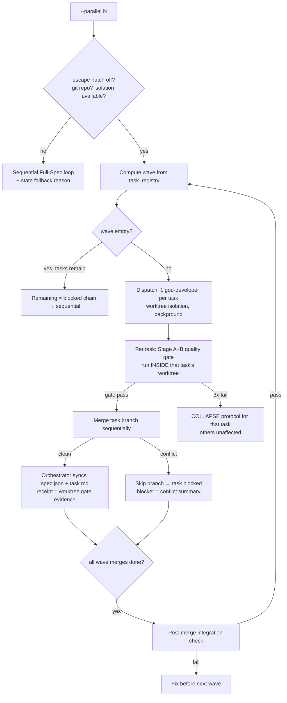

# Design — develop-parallel-wave

## Context & Overview

`hapo:develop` Full-Spec mode implements one task at a time (SKILL.md:179, :252). Field test (16-task spec) measured 1h38m sequential. `task_registry` already stores per-task `dependencies`, and Claude Code subagents support worktree isolation with background execution — the missing piece is a wave scheduler in the skill's orchestration text. This design adds an **opt-in** `--parallel` mode; the sequential default is untouched (R5.2).

## Architecture

### Components (all prompt/workflow layer — no new runtime code)

| Component | File | Change |
|---|---|---|
| Wave protocol reference | `packages/spec/src/claude/skills/develop/references/parallel-waves.md` | **NEW** — algorithm, conflict rule, caps, fallback, merge protocol |
| Develop skill | `packages/spec/src/claude/skills/develop/SKILL.md` | Add Parallel Wave mode section + flag; point to reference |
| Quality gate | `packages/spec/src/claude/skills/develop/references/quality-gate.md` | Add "gate cwd = task worktree" note + post-merge integration check step |
| Builder agent | `packages/spec/src/claude/agents/god-developer.md` | "Single-Track" → "Single-Track within its workspace"; worktree awareness |
| Orchestration rule | `packages/spec/src/claude/rules/orchestrator.md` | Parallel prerequisites gain the worktree clause; wave cap noted |
| Config toggle | `packages/spec/src/claude/runtime.json` | `develop.parallel` escape hatch (see contract) |
| Self-tests | `packages/spec/scripts/run-skill-self-tests.mjs` | Assertions per R5.3 |

### Wave algorithm (normative)

```
ready(t)   = t.status == "pending" AND all deps(t).status == "done"
wave       = first N ready tasks in registry order, N = cap (default 3, max 5)
             minus any task sharing a Create/Modify path with an earlier task in the wave
             (deferred task returns to the candidate pool for the next wave)
```

Conflict detection input: each task's `## Related Files` rows with Action `Create` or `Modify` (exact path string match after normalization). `Read` rows never conflict.

### Execution flow



### Dispatch prompt requirements (R2.2)

Each agent prompt is self-contained per `orchestrator.md`: task file content, design/requirements excerpts, work-context/specs/docs paths, acceptance criteria, and two hard prohibitions: (1) do NOT edit `spec.json` or any `tasks/*.md` — the orchestrator owns spec state; (2) do NOT touch files outside the task's `Related Files`. Agents end with the standard `Status:` block.

### State sync (R4)

Single writer: the orchestrator updates `task_registry` after each merged task (status, `completed_at`, receipt in task md referencing worktree gate evidence + post-merge check) and re-runs the wave computation. The Stop completion gate (`spec-gate.cjs`) applies unchanged — receipts must exist before turn end marks tasks done.

## Canonical Contracts & Invariants

<!-- contract:WAVE_CONFIG -->
```jsonc
// .claude/runtime.json — develop parallel toggle (missing key = allowed)
"develop": {
  "parallel": true   // false = --parallel refused, sequential run + notice
}
// Flag: /hapo:develop <feature> --parallel [N]   (N = wave cap, 1..5, default 3)
```

Invariants:
- Sequential default without `--parallel` is byte-identical to current behavior.
- One writer per file per wave; one writer (orchestrator) for spec state, always.
- Quality gate thresholds/protocol unchanged (Stage A+B, ≥9.5, 0 critical, 3-strike COLLAPSE).

## Requirements traceability

| Requirement | Design element |
|---|---|
| R1.1–R1.3 | Wave algorithm (normative block) |
| R2.1–R2.2 | Execution flow "Dispatch" + Dispatch prompt requirements |
| R2.3, R5.1 | Flow gate B (escape hatch / prerequisites) |
| R3.1–R3.4 | Flow F/G/H/I/L; quality-gate.md amendment |
| R4.1–R4.2 | State sync section |
| R5.2 | Context & Overview (opt-in), invariant 1 |
| R5.3 | Components table (self-tests row) |
| R6.1 | Wave cap in algorithm |
| R6.2 | Spike task R1-01 gates the merge-protocol prose in parallel-waves.md |

## Risk Assessment

| Risk | Severity | Mitigation |
|---|---|---|
| Worktree merge semantics differ from assumption | High | Spike R1-01 runs FIRST; merge prose written only from spike evidence (R6.2) |
| Merge conflicts despite file planning (shared generated files, lockfiles) | Medium | R3.2 skip-and-block protocol; conflicting task re-runs sequentially later |
| Resource exhaustion from N parallel agents | Medium | Cap 3 default / 5 max (R6.1); orchestrator.md resource warning retained |
| Model ignores single-writer prohibitions | Medium | Prohibitions embedded in dispatch prompt AND asserted by self-tests (R5.3); spec-gate still blocks receipt-less done |
| Post-merge integration check too slow per wave | Low | Scoped to build or affected tests only; full suite stays at develop completion |

## Unresolved questions

- None blocking design; R1-01 spike resolves the single flagged unknown before dependent prose is written.
