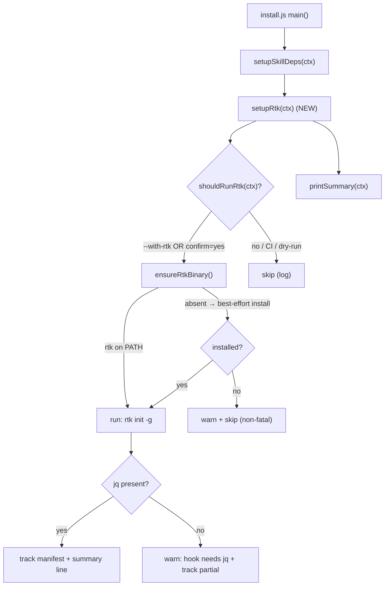

# Design Document

## Overview

Add an opt-in `setup-rtk` phase to the cafekit installer that (1) asks consent (or honors `--with-rtk`), (2) ensures the `rtk` binary is present, and (3) registers rtk's official Claude Code hook via `rtk init -g`. The phase is strictly additive, non-fatal, and modeled directly on the existing `setup-rtk`-style opt-in used for skill dependencies. cafekit owns the *offer* and *orchestration*; rtk owns the *binary* and the *hook*.

### Goals
- One opt-in question (or `--with-rtk` flag) during `npx @haposoft/cafekit`.
- Install rtk binary (best-effort) and run `rtk init -g`.
- Never break the core install; default OFF; CI-safe.
- Localized prompt/summary (en/ja/vi); manifest-tracked action.

### Non-Goals
- Reimplementing rtk compression filters.
- Authoring a custom PreToolUse hook (rtk's `rtk init -g` is the single source of truth).
- Auto-enabling without consent; managing Rust toolchains beyond best-effort.
- Any change to hapo-ai-hub.

## Architecture

### Existing Architecture Analysis
The installer (`packages/spec/bin/install.js`) runs a linear pipeline in `main()`:
`buildContext → selectLanguage → resolvePlatforms → checkVersions → installPlatform(...) → ensureGitignore → runPostInstall → setupSkillDeps → printSummary`.
`setupSkillDeps` (`phases/skills-setup.js`) is the template: it gates on `shouldRun(ctx)` (flag OR interactive confirm, CI skips), runs external commands via `lib/skill-deps.js` helpers (`run` = spawnSync captured, `hasCmd` = which/where), and is wrapped so failures never abort the install.

### Architecture Pattern & Boundary Map



**Architecture Integration:** new module `packages/spec/bin/phases/setup-rtk.js` + a one-line call in `main()` after `setupSkillDeps`. No change to the pipeline shape; the new phase obeys the same `ctx` contract (`ctx.ui`, `ctx.t`, `ctx.options`, `ctx.interactive`, `ctx.dryRun`, manifest).

### Technology Stack
- Node.js CLI (existing), `child_process.spawnSync` via `lib/skill-deps.js` helpers.
- rtk binary (external, Rust); `rtk init -g`; `jq` (rtk hook runtime dep).
- No new npm dependencies.

## Canonical Contracts & Invariants

- **Consent invariant:** the rtk binary is NEVER installed unless `options.withRtk === true` OR an interactive confirm returned true. (R1, R5.1)
- **Non-fatal invariant:** `setupRtk` is wrapped in try/catch; any throw/timeout/non-zero is logged as a warning and the installer continues with its existing exit code. (R2.7, R4.1)
- **Single-source-of-truth invariant:** cafekit never writes hook logic; it only invokes `rtk init -g`. (R2.4, scope)
- **CI-safe invariant:** non-interactive + no `--with-rtk` ⇒ phase is a no-op. (R1.3, R4.2)
- **Idempotency invariant:** re-running with rtk already installed skips binary install and re-runs `rtk init -g` (rtk handles its own idempotency); cafekit records the action in the manifest. (R2.1, R2.6)

## System Flows

Covered by the Architecture flowchart above (consent → ensure binary → init hook → jq check → track/summary). No additional non-trivial flow.

## Requirements Traceability

| Requirement | Design element |
|---|---|
| R1.1–R1.5 | `shouldRunRtk(ctx)` + `--with-rtk` parsing in `context.js` |
| R2.1 | `ensureRtkBinary` short-circuits when `hasCmd('rtk')` |
| R2.2–R2.3 | `installRtkBinary` best-effort order + non-fatal skip |
| R2.4 | `run('rtk', ['init','-g'])` |
| R2.5 | `hasCmd('jq')` check → warn key |
| R2.6 | manifest tracking call |
| R2.7, R4.1 | try/catch wrapper in `setupRtk` |
| R3.1–R3.4 | i18n keys + help + summary line |
| R4.2 | reuse `run` (captured spawnSync) |
| R4.3 | no writes outside manifest scope |
| R5.1 | consent gate |
| R5.2 | surface install method/source before running |
| R5.3 | no data transmission (pure local install) |

## Components and Interfaces

### Installer / Phases

#### setup-rtk.js (NEW)
Mirrors `skills-setup.js` structure.

##### Service Interface
```js
// packages/spec/bin/phases/setup-rtk.js
async function shouldRunRtk(ctx)            // → boolean (flag | confirm | false)
function ensureRtkBinary(ctx)               // → 'present' | 'installed' | 'absent'
function installRtkBinary(ctx)              // best-effort; → boolean success
async function setupRtk(ctx)                // orchestrates; never throws out
module.exports = { setupRtk };
```

##### Behavior contract
- `shouldRunRtk`: `if (ctx.dryRun) return report-only/false; if (ctx.options.withRtk) return true; if (!ctx.interactive) return false; return await ctx.ui.confirm({ message: ctx.t('rtkConfirm'), initialValue:false }, false) === true;`
- `ensureRtkBinary`: if `hasCmd('rtk')` → 'present'; else `installRtkBinary()` → 'installed'/'absent'.
- `installRtkBinary` order (R2.2, R5.2): surface method, then (1) official prebuilt install script, (2) `cargo install rtk` if `hasCmd('cargo')`, else return false. **Cross-OS note (validation 2026-06-15):** this priority order is already cross-platform — the fall-through to `cargo` covers macOS/Linux dev machines when prebuilt is platform-specific or unreachable; CI without either path skips with a warning (R2.3). No additional OS-specific tier required.
- After binary present: `run('rtk', ['init','-g'])`; then `if (!hasCmd('jq')) ctx.ui.warn(ctx.t('rtkNeedsJq'))`.
- Wrap whole body in try/catch → `ctx.ui.warn(ctx.t('rtkFailed', {reason}))`.
- Record manifest action + push summary line.

#### context.js (MODIFY)
Add to arg loop: `else if (arg === '--with-rtk') { args.withRtk = true; }`; default `withRtk:false` in the options object.

#### install.js (MODIFY)
- `printHelp()`: add `--with-rtk   Install the rtk token-saver (binary + Claude Code hook). Otherwise prompted.`
- `main()`: insert `await setupRtk(ctx);` immediately after `await setupSkillDeps(ctx);` and before `printSummary(ctx);`. Require at top: `const { setupRtk } = require('./phases/setup-rtk');`

##### State Management
Reuses `ctx` (no new global state). Manifest entry is the only persisted artifact cafekit owns; rtk's binary/hook are owned by rtk.

- Risks: install-method availability varies by OS/network → mitigated by best-effort order + non-fatal skip.

## Data Models
No persistent data model changes. Manifest gains one tracked rtk-setup record with the shape `{ rtk: { setupRan: true } }` (validated decision 2026-06-15 session 1). Boolean-only is sufficient for R2.6 idempotency: re-runs observe `setupRan === true` and rely on `hasCmd('rtk')` + `rtk init -g` re-invocation for refresh. The record is consistent with existing manifest entries (string/boolean).

## Error Handling

### Error Strategy
All rtk operations are best-effort and non-fatal. Failures degrade to warnings; the installer's existing success/exit logic is untouched.

### Error Categories and Responses
- Binary install fails / unavailable → warn `rtkInstallFailed`, skip hook, continue.
- `rtk init -g` non-zero → warn `rtkInitFailed`, continue.
- `jq` missing → warn `rtkNeedsJq`, continue (hook present but inert until jq installed).
- Unexpected throw → caught at `setupRtk` boundary, warn `rtkFailed`, continue.

### Monitoring
Console warnings via `ctx.ui`; optional parity with rtk's own `RTK_HOOK_AUDIT` is out of scope.

### Dry-run Behavior
When `ctx.dryRun === true` and `shouldRunRtk(ctx)` returns false (no `--with-rtk`, no interactive yes), `setupRtk` emits a single verbose line via `ctx.ui`:

```text
[dry-run] rtk setup skipped (would: detect rtk binary, install if missing via prebuilt/cargo, run rtk init -g, check jq)
```

This matches the explicit "Log 1 dòng liệt kê đầy đủ hành động sẽ chạy" decision from validation session 1 (2026-06-15). Rationale: dev/CI users running `--dry-run` benefit from seeing the exact action set that would execute, making the dry-run output self-explanatory without requiring a re-run. The line is emitted once, before the early-return; it does not block the pipeline.

## Testing Strategy

### Default sections
- **Unit (where feasible):** `shouldRunRtk` decision matrix (flag on; interactive yes/no; CI; dry-run) using a stubbed `ctx`.
- **Manual / smoke:** `node packages/spec/bin/install.js --dry-run --with-rtk` (offers, installs nothing); `--yes` (skips); interactive decline (skips). Verify with `rtk` pre-installed (uses 'present' path) and absent (best-effort/skip).
- **i18n check:** all new keys exist in en/ja/vi (no missing-key fallback).
- **Help/summary:** `--help` lists `--with-rtk`; summary shows a result line when run.

## Conditional Sections

### Security Considerations
- Explicit consent before any binary install (flag or affirmative prompt).
- Surface the install method/source (R5.2); prefer the official pinned source.
- No project data leaves the machine (R5.3).
- `setup-rtk` runs after platform files are written, so a failure here cannot corrupt the core install.

### Performance & Scalability
- Adds at most one prompt + a few `spawnSync` probes when opted out (fast).
- Binary compile via `cargo install` can be slow — only on explicit opt-in and when no prebuilt path exists; surfaced to the user.
